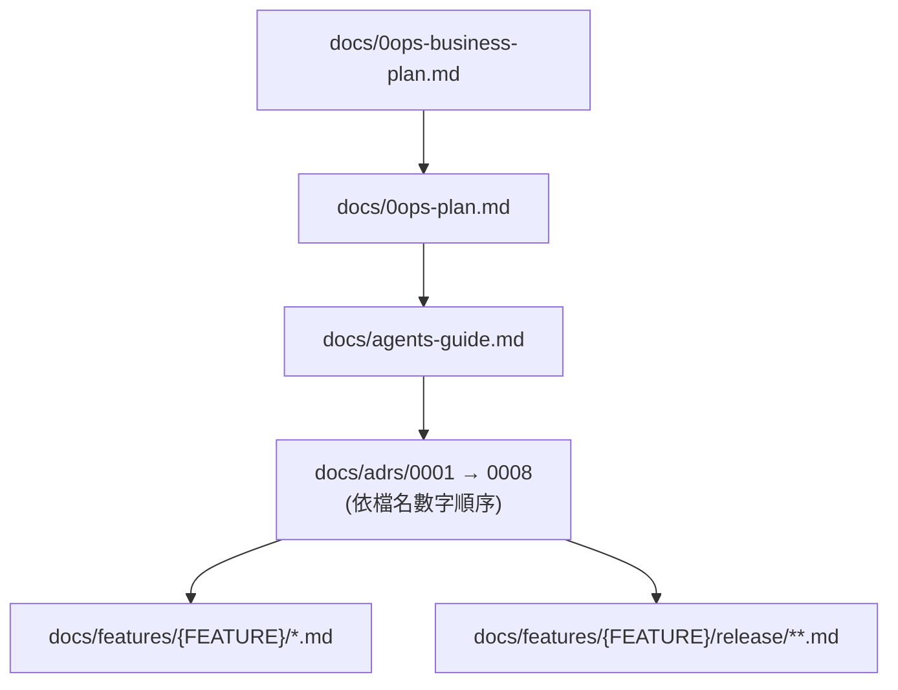

# 0ops Contribution Rules

## Purpose

本文件定義 `0ops` 專案的貢獻規範。
只聚焦五類規則：

- 命名
- 目錄
- 測試
- 提交
- 文件

若與其他文件衝突，優先順序如下：

1. 使用者明確要求
2. 本文件
3. `docs/adrs/*.md`（已接受之 ADR）
4. `docs/0ops-plan.md`

ADR 之所以高於 plan：plan 為長期演進的廣泛規劃文件，可能殘留 ADR 已 supersede
的措辭；正式決策以 ADR 為準。

## Document Reading Order

閱讀專案文件時，固定依以下順序進行：

1. `docs/0ops-business-plan.md`
2. `docs/0ops-plan.md`
3. `docs/agents-guide.md`
4. `docs/adrs/*.md`

ADR 為不可違反的架構決策。讀法規約：

- **依檔名數字順序閱讀**（0001 → 0002 → ... → 0008）；後者可能依賴前者，跳讀
  會錯失依賴語境（例：ADR-0008 之 leader-only 任務語意源自 ADR-0002）。
- **至少讀完每份 TL;DR 段**（「## 0. TL;DR（先讀本段）」）。實作或修改某 ADR
  涵蓋之主題前，**必須讀完整份**該 ADR（含 Pros&Cons、Consequences、Revisit
  Triggers 與 Open Questions）。
- 新增 ADR 採 MADR 9-section 結構並接續編號；ADR 之間有跨引用時必須在 More
  Information 段顯式列出。

若當前任務有對應 `{FEATURE}`，完成共用文件閱讀後，必須一併閱讀以下兩類文件：

1. `docs/features/{FEATURE}/*.md`
2. `docs/features/{FEATURE}/release/**.md`

## Naming

- 後端語言固定為 Go。
- Go module path 與 package name 不可用數字開頭。
- 專案內部 package 名稱使用 `server`、`cli`、`mcp`、`shared` 這類語意明確名稱。
- binary 輸出名稱可使用 `0ops`、`0ops-mcp`、`0ops-server`。
- app slug 只保證在 `team` 內唯一，不可假設全域唯一。
- team-scoped 資源命名與查詢必須顯式帶入 `team_slug` 或 `team_id`。
- 名稱應反映責任，不可新增 `utils`、`misc`、`helper`、`common` 這類模糊命名作為逃生艙。

## Testing

任何行為變更都必須補對應測試。最低要求：

- 單元測試：`testing`
- API handler 測試：`net/http/httptest`
- DB 整合測試
- CLI / MCP 與 backend DTO contract test

高風險區域必測：

- preview / confirm 流程
- idempotent retry
- team 隔離
- role / scope 權限矩陣
- webhook 或 callback 簽章驗證
- deploy 狀態轉移與 reconciler 收斂

若修改以下項目，不可只改程式不補測試：

- API request / response DTO
- MCP tool schema
- CLI output contract
- migration
- middleware 權限邏輯

## Commits

- 提交必須單一目的，避免把重構、格式化、功能修改混成一筆。
- Commit message 使用命令式、具體描述結果，不寫空泛訊息。
- 若變更會影響 API、schema、workflow 或文件，必須在同一批提交中一併處理，不要留技術債到下一筆。
- 不可提交與當前任務無關的順手修正。
- 不可用提交訊息取代文件；系統行為改變仍要更新文件。

建議格式：

- `feat: add app create preview flow`
- `fix: enforce team scope in app queries`
- `docs: clarify MCP confirm contract`
- `test: cover deploy callback signature validation`

避免：

- `update`
- `fix stuff`
- `wip`
- `misc changes`

## Documentation

文件是規格來源的一部分，不是收尾附件。

以下變更必須同步更新文件：

- API 路徑或語意
- preview / confirm 規則
- 目錄責任分工
- role / scope 權限定義
- deploy workflow 階段
- domain verify 規則
- 安裝或整合方式

優先更新位置：

- `docs/0ops-plan.md`
- `docs/` 下對應主題文件
- `skills/` 內相關整合說明或設定片段

新增文件時遵守：

- 先寫結論，再寫限制
- 用可驗證描述，避免口語化模糊句
- 避免同一規則散落多份文件而互相漂移
- 若新增文件是某份主文件的提煉版，需明確標示來源

## Review Heuristics

提交前自查：

1. 命名是否反映實際責任
2. 檔案是否放在正確邊界
3. 測試是否覆蓋改動風險
4. commit 是否單一目的且可審查
5. 文件是否與實作同步

任一答案為否，先修正再提交。
