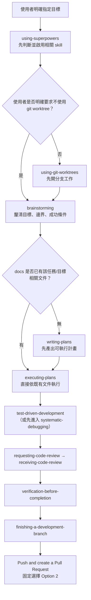
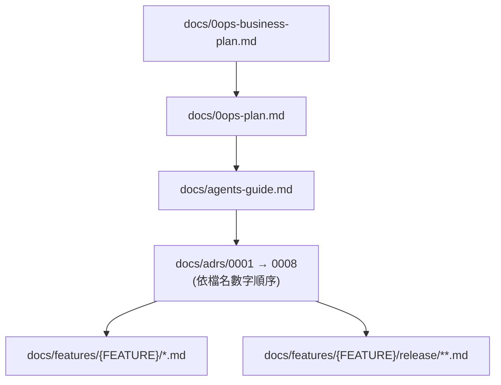

# 0ops Contribution Rules

## Purpose

本文件定義 `0ops` 專案的貢獻規範。
只聚焦三類規則：

- 測試
- 提交
- 文件

命名、目錄結構、租戶邊界等架構級規則由 `docs/adrs/*.md` 與 `docs/0ops-plan.md`
落地，本文件不重述。

若與其他文件衝突，優先順序如下：

1. 使用者明確要求
2. 本文件
3. `docs/adrs/*.md`（已接受之 ADR）
4. `docs/0ops-plan.md`

ADR 之所以高於 plan：plan 為長期演進的廣泛規劃文件，可能殘留 ADR 已 supersede
的措辭；正式決策以 ADR 為準。

## Mandatory Agent Loop Trigger

當使用者明確指定目標（例如「做什麼」、「修什麼」、「新增什麼」）後，agent
必須自動啟動以下工作流程，不可跳步、不可省略：



例外僅限：

- 使用者明確要求「只要討論 / 不要實作」
- 使用者要求「只做單一步驟」（例如只畫圖、只改文件）

若命令與流程衝突，優先順序為：

1. 使用者明確要求
2. 本節 Mandatory Agent Loop Trigger
3. 本文件其他章節

## Document Reading Order

閱讀專案文件時，固定依以下順序進行：

1. `docs/0ops-business-plan.md`
2. `docs/0ops-plan.md`
3. `docs/agents-guide.md`
4. `docs/adr-reading-strategy.md` ⭐ **必讀**（定義 ADR 讀取時機與深度）
5. `docs/adrs/*.md`
6. `tasks/todo.md`（完成的 task 需先查閱，確認收尾狀態與後續項目）
7. `tasks/lessons.md`（經驗談／複盤參考）

### ADR 讀取策略

ADR 為不可違反的架構決策。讀取分三層深度：

- **Skim**（<1 分鐘，TL;DR Only）：低風險修改、模組內部重構、簡單 bug 修復
- **Read**（3-5 分鐘，完整 ADR）：新 API、schema 變更、跨模組影響
- **Deep**（5-10 分鐘，Consequences + Open Questions）：架構變更、權限邏輯、重大決策變更

**讀法規約**：

- **每次 agent 啟動前**：依 `docs/adr-reading-strategy.md` 第 1 節「讀取時機決策矩陣」判斷深度
- **識別相關 ADR**：使用第 2 節「快速參考表」快速定位涉及 ADR（無需依序讀全部）
- **依檔名數字順序深讀**：當需 Deep 讀時，若多個 ADR 涉及應按 0001 → 0002 → ... 順序
  （後者可能依賴前者；例：ADR-0008 之 leader 職責源自 ADR-0002 冪等性決策）
- **實作或修改時**：發現違反 ADR 立即停止 → 深讀該 ADR Consequences 與 Open Questions → 
  評估是否應新增 ADR 而非違反現有決策
- 新增 ADR 採 MADR 9-section 結構並接續編號；ADR 之間有跨引用時必須在 More
  Information 段顯式列出；新 ADR 應同步更新 `adr-reading-strategy.md` 第 2 節

若當前任務有對應 `{FEATURE}`，完成共用文件閱讀後，必須一併閱讀以下兩類文件：

1. `docs/features/{FEATURE}/*.md`
2. `docs/features/{FEATURE}/release/**.md`



## Phase 功能實作流程

當需要實作某個 phase 的功能時，遵循以下流程：

### 1. 功能拆解（Function Decomposition）

首先將 phase 目標拆解為**獨立功能清單**，每個功能應滿足：

- 功能邊界清晰，可獨立 code review
- 有明確的前置條件（前期需完成的功能）
- 測試邊界可獨立驗證
- 提交可單獨 merge

拆解時參考：

- `docs/0ops-plan.md` 中該 phase 的描述與約束
- `docs/features/{FEATURE}/*.md` 的功能規格
- 相關 ADR 的 Consequences 中的依賴關係

### 2. 功能優先序與依賴

將拆解的功能依需入 SQL `todos` 與 `todo_deps` 表，記錄：

- 功能 ID、標題、詳細描述
- 功能間依賴（哪些功能必須先完成）
- 初始狀態設為 `pending`

### 3. 按功能逐個執行 Agent Loop

對每個 `pending` 功能，執行**標準 Agent Loop**：

```
功能視為一次「明確指定的目標」
  ↓
[Mandatory Agent Loop]
  using-superpowers
  → using-git-worktrees（或跳過）
  → brainstorming
  → writing-plans OR executing-plans
  → test-driven-development
  → requesting-code-review → receiving-code-review
  → verification-before-completion
  → finishing-a-development-branch
  ↓
Merge 至主分支，更新 SQL 狀態為 'done'
  ↓
下一功能（如有依賴則等依賴完成）
```

### 4. 跨功能邊界的檢驗

完成單一功能後：

- 檢查是否有後續功能的前置依賴已滿足
- 如後續功能有新的先決條件發現，更新 `todo_deps`
- 若跨功能發現架構問題，評估是否需新增 ADR 而非工作區間修正

### 示例

假設實作 phase：「Team API 權限矩陣」，功能拆解可能為：

| 功能 ID | 功能名稱 | 依賴 | 描述 |
|---------|---------|------|------|
| `team-scope-model` | Team Scope 資料模型 | 無 | 定義 scope 與權限等級，含 migration |
| `team-scope-queries` | Team Scope 查詢層 | `team-scope-model` | 實作 GetTeamScopes、ListTeamMembers |
| `api-scope-middleware` | API Scope 檢驗中間件 | `team-scope-queries` | 在 HTTP handler 層驗證 scope |
| `mcp-scope-contract` | MCP Tool Scope 規格 | `api-scope-middleware` | 定義並驗證 MCP tool schema |
| `scope-rbac-tests` | RBAC 全整合測試 | `mcp-scope-contract` | 跨 API、MCP、DB 層級的權限矩陣測試 |

各功能優先依序執行 Agent Loop，完成後更新 todo 狀態。

## Testing

任何行為變更都必須補對應測試。最低要求：

- 單元測試：`testing`
- API handler 測試：`net/http/httptest`
- DB 整合測試
- CLI / MCP 與 backend DTO contract test

### e2e 測試（每個 feature 必備）

每個 feature 必須有一條 e2e，對「真實組裝起來的系統」行使該 feature 的招牌保證，而非僅
單元/handler 層的隔離測試。標準與棧的建法見 `docs/features/e2e-testing/spec.md`，要點：

- 兩層擇一或併用：**composition test（Go，`e2e_*_test.go`）** 對 in-process router（可接真
  postgres）；**compose-stack e2e（`tasks/e2e-{feature}.sh` + `manage.sh e2e-{feature}`）** 對
  `podman compose` 真服務棧。跨容器/外部協定/權限與撤權鏈類，必走 compose-stack e2e。
- 外部依賴以 in-repo mock（`src/cmd/devtools/mock-*`）+ `compose.e2e.yaml` overlay 提供；
  production compose 永不含 mock。
- 硬規約（L001）：e2e 一律經 `OPS_HOST` 打 compose stack / staging；不可在 host 直跑
  `./bin/0ops-server`；CLI/MCP 以 `podman run` runtime image 驅動。
- 招牌保證本身必須經 live 路徑行使，不可用 SQL 偽造結果；無法在 e2e 行使者（需真 IdP/cluster）
  於 feature 文件明列 deferred 與替代覆蓋層。

高風險區域必測：

- preview / confirm 流程
- idempotent retry
- team 隔離
- role / scope 權限矩陣
- webhook 或 callback 簽章驗證
- deploy 狀態轉移與 reconciler 收斂

若修改以下項目，不可只改程式不補測試：

- API request / response DTO
- MCP tool schema
- CLI output contract
- migration
- middleware 權限邏輯

## Commits

- 提交必須單一目的，避免把重構、格式化、功能修改混成一筆。
- Commit message 使用命令式、具體描述結果，不寫空泛訊息。
- 若變更會影響 API、schema、workflow 或文件，必須在同一批提交中一併處理，不要留技術債到下一筆。
- 不可提交與當前任務無關的順手修正。
- 不可用提交訊息取代文件；系統行為改變仍要更新文件。

建議格式：

- `feat: add app create preview flow`
- `fix: enforce team scope in app queries`
- `docs: clarify MCP confirm contract`
- `test: cover deploy callback signature validation`

避免：

- `update`
- `fix stuff`
- `wip`
- `misc changes`

## Documentation

文件是規格來源的一部分，不是收尾附件。

以下變更必須同步更新文件：

- API 路徑或語意
- preview / confirm 規則
- 目錄責任分工
- role / scope 權限定義
- deploy workflow 階段
- domain verify 規則
- 安裝或整合方式

優先更新位置：

- `docs/0ops-plan.md`
- `docs/` 下對應主題文件
- `skills/` 內相關整合說明或設定片段

新增文件時遵守：

- 先寫結論，再寫限制
- 用可驗證描述，避免口語化模糊句
- 避免同一規則散落多份文件而互相漂移
- 若新增文件是某份主文件的提煉版，需明確標示來源

## Review Heuristics

提交前自查：

1. 命名是否反映實際責任
2. 檔案是否放在正確邊界
3. 測試是否覆蓋改動風險
4. commit 是否單一目的且可審查
5. 文件是否與實作同步

任一答案為否，先修正再提交。
