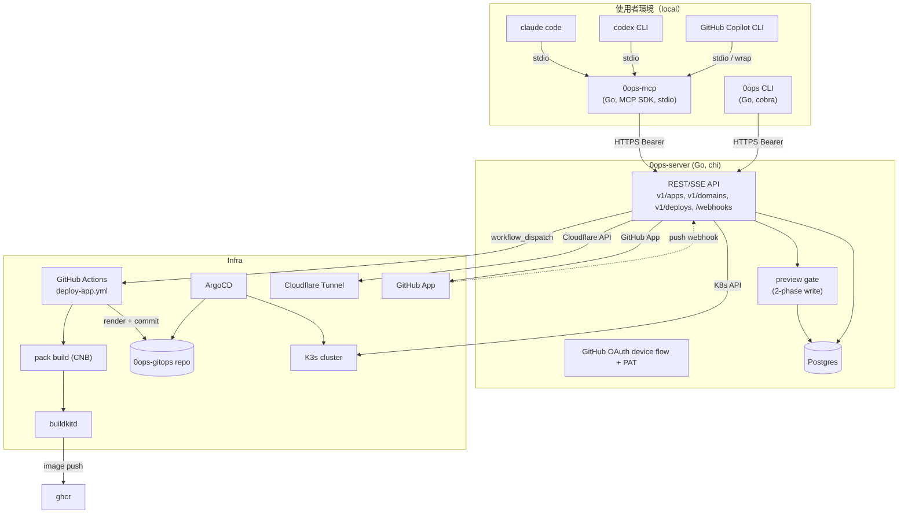

# Plan：AI agent 原生出貨工具（CLI + MCP Infra Console，新專案）

## Context

### 為何要做
使用者要建一個內部 PaaS 控制台。給定 (GitHub repo URL, desired domain) 即自動完成 stack 偵測 → 構建 → FQDN 配發 → 部署。

身份定位:0ops 是 **AI coding agent 原生用來「出貨」的工具**——agent（claude code / codex）把程式寫完後原生呼叫它,補上工具帶裡 `read / edit / run` 之外缺的那一格 `ship`。CLI 與 MCP 是兩條**接入機制（how）**,非身份（who）;即使 MCP 被在位者商品化,「agent 出貨時呼叫的那隻手」這個角色不變。

操作介面分兩條：

1. **`0ops` CLI**：直接打 backend REST API，適合腳本化、CI、熟手
2. **AI CLI（claude code / codex CLI / GitHub Copilot CLI）**：透過 `0ops-mcp`（stdio MCP server）以自然語言驅動同一組 backend API

Backend 不跑 LLM agent；agent 邏輯在使用者端的 AI CLI 內。

### 已決策參數
| 維度 | 決策 |
|---|---|
| 專案性質 | 新 repo、綠地開發 |
| 後端語言 | **Go**（goroutines/channels，chi web framework） |
| 主要介面 | **CLI + MCP**（給 claude code / codex / copilot） |
| Agent 位置 | **使用者端 AI CLI**（backend 純 API、不跑 Anthropic） |
| Stack 偵測 | Cloud Native Buildpacks（多語言、無 Dockerfile 也能跑） |
| 域名範圍 | `*.jesontech.com` 子網域 + 客戶自有網域 |
| Build 職責 | 系統負責（buildkit + CNB） |
| Re-deploy | Webhook 自動 + CLI/API 手動 雙觸發 |
| 寫入安全模型 | **兩階段 API**：preview 必先呼，confirm 後才執行（CLI 互動式 y/N、AI CLI 由 LLM 呈現給 user 確認） |
| 租戶模型 | **team 為一階租戶邊界**；`(team_id, slug)` 複合唯一；RBAC 四角色（owner/admin/member/viewer）；URL 帶 `team_slug` |
| Idempotency | preview_id 兼 idempotency key；confirm 重試冪等；`(team_id, idempotency_key)` 唯一 |
| 副作用補償 | reconciliation loop + deploy_run 狀態機；GHA 完成後 HMAC callback，polling 為退路 |
| 觀察基線 | M2 必上 `/metrics`、SLO/SLI、structured trace_id propagation |
| v1 Web UI | **不做**（延後 v2） |
| v2 Web UI 技術 | Vue 3 + Vite + Tailwind + shadcn-vue |
| 容器引擎 / 開發環境 | **`podman` + `podman compose`**（禁止 `docker`、禁止 `podman-compose` v1 wrapper） |
| 容器化檔案 | root `compose.yaml` + 各 binary `cmd/{server,cli,mcp}/Dockerfile` + root `.dockerignore` / `.env.example` |

---

## Goals & Non-goals

### Goals (v1)
- `0ops apps create nextdemo --repo=...` 或 claude code 內一句「幫我把 X 接進來叫 nextdemo」→ 5 分鐘內 `nextdemo.jesontech.com` 可用
- 寫入/刪除類操作必走 preview → confirm 兩階段，無沉默副作用
- 客戶自有域名透過 CNAME → Cloudflare Tunnel + CLI 即時驗證
- Push 到預設分支自動 redeploy
- 一份 MCP server，三個 AI CLI 共用（依 MCP 支援度）

### Non-goals (v1)
- Web UI（v2）
- 多服務 stack（compose 多 service）：v2
- 客戶自帶 TLS 憑證：v2
- 配額 / 帳單：v2
- 多分支預覽部署：v2
- Backend 跑 LLM agent：永久不做（設計上就交給使用者端）

---

## Architecture

### 高層流程



### 關鍵設計

1. **Backend = 純 IaaS API**：chi REST/SSE、Postgres 持久化、Cloudflare/K8s/GitOps 副作用、GitHub App webhook。**不引 Anthropic、不存對話、不做 prompt caching**
2. **多租戶與授權**（兩道防線）：
   - 一階實體：`team` 為租戶邊界與計費單位；`user` 透過 `team_membership` 加入 team 並持有 role
   - RBAC：`owner / admin / member / viewer` 四角色（矩陣見 Auth 章節）；PAT scope 與 role 正交，**有效權限 = role × scope 交集**
   - URL routing：寫入/讀取類皆帶 team 路徑前綴 `/v1/teams/{team_slug}/...`
   - 第一道防線：所有 sqlc query 模板強制 `WHERE team_id = $1`，**不提供無 team_id 的 query**
   - 第二道防線：chi middleware chain `AuthBearer → ResolveTeam → CheckMembership → CheckTokenScope`
3. **兩階段寫入 + idempotency**：
   - `POST /v1/teams/{team}/apps:preview { ... }` → `{ preview_id, action_summary, side_effects[], expires_at }`
   - `POST /v1/teams/{team}/apps { preview_id }` → 真正執行（必須帶有效未過期 preview_id；consumed 後標記不可重用）
   - **preview_id 兼 idempotency key**：confirm 端點對同一 preview_id 重試冪等（已 consumed 直接回 last result，不重做副作用）
   - `(team_id, idempotency_key)` DB 唯一索引；client 可主動帶 `Idempotency-Key` header 控制
   - 純讀取 endpoint 直接執行
4. **副作用補償（saga 簡化版）**：
   - 寫入動作有狀態機：`queued → preparing → applying → committing → done`，任一步失敗轉 `compensating → rolled_back`
   - 每個 stage 寫入 `deploy_run.events` 與 `audit_log`，背景 reconciler 對 `applying` 滯留 > 15min 的 row 主動拉外部狀態收斂
   - 副作用順序：先 reversible（gitops branch、Cloudflare DNS draft）→ 後 irreversible（image push、tunnel binding）
5. **CLI**：cobra command tree，支援互動式（自動呼 preview → 印摘要 → y/N → confirm）與非互動式（`--yes` 直接 confirm）；`0ops teams use <slug>` 切換 current team
6. **MCP server**：本地 binary、stdio transport；tool 一對一映射 backend API；寫入工具的設計強制 LLM「先呼 `*_preview` → 把 PlanPreview 呈現給 user → 取得確認 → 才呼真執行」；所有 write tool 的 `team_slug` 皆為**必填參數**避免 LLM 預設打錯 team
7. **Auth**：GitHub OAuth device flow（CLI/MCP 共用 token cache `~/.config/0ops/auth.json`）+ Bearer token 帶到 backend；CI/自動化用 personal access token（PAT），PAT 綁定 team + scope
8. **Observability baseline**（M2 必上，非延後）：
   - `/metrics` Prometheus exposition；固定 label `route, method, status, team_bucket`
   - `traceparent` middleware → slog context → 透過 GHA `repository_dispatch` payload 帶到 build → callback 帶回 → `audit_log.trace_id` 全鏈路重組
   - SLO/SLI 表與 burn-rate alert 見《Observability & SLO》章節

### Go 技術棧（v1 預設選型）

| 用途 | 套件 | 備註 |
|---|---|---|
| Web framework | `go-chi/chi/v5` | 輕量、stdlib-aligned、原生支援 SSE |
| Concurrency | goroutines + channels（stdlib） | 無外部 runtime |
| HTTP client | `net/http`（+ `go-resty/resty/v2` 可選） | Cloudflare API、CLI/MCP 對 backend |
| MCP SDK | `github.com/modelcontextprotocol/go-sdk` | 官方 SDK；stdio transport、tool registry；細節見 ADR-0003 |
| CLI | `spf13/cobra` + `AlecAivazis/survey/v2`（互動 prompt）+ `olekukonko/tablewriter`（表格輸出）+ `encoding/json`/`gopkg.in/yaml.v3` | |
| DB driver | `jackc/pgx/v5` + `sqlc`（codegen 產生 type-safe query） | Postgres 原生協定、無 ORM 開銷 |
| Migration | `pressly/goose` 或 `golang-migrate/migrate` | |
| 序列化 | `encoding/json` + `gopkg.in/yaml.v3` | API DTO、tool args |
| GitHub | `google/go-github/v66` | App JWT、installation token、workflow_dispatch |
| Webhook 簽章 | `crypto/hmac` + `crypto/sha256`（stdlib） | GitHub webhook HMAC 驗證 |
| K8s | `kubernetes/client-go` | Pod logs、Deployment status |
| 排程 | `time.Ticker` + goroutine | DNS 驗證輪詢、preview 過期清理 |
| 設定 | `knadh/koanf`（推薦）或 `spf13/viper` + `joho/godotenv` | env / file 多來源 |
| Logging | `log/slog`（stdlib，1.21+） | 結構化日誌（MCP binary 走 stderr） |
| 錯誤 | `errors` + `fmt.Errorf("...: %w", err)` | wrap chain；boundary 處 `errors.As` 解包 |
| 認證 | Bearer middleware（`chi` middleware）+ `golang.org/x/crypto/argon2` 雜湊 PAT | RBAC 角色檢查在 ResolveTeam middleware 之後 |
| DNS resolver | `net.DefaultResolver` 或 `miekg/dns`（進階） | 客戶域名驗證輪詢 |
| Cache | `dgraph-io/ristretto` 或 `patrickmn/go-cache` | repo introspect 結果 5 分鐘快取 |
| Metrics | `prometheus/client_golang` | `/metrics` exposition、histogram、team-bucket label |
| Tracing | `go.opentelemetry.io/otel` + `otel/exporters/otlp/otlptrace` | trace_id propagation；可選 OTLP exporter |
| Image scan | `aquasecurity/trivy`（外掛 GHA step） | HIGH/CRITICAL 阻擋 push（v1 觀察、v1.1 強制） |
| 測試 | `testing` + `net/http/httptest` + `testcontainers/testcontainers-go` + `stretchr/testify` | 含 contract test：CLI/MCP DTO vs backend OpenAPI |
| Lint | `golangci-lint`（含 govet、staticcheck、errcheck、gosec） | CI 強制 |
| Build/Release | `goreleaser` | 跨平台靜態 binary、GitHub Release 自動化、Homebrew tap |
| 容器化 | multi-stage `Dockerfile`（builder: `golang:1.25-alpine` → runtime: `gcr.io/distroless/static-debian12:nonroot`） | dev stage 內含 `air` 熱重載；CLI/MCP 僅 builder + runtime |
| Container engine | `podman` rootless + `podman compose`（v2 內建，非 wrapper） | 與 docker compose v2 行為一致；禁用 docker 與 podman-compose |
| Dockerfile lint | `hadolint` | CI 強制 |

---

## Tool catalog（v1）

下表是 backend API 的核心動作。每個動作對應一條 MCP tool 與一條 CLI 子命令。寫入/刪除類必經 preview。
所有 endpoint 路徑帶 `/v1/teams/{team_slug}` 前綴；下表為節省欄寬以 `…` 略寫，實際完整路徑即 `/v1/teams/{team}/apps...`。
跨 team 的查詢另設獨立 endpoint（如 `GET /v1/me/apps` 列出當前 user 在所有 team 的 app）。

| 動作 | 類別 | 最低 role | scope | Backend endpoint（省略 `/v1/teams/{team}` 前綴） | MCP tool | CLI |
|---|---|---|---|---|---|---|
| 列出 app | read | viewer | `apps:read` | `GET …/apps` | `list_apps` | `0ops apps list` |
| 取得 app | read | viewer | `apps:read` | `GET …/apps/{slug}` | `get_app` | `0ops apps get <slug>` |
| 偵測 repo stack | read | member | `repos:read` | `POST …/repos:inspect` | `inspect_repo` | `0ops repo inspect <url> [--ref]` |
| 拉 logs | read（SSE） | viewer | `apps:read` | `GET …/apps/{slug}/logs?lines=N&follow=true` | `tail_logs` | `0ops deploys logs <slug> [--follow]` |
| 取部署狀態 | read | viewer | `apps:read` | `GET …/apps/{slug}/deploy-status` | `get_deploy_status` | `0ops deploys status <slug>` |
| 列網域 | read | viewer | `apps:read` | `GET …/apps/{slug}/domains` | `list_domains` | `0ops domains list <slug>` |
| 主動驗證網域 | read | member | `domains:write` | `POST …/apps/{slug}/domains/{host}:verify` | `verify_domain` | `0ops domains verify <slug> <host>` |
| 建立 app | **write** | member | `apps:write` | `POST …/apps:preview` → `POST …/apps` | `create_app_preview` + `create_app` | `0ops apps create <slug> --repo=...` |
| 觸發 redeploy | **write** | member | `apps:write` | `POST …/apps/{slug}/redeploys:preview` → `POST …/redeploys` | `redeploy_preview` + `redeploy` | `0ops deploys redeploy <slug>` |
| 加網域 | **write** | member | `domains:write` | `POST …/apps/{slug}/domains:preview` → `POST …/domains` | `add_domain_preview` + `add_domain` | `0ops domains add <slug> <host>` |
| 改 app 設定 | **write** | member | `apps:write` | `PATCH …/apps/{slug}:preview` → `PATCH …/apps/{slug}` | `update_app_preview` + `update_app` | `0ops apps update <slug> --branch=...` |
| 刪 app | **delete** | admin | `apps:delete` | `DELETE …/apps/{slug}:preview` → `DELETE …/apps/{slug}` | `delete_app_preview` + `delete_app` | `0ops apps delete <slug>` |
| 移除網域 | **delete** | admin | `domains:write` | `DELETE …/domains/{host}:preview` → `DELETE …/domains/{host}` | `remove_domain_preview` + `remove_domain` | `0ops domains remove <slug> <host>` |
| 列 team | read | — | `teams:read` | `GET /v1/me/teams` | `list_teams` | `0ops teams list` |
| 切 team（local） | local | — | — | — | — | `0ops teams use <slug>` |
| 加 member | **write** | owner | `members:manage` | `POST …/members:preview` → `POST …/members` | `invite_member_preview` + `invite_member` | `0ops teams invite <github_login> --role=...` |
| 安裝 GitHub App | **write** | owner | `members:manage` | `POST …/github/install:preview` → callback 流程 | `install_github_app_preview` + `install_github_app` | `0ops teams github install` |
| 移除 GitHub App | **delete** | owner | `members:manage` | `DELETE …/github/install:preview` → `DELETE …/github/install` | `uninstall_github_app_preview` + `uninstall_github_app` | `0ops teams github uninstall` |
| 查 audit log | read | admin | `audit:read` | `GET …/audit?since=&until=&action=&actor=` | `query_audit_log` | `0ops audit list [--since=24h] [--action=create_app]` |

`create_app` 的 preview / confirm orchestration 已抽入 `internal/server/services/createapp/`；handler 現在只負責 HTTP/DTO 轉接與授權檢查。

PlanPreview 物件結構（所有 `*:preview` 回傳一致）：
```json
{
  "preview_id": "uuid",
  "action": "create_app",
  "action_summary": "建立 app nextdemo（next.js-helloworld @ main）",
  "side_effects": [
    "在 0ops-gitops 建立 apps/nextdemo/",
    "在 Cloudflare 註冊 hostname nextdemo.jesontech.com",
    "觸發初次 build via GitHub Actions"
  ],
  "expires_at": "2026-05-08T12:34:56Z"
}
```

---

## 專案結構

工作名稱 `0ops`（已定）。獨立 git repo，下列路徑均相對於 repo root。

> **Go naming 約束**：Go module path / package name 不能以數字開頭，但 binary 輸出檔名不受限。約定：
> - Module path：`github.com/winshare/zeroops`（或私有 path）
> - 內部 package：`server`, `cli`, `mcp`, `shared`（不帶數字前綴）
> - Binary 輸出：`go build -o 0ops ./cmd/cli`、`-o 0ops-mcp ./cmd/mcp`、`-o 0ops-server ./cmd/server`
> - GoReleaser 在 `.goreleaser.yaml` 固定產出 `0ops`、`0ops-mcp`、`0ops-server` 三個檔名

單一 Go module + cmd/ 多 binary 結構（Go 慣例）。

```
0ops/
├── README.md
├── go.mod                          # module github.com/winshare/zeroops
├── go.sum
├── .golangci.yml
├── .goreleaser.yaml
├── .dockerignore                   # build context 排除清單
├── .env.example                    # 開發環境變數範本（.env 由貢獻者複製後填寫，禁止 commit）
├── manage.sh                        # 收口 dev / build / lint / migrate target
├── compose.yaml                    # podman compose v2 預設探索檔；本機 dev runtime（db + migrate + server）
├── cmd/
│   ├── server/                     # backend binary（build → 0ops-server）
│   │   ├── main.go
│   │   └── Dockerfile              # multi-stage：builder → dev (air) → runtime (distroless)
│   ├── cli/                        # CLI binary（build → 0ops）
│   │   ├── main.go
│   │   └── Dockerfile              # multi-stage：builder → runtime（無 dev stage）
│   └── mcp/                        # MCP server binary（build → 0ops-mcp）
│       ├── main.go
│       └── Dockerfile              # multi-stage：builder → runtime（無 dev stage；stdio）
├── internal/
│   ├── server/                     # chi REST/SSE backend
│   │   ├── routers/
│   │   │   ├── teams.go            # /v1/teams[:preview]、/v1/me/teams、members
│   │   │   ├── apps.go             # /v1/teams/{team}/apps[:preview]
│   │   │   ├── domains.go
│   │   │   ├── deploys.go          # logs (SSE)、status、redeploy
│   │   │   ├── repos.go            # /v1/teams/{team}/repos:inspect
│   │   │   ├── webhooks.go         # /webhooks/github (HMAC + replay protection)
│   │   │   ├── callback.go         # /internal/deploy-runs/{id}/callback (HMAC from GHA)
│   │   │   └── auth.go             # device flow callback、PAT 管理
│   │   ├── preview/                # PlanPreview produce / consume + idempotency
│   │   │   └── preview.go
│   │   ├── statemachine/           # deploy_run 狀態機 + compensation
│   │   │   ├── deploy.go
│   │   │   └── transitions.go
│   │   ├── reconciler/             # 背景收斂 (reconciliation_job)
│   │   │   ├── deploy_status.go
│   │   │   ├── domain_verify.go
│   │   │   └── preview_cleanup.go
│   │   ├── services/
│   │   │   ├── githubapp/
│   │   │   ├── repointrospect/
│   │   │   ├── cloudflare/
│   │   │   ├── domainverify/
│   │   │   ├── workflowdispatch/
│   │   │   └── k8sstatus/
│   │   ├── db/
│   │   │   ├── models.go
│   │   │   ├── queries.sql         # sqlc input；所有 query 強制 team_id 鎖定
│   │   │   └── repo.go             # sqlc-generated + custom 包裝
│   │   ├── auth/                   # Bearer + device flow + PAT 雜湊 + RBAC middleware
│   │   │   ├── bearer.go
│   │   │   ├── device.go
│   │   │   ├── rbac.go             # role + scope 矩陣、CheckMembership/CheckTokenScope
│   │   │   └── webhook.go          # HMAC 驗章 + timestamp window + dedup
│   │   ├── observability/          # metrics、tracing、slog handler
│   │   │   ├── metrics.go          # prometheus collectors
│   │   │   ├── tracing.go          # otel propagation
│   │   │   └── logging.go
│   │   ├── apperror/
│   │   └── settings/
│   ├── cli/                        # 0ops CLI 內部邏輯
│   │   ├── commands/               # auth/teams/apps/domains/deploys/repo
│   │   ├── client/                 # backend HTTP client
│   │   ├── interactive/            # preview → 印摘要 → survey y/N
│   │   ├── ctx/                    # current_team 切換、auth.json 管理
│   │   └── output/                 # table / json / yaml
│   ├── mcp/                        # 0ops-mcp（stdio）
│   │   ├── tools/                  # 每個工具一個檔；read 直接呼 backend；write 是 preview/confirm 對
│   │   ├── client/                 # 共用 backend client
│   │   └── auth/                   # 讀 ~/.config/0ops/auth.json
│   └── shared/                     # 共用 dto、preview schema、RBAC enum
│       ├── dto/
│       ├── preview/
│       └── rbac/                   # role/scope 常數、矩陣，server 與 cli/mcp 共用
├── migrations/                     # goose / golang-migrate
├── skills/
│   ├── claude-code/0ops/
│   │   ├── SKILL.md
│   │   └── mcp-config.json
│   ├── codex/0ops/
│   │   ├── SKILL.md
│   │   └── codex-config.toml.snippet
│   └── copilot/0ops/
│       ├── SKILL.md
│       └── README.md
├── deploy/
│   ├── chart/launchpad/            # backend 自身的 Helm chart
│   ├── chart/managed-app/          # 給 managed apps 用的 template chart
│   ├── gitops/                     # 範例 manifests + ApplicationSet
│   └── workflows/
│       └── deploy-app.yml          # GitHub Actions：pack build + render gitops
└── docs/
    ├── architecture.md
    ├── cli-usage.md
    ├── mcp-integration.md
    ├── features/                   # 各 feature 規格（含 dev-environment）
    └── runbooks/
# 註：web/ 在 v2 才加（Vue 3 + Vite + Tailwind + shadcn-vue）
# 註：compose 入口從 infra/compose.dev.yaml 改為 root compose.yaml；infra/ 目錄取消，dev 服務拓樸詳見 docs/features/dev-environment/spec.md
```


---

## 延伸文件（按需讀取）

以下章節已拆出為獨立文件，僅在任務涉及對應領域時才需讀取：

| 文件 | 內容 | 讀取時機 |
|------|------|----------|
| `docs/0ops-plan-components.md` | Preview gate、CLI confirm、MCP server、Skill packs、Build & deploy、GitOps、Domain verify 元件設計 | 實作或修改上述元件時 |
| `docs/0ops-plan-schema.md` | DB schema（SQL）、索引策略、migration policy、資料保留期 | 改 DB 層、新增 migration 時 |
| `docs/0ops-plan-auth.md` | GitHub OAuth device flow、PAT、RBAC 角色矩陣、GitHub App install 流程、Webhook 安全 | 改認證、授權、webhook 時 |
| `docs/0ops-plan-observability.md` | SLO/SLI 表、metrics 暴露、trace propagation、Deploy 狀態機、Reconciler | 改 metrics、tracing、deploy 狀態機時 |
| `docs/0ops-plan-runtime.md` | K3s namespace 隔離、Backend HA topology、Postgres backup/DR、Rate limit | 改 K8s 配置、HA、限流時 |
| `docs/0ops-plan-examples.md` | Pattern A/B/C 使用者腳本（CLI、MCP、domain 加入） | 了解端到端 UX 流程時 |
| `docs/0ops-plan-verification.md` | Smoke、Contract、整合、邊界測試策略 | 設計測試計畫時 |
| `docs/0ops-plan-risks.md` | Risks & open items（含已解決項目記錄） | 架構討論、Open Question 評估時 |
| `docs/0ops-plan-milestones.md` | Milestones（M0–M6）、立即下一步、TBD | 規劃、進度確認時 |
