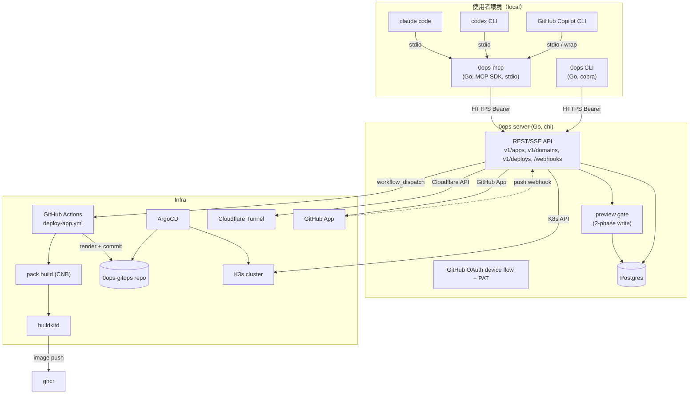

# Plan：CLI / MCP-first Infra Console（新專案）

## Context

### 為何要做
使用者要建一個內部 PaaS 控制台。給定 (GitHub repo URL, desired domain) 即自動完成 stack 偵測 → 構建 → FQDN 配發 → 部署。

操作介面分兩條：

1. **`0ops` CLI**：直接打 backend REST API，適合腳本化、CI、熟手
2. **AI CLI（claude code / codex CLI / GitHub Copilot CLI）**：透過 `0ops-mcp`（stdio MCP server）以自然語言驅動同一組 backend API

Backend 不跑 LLM agent；agent 邏輯在使用者端的 AI CLI 內。

### 已決策參數
| 維度 | 決策 |
|---|---|
| 專案性質 | 新 repo、綠地開發 |
| 後端語言 | **Go**（goroutines/channels，chi web framework） |
| 主要介面 | **CLI + MCP**（給 claude code / codex / copilot） |
| Agent 位置 | **使用者端 AI CLI**（backend 純 API、不跑 Anthropic） |
| Stack 偵測 | Cloud Native Buildpacks（多語言、無 Dockerfile 也能跑） |
| 域名範圍 | `*.winshare.tw` 子網域 + 客戶自有網域 |
| Build 職責 | 系統負責（buildkit + CNB） |
| Re-deploy | Webhook 自動 + CLI/API 手動 雙觸發 |
| 寫入安全模型 | **兩階段 API**：preview 必先呼，confirm 後才執行（CLI 互動式 y/N、AI CLI 由 LLM 呈現給 user 確認） |
| 租戶模型 | **team 為一階租戶邊界**；`(team_id, slug)` 複合唯一；RBAC 四角色（owner/admin/member/viewer）；URL 帶 `team_slug` |
| Idempotency | preview_id 兼 idempotency key；confirm 重試冪等；`(team_id, idempotency_key)` 唯一 |
| 副作用補償 | reconciliation loop + deploy_run 狀態機；GHA 完成後 HMAC callback，polling 為退路 |
| 觀察基線 | M2 必上 `/metrics`、SLO/SLI、structured trace_id propagation |
| v1 Web UI | **不做**（延後 v2） |
| v2 Web UI 技術 | Vue 3 + Vite + Tailwind + shadcn-vue |
| 容器引擎 / 開發環境 | **`podman` + `podman compose`**（禁止 `docker`、禁止 `podman-compose` v1 wrapper） |
| 容器化檔案 | root `compose.yaml` + 各 binary `cmd/{server,cli,mcp}/Dockerfile` + root `.dockerignore` / `.env.example` |

---

## Goals & Non-goals

### Goals (v1)
- `0ops apps create nextdemo --repo=...` 或 claude code 內一句「幫我把 X 接進來叫 nextdemo」→ 5 分鐘內 `nextdemo.winshare.tw` 可用
- 寫入/刪除類操作必走 preview → confirm 兩階段，無沉默副作用
- 客戶自有域名透過 CNAME → Cloudflare Tunnel + CLI 即時驗證
- Push 到預設分支自動 redeploy
- 一份 MCP server，三個 AI CLI 共用（依 MCP 支援度）

### Non-goals (v1)
- Web UI（v2）
- 多服務 stack（compose 多 service）：v2
- 客戶自帶 TLS 憑證：v2
- 配額 / 帳單：v2
- 多分支預覽部署：v2
- Backend 跑 LLM agent：永久不做（設計上就交給使用者端）

---

## Architecture

### 高層流程



### 關鍵設計

1. **Backend = 純 IaaS API**：chi REST/SSE、Postgres 持久化、Cloudflare/K8s/GitOps 副作用、GitHub App webhook。**不引 Anthropic、不存對話、不做 prompt caching**
2. **多租戶與授權**（兩道防線）：
   - 一階實體：`team` 為租戶邊界與計費單位；`user` 透過 `team_membership` 加入 team 並持有 role
   - RBAC：`owner / admin / member / viewer` 四角色（矩陣見 Auth 章節）；PAT scope 與 role 正交，**有效權限 = role × scope 交集**
   - URL routing：寫入/讀取類皆帶 team 路徑前綴 `/v1/teams/{team_slug}/...`
   - 第一道防線：所有 sqlc query 模板強制 `WHERE team_id = $1`，**不提供無 team_id 的 query**
   - 第二道防線：chi middleware chain `AuthBearer → ResolveTeam → CheckMembership → CheckTokenScope`
3. **兩階段寫入 + idempotency**：
   - `POST /v1/teams/{team}/apps:preview { ... }` → `{ preview_id, action_summary, side_effects[], expires_at }`
   - `POST /v1/teams/{team}/apps { preview_id }` → 真正執行（必須帶有效未過期 preview_id；consumed 後標記不可重用）
   - **preview_id 兼 idempotency key**：confirm 端點對同一 preview_id 重試冪等（已 consumed 直接回 last result，不重做副作用）
   - `(team_id, idempotency_key)` DB 唯一索引；client 可主動帶 `Idempotency-Key` header 控制
   - 純讀取 endpoint 直接執行
4. **副作用補償（saga 簡化版）**：
   - 寫入動作有狀態機：`queued → preparing → applying → committing → done`，任一步失敗轉 `compensating → rolled_back`
   - 每個 stage 寫入 `deploy_run.events` 與 `audit_log`，背景 reconciler 對 `applying` 滯留 > 15min 的 row 主動拉外部狀態收斂
   - 副作用順序：先 reversible（gitops branch、Cloudflare DNS draft）→ 後 irreversible（image push、tunnel binding）
5. **CLI**：cobra command tree，支援互動式（自動呼 preview → 印摘要 → y/N → confirm）與非互動式（`--yes` 直接 confirm）；`0ops teams use <slug>` 切換 current team
6. **MCP server**：本地 binary、stdio transport；tool 一對一映射 backend API；寫入工具的設計強制 LLM「先呼 `*_preview` → 把 PlanPreview 呈現給 user → 取得確認 → 才呼真執行」；所有 write tool 的 `team_slug` 皆為**必填參數**避免 LLM 預設打錯 team
7. **Auth**：GitHub OAuth device flow（CLI/MCP 共用 token cache `~/.config/0ops/auth.json`）+ Bearer token 帶到 backend；CI/自動化用 personal access token（PAT），PAT 綁定 team + scope
8. **Observability baseline**（M2 必上，非延後）：
   - `/metrics` Prometheus exposition；固定 label `route, method, status, team_bucket`
   - `traceparent` middleware → slog context → 透過 GHA `repository_dispatch` payload 帶到 build → callback 帶回 → `audit_log.trace_id` 全鏈路重組
   - SLO/SLI 表與 burn-rate alert 見《Observability & SLO》章節

### Go 技術棧（v1 預設選型）

| 用途 | 套件 | 備註 |
|---|---|---|
| Web framework | `go-chi/chi/v5` | 輕量、stdlib-aligned、原生支援 SSE |
| Concurrency | goroutines + channels（stdlib） | 無外部 runtime |
| HTTP client | `net/http`（+ `go-resty/resty/v2` 可選） | Cloudflare API、CLI/MCP 對 backend |
| MCP SDK | `github.com/modelcontextprotocol/go-sdk` | 官方 SDK；stdio transport、tool registry；細節見 ADR-0003 |
| CLI | `spf13/cobra` + `AlecAivazis/survey/v2`（互動 prompt）+ `olekukonko/tablewriter`（表格輸出）+ `encoding/json`/`gopkg.in/yaml.v3` | |
| DB driver | `jackc/pgx/v5` + `sqlc`（codegen 產生 type-safe query） | Postgres 原生協定、無 ORM 開銷 |
| Migration | `pressly/goose` 或 `golang-migrate/migrate` | |
| 序列化 | `encoding/json` + `gopkg.in/yaml.v3` | API DTO、tool args |
| GitHub | `google/go-github/v66` | App JWT、installation token、workflow_dispatch |
| Webhook 簽章 | `crypto/hmac` + `crypto/sha256`（stdlib） | GitHub webhook HMAC 驗證 |
| K8s | `kubernetes/client-go` | Pod logs、Deployment status |
| 排程 | `time.Ticker` + goroutine | DNS 驗證輪詢、preview 過期清理 |
| 設定 | `knadh/koanf`（推薦）或 `spf13/viper` + `joho/godotenv` | env / file 多來源 |
| Logging | `log/slog`（stdlib，1.21+） | 結構化日誌（MCP binary 走 stderr） |
| 錯誤 | `errors` + `fmt.Errorf("...: %w", err)` | wrap chain；boundary 處 `errors.As` 解包 |
| 認證 | Bearer middleware（`chi` middleware）+ `golang.org/x/crypto/argon2` 雜湊 PAT | RBAC 角色檢查在 ResolveTeam middleware 之後 |
| DNS resolver | `net.DefaultResolver` 或 `miekg/dns`（進階） | 客戶域名驗證輪詢 |
| Cache | `dgraph-io/ristretto` 或 `patrickmn/go-cache` | repo introspect 結果 5 分鐘快取 |
| Metrics | `prometheus/client_golang` | `/metrics` exposition、histogram、team-bucket label |
| Tracing | `go.opentelemetry.io/otel` + `otel/exporters/otlp/otlptrace` | trace_id propagation；可選 OTLP exporter |
| Image scan | `aquasecurity/trivy`（外掛 GHA step） | HIGH/CRITICAL 阻擋 push（v1 觀察、v1.1 強制） |
| 測試 | `testing` + `net/http/httptest` + `testcontainers/testcontainers-go` + `stretchr/testify` | 含 contract test：CLI/MCP DTO vs backend OpenAPI |
| Lint | `golangci-lint`（含 govet、staticcheck、errcheck、gosec） | CI 強制 |
| Build/Release | `goreleaser` | 跨平台靜態 binary、GitHub Release 自動化、Homebrew tap |
| 容器化 | multi-stage `Dockerfile`（builder: `golang:1.23-alpine` → runtime: `gcr.io/distroless/static-debian12:nonroot`） | dev stage 內含 `air` 熱重載；CLI/MCP 僅 builder + runtime |
| Container engine | `podman` rootless + `podman compose`（v2 內建，非 wrapper） | 與 docker compose v2 行為一致；禁用 docker 與 podman-compose |
| Dockerfile lint | `hadolint` | CI 強制 |

---

## Tool catalog（v1）

下表是 backend API 的核心動作。每個動作對應一條 MCP tool 與一條 CLI 子命令。寫入/刪除類必經 preview。
所有 endpoint 路徑帶 `/v1/teams/{team_slug}` 前綴；下表為節省欄寬以 `…` 略寫，實際完整路徑即 `/v1/teams/{team}/apps...`。
跨 team 的查詢另設獨立 endpoint（如 `GET /v1/me/apps` 列出當前 user 在所有 team 的 app）。

| 動作 | 類別 | 最低 role | scope | Backend endpoint（省略 `/v1/teams/{team}` 前綴） | MCP tool | CLI |
|---|---|---|---|---|---|---|
| 列出 app | read | viewer | `apps:read` | `GET …/apps` | `list_apps` | `0ops apps list` |
| 取得 app | read | viewer | `apps:read` | `GET …/apps/{slug}` | `get_app` | `0ops apps get <slug>` |
| 偵測 repo stack | read | member | `repos:read` | `POST …/repos:inspect` | `inspect_repo` | `0ops repo inspect <url> [--ref]` |
| 拉 logs | read（SSE） | viewer | `apps:read` | `GET …/apps/{slug}/logs?lines=N&follow=true` | `tail_logs` | `0ops deploys logs <slug> [--follow]` |
| 取部署狀態 | read | viewer | `apps:read` | `GET …/apps/{slug}/deploy-status` | `get_deploy_status` | `0ops deploys status <slug>` |
| 列網域 | read | viewer | `apps:read` | `GET …/apps/{slug}/domains` | `list_domains` | `0ops domains list <slug>` |
| 主動驗證網域 | read | member | `domains:write` | `POST …/apps/{slug}/domains/{host}:verify` | `verify_domain` | `0ops domains verify <slug> <host>` |
| 建立 app | **write** | member | `apps:write` | `POST …/apps:preview` → `POST …/apps` | `create_app_preview` + `create_app` | `0ops apps create <slug> --repo=...` |
| 觸發 redeploy | **write** | member | `apps:write` | `POST …/apps/{slug}/redeploys:preview` → `POST …/redeploys` | `redeploy_preview` + `redeploy` | `0ops deploys redeploy <slug>` |
| 加網域 | **write** | member | `domains:write` | `POST …/apps/{slug}/domains:preview` → `POST …/domains` | `add_domain_preview` + `add_domain` | `0ops domains add <slug> <host>` |
| 改 app 設定 | **write** | member | `apps:write` | `PATCH …/apps/{slug}:preview` → `PATCH …/apps/{slug}` | `update_app_preview` + `update_app` | `0ops apps update <slug> --branch=...` |
| 刪 app | **delete** | admin | `apps:delete` | `DELETE …/apps/{slug}:preview` → `DELETE …/apps/{slug}` | `delete_app_preview` + `delete_app` | `0ops apps delete <slug>` |
| 移除網域 | **delete** | admin | `domains:write` | `DELETE …/domains/{host}:preview` → `DELETE …/domains/{host}` | `remove_domain_preview` + `remove_domain` | `0ops domains remove <slug> <host>` |
| 列 team | read | — | `teams:read` | `GET /v1/me/teams` | `list_teams` | `0ops teams list` |
| 切 team（local） | local | — | — | — | — | `0ops teams use <slug>` |
| 加 member | **write** | owner | `members:manage` | `POST …/members:preview` → `POST …/members` | `invite_member_preview` + `invite_member` | `0ops teams invite <github_login> --role=...` |
| 安裝 GitHub App | **write** | owner | `members:manage` | `POST …/github/install:preview` → callback 流程 | `install_github_app_preview` + `install_github_app` | `0ops teams github install` |
| 移除 GitHub App | **delete** | owner | `members:manage` | `DELETE …/github/install:preview` → `DELETE …/github/install` | `uninstall_github_app_preview` + `uninstall_github_app` | `0ops teams github uninstall` |
| 查 audit log | read | admin | `audit:read` | `GET …/audit?since=&until=&action=&actor=` | `query_audit_log` | `0ops audit list [--since=24h] [--action=create_app]` |

PlanPreview 物件結構（所有 `*:preview` 回傳一致）：
```json
{
  "preview_id": "uuid",
  "action": "create_app",
  "action_summary": "建立 app nextdemo（next.js-helloworld @ main）",
  "side_effects": [
    "在 0ops-gitops 建立 apps/nextdemo/",
    "在 Cloudflare 註冊 hostname nextdemo.winshare.tw",
    "觸發初次 build via GitHub Actions"
  ],
  "expires_at": "2026-05-08T12:34:56Z"
}
```

---

## 專案結構

工作名稱 `0ops`（已定）。獨立 git repo，下列路徑均相對於 repo root。

> **Go naming 約束**：Go module path / package name 不能以數字開頭，但 binary 輸出檔名不受限。約定：
> - Module path：`github.com/winshare/zeroops`（或私有 path）
> - 內部 package：`server`, `cli`, `mcp`, `shared`（不帶數字前綴）
> - Binary 輸出：`go build -o 0ops ./cmd/cli`、`-o 0ops-mcp ./cmd/mcp`、`-o 0ops-server ./cmd/server`
> - GoReleaser 在 `.goreleaser.yaml` 固定產出 `0ops`、`0ops-mcp`、`0ops-server` 三個檔名

單一 Go module + cmd/ 多 binary 結構（Go 慣例）。

```
0ops/
├── README.md
├── go.mod                          # module github.com/winshare/zeroops
├── go.sum
├── .golangci.yml
├── .goreleaser.yaml
├── .dockerignore                   # build context 排除清單
├── .env.example                    # 開發環境變數範本（.env 由貢獻者複製後填寫，禁止 commit）
├── Makefile                        # 收口 dev / build / lint / migrate target
├── compose.yaml                    # podman compose v2 預設探索檔；本機 dev runtime（db + migrate + server）
├── cmd/
│   ├── server/                     # backend binary（build → 0ops-server）
│   │   ├── main.go
│   │   └── Dockerfile              # multi-stage：builder → dev (air) → runtime (distroless)
│   ├── cli/                        # CLI binary（build → 0ops）
│   │   ├── main.go
│   │   └── Dockerfile              # multi-stage：builder → runtime（無 dev stage）
│   └── mcp/                        # MCP server binary（build → 0ops-mcp）
│       ├── main.go
│       └── Dockerfile              # multi-stage：builder → runtime（無 dev stage；stdio）
├── internal/
│   ├── server/                     # chi REST/SSE backend
│   │   ├── routers/
│   │   │   ├── teams.go            # /v1/teams[:preview]、/v1/me/teams、members
│   │   │   ├── apps.go             # /v1/teams/{team}/apps[:preview]
│   │   │   ├── domains.go
│   │   │   ├── deploys.go          # logs (SSE)、status、redeploy
│   │   │   ├── repos.go            # /v1/teams/{team}/repos:inspect
│   │   │   ├── webhooks.go         # /webhooks/github (HMAC + replay protection)
│   │   │   ├── callback.go         # /internal/deploy-runs/{id}/callback (HMAC from GHA)
│   │   │   └── auth.go             # device flow callback、PAT 管理
│   │   ├── preview/                # PlanPreview produce / consume + idempotency
│   │   │   └── preview.go
│   │   ├── statemachine/           # deploy_run 狀態機 + compensation
│   │   │   ├── deploy.go
│   │   │   └── transitions.go
│   │   ├── reconciler/             # 背景收斂 (reconciliation_job)
│   │   │   ├── deploy_status.go
│   │   │   ├── domain_verify.go
│   │   │   └── preview_cleanup.go
│   │   ├── services/
│   │   │   ├── githubapp/
│   │   │   ├── repointrospect/
│   │   │   ├── cloudflare/
│   │   │   ├── domainverify/
│   │   │   ├── workflowdispatch/
│   │   │   └── k8sstatus/
│   │   ├── db/
│   │   │   ├── models.go
│   │   │   ├── queries.sql         # sqlc input；所有 query 強制 team_id 鎖定
│   │   │   └── repo.go             # sqlc-generated + custom 包裝
│   │   ├── auth/                   # Bearer + device flow + PAT 雜湊 + RBAC middleware
│   │   │   ├── bearer.go
│   │   │   ├── device.go
│   │   │   ├── rbac.go             # role + scope 矩陣、CheckMembership/CheckTokenScope
│   │   │   └── webhook.go          # HMAC 驗章 + timestamp window + dedup
│   │   ├── observability/          # metrics、tracing、slog handler
│   │   │   ├── metrics.go          # prometheus collectors
│   │   │   ├── tracing.go          # otel propagation
│   │   │   └── logging.go
│   │   ├── apperror/
│   │   └── settings/
│   ├── cli/                        # 0ops CLI 內部邏輯
│   │   ├── commands/               # auth/teams/apps/domains/deploys/repo
│   │   ├── client/                 # backend HTTP client
│   │   ├── interactive/            # preview → 印摘要 → survey y/N
│   │   ├── ctx/                    # current_team 切換、auth.json 管理
│   │   └── output/                 # table / json / yaml
│   ├── mcp/                        # 0ops-mcp（stdio）
│   │   ├── tools/                  # 每個工具一個檔；read 直接呼 backend；write 是 preview/confirm 對
│   │   ├── client/                 # 共用 backend client
│   │   └── auth/                   # 讀 ~/.config/0ops/auth.json
│   └── shared/                     # 共用 dto、preview schema、RBAC enum
│       ├── dto/
│       ├── preview/
│       └── rbac/                   # role/scope 常數、矩陣，server 與 cli/mcp 共用
├── migrations/                     # goose / golang-migrate
├── skills/
│   ├── claude-code/0ops/
│   │   ├── SKILL.md
│   │   └── mcp-config.json
│   ├── codex/0ops/
│   │   ├── SKILL.md
│   │   └── codex-config.toml.snippet
│   └── copilot/0ops/
│       ├── SKILL.md
│       └── README.md
├── deploy/
│   ├── chart/launchpad/            # backend 自身的 Helm chart
│   ├── chart/managed-app/          # 給 managed apps 用的 template chart
│   ├── gitops/                     # 範例 manifests + ApplicationSet
│   └── workflows/
│       └── deploy-app.yml          # GitHub Actions：pack build + render gitops
└── docs/
    ├── architecture.md
    ├── cli-usage.md
    ├── mcp-integration.md
    ├── features/                   # 各 feature 規格（含 dev-environment）
    └── runbooks/
# 註：web/ 在 v2 才加（Vue 3 + Vite + Tailwind + shadcn-vue）
# 註：compose 入口從 infra/compose.dev.yaml 改為 root compose.yaml；infra/ 目錄取消，dev 服務拓樸詳見 docs/features/dev-environment/spec.md
```

---

## 核心元件設計

### Backend：preview gate（`internal/server/preview/preview.go`）
- 寫入/刪除類 endpoint 接受兩種模式：
  - `:preview` 後綴：執行 dry-run，計算 side_effects（不真的呼叫 Cloudflare / 不真的 push gitops），寫入 `preview` 表，回 PlanPreview
  - 主端點 + body 帶 `preview_id`：載入 preview、**SQL 強制 `WHERE team_id = $1 AND id = $2`**（不可跨 team）、檢查 actor_user_id 一致、未過期、未 consumed → 重做先決條件檢查（slug 是否仍可用、token 是否仍有效、role/scope 仍夠）→ 真正執行 → 標記 consumed 並把執行結果存進 `preview.last_result`
- **Idempotency**：
  - `preview_id` 兼 idempotency key；`(team_id, idempotency_key)` 唯一
  - 同一 `preview_id` 的 confirm 重試：若 `consumed_at != null`，直接回 `last_result`，**不重做副作用**
  - client 也可主動帶 `Idempotency-Key` header（若帶且與 preview_id 衝突 → 422）
- TTL：preview 10 分鐘；背景 goroutine 每 60s 清過期 row
- **race 條件**：confirm 進入後在 transaction 內 `SELECT ... FOR UPDATE` preview row，避免並發 confirm 同 preview；先決條件檢查在同一 tx 內
- **副作用順序**：reversible（gitops branch、Cloudflare DNS draft）先 → irreversible（image push、tunnel binding）後；任一步失敗轉狀態機 `compensating`，反向回滾 reversible 部分
- 安全：preview 不得跨 team 取用；query 模板鎖 `team_id`，handler 不接受用戶傳入 team_id（一律從 URL path resolve）

### CLI：互動式 confirm（`internal/cli/interactive/`）
- 預設行為：寫入/刪除指令先呼 `*:preview` → 用 `tablewriter` 印 action_summary + side_effects → `survey.Confirm` y/N → y 才呼主端點
- `--yes` / `-y`：跳過互動，直接 preview + 立刻 confirm（仍走兩階段，紀錄 audit）
- `--dry-run`：只呼 preview，印 PlanPreview 後結束
- `--output {table,json,yaml}`：適用所有讀取與最終結果

### MCP server（`cmd/mcp/` + `internal/mcp/`）
- 套件：官方 `github.com/modelcontextprotocol/go-sdk`；fallback 條件與相容性矩陣見 ADR-0003
- Transport：stdio；logging 走 `log/slog` + stderr
- Tool registry：在 `init()` 或啟動時註冊；每個 tool 提供 `Name()`, `Schema() json.RawMessage`, `Description() string`, `Call(ctx, args) (Result, error)`
- 寫入類拆兩個 tool：`<action>_preview` 與 `<action>`，後者必須帶前者回的 `preview_id`
- 認證：啟動時讀 `~/.config/0ops/auth.json`；無 token 時 tool 回錯誤訊息要使用者跑 `0ops auth login`
- 對 backend 的呼叫共用 `*http.Client`（含 timeout、retry middleware、429 處理）
- 對 SSE 類（logs follow）：優先採官方 SDK 的 streaming 能力；若 spike 驗證不足，退為分頁拉取 + cursor（見 ADR-0003）

#### Tool description 強制約定

Tool description 是 LLM 唯一能看見的「使用說明書」；三家 AI CLI 對 description 的遵守率差異大。所有 description **必須**符合下列規約：

**`<action>_preview` tool description 範本**：
```
Preview the side effects of <action>. Returns a PlanPreview with action_summary, side_effects[], and a preview_id valid for 10 minutes. ALWAYS call this BEFORE calling `<action>`. Show the user the action_summary and the FULL side_effects list and wait for explicit approval ("yes" / "go" / "確認") before invoking `<action>`. If the user does not explicitly approve, treat as rejection and abort.
```

**`<action>` tool description 範本**：
```
Execute <action> using a preview_id obtained from `<action>_preview`. NEVER call this tool without a fresh, user-approved preview_id. Calling without preview_id, with an expired preview_id, or without showing the user the side_effects first is a protocol violation; the backend will reject with 4xx. Idempotent on the same preview_id (returns last_result on retry).
```

**Read tool description**：簡述用途即可，無強制句式。

**強制機制**（不依賴 LLM 自律）：
- backend 的 `<action>` endpoint 無 `preview_id` 直接回 `400 missing_preview_id`
- preview 過期 `410 preview_expired`、跨 team `403 forbidden_team`、consumed 重試走 last_result 回放
- MCP server 啟動時 lint 自身 tool description：`*_preview` 必含 "ALWAYS call this BEFORE"；非 preview 寫入 tool 必含 "NEVER call this tool without"。違反則 `mcp-server` 啟動失敗並印明確錯誤
- skill packs `SKILL.md` 內也重述同一段 verbatim，雙保險

### Skill packs（`skills/`）
每個 pack 三件事：(a) 怎麼註冊 MCP server、(b) SKILL.md 描述使用情境與兩階段約定、(c) 安裝指引。

**Claude Code**（`skills/claude-code/0ops/`）
- `mcp-config.json`：
  ```json
  {
    "mcpServers": {
      "0ops": {
        "command": "0ops-mcp",
        "args": []
      }
    }
  }
  ```
  使用者跑 `claude mcp add` 或手動貼到 `~/.claude.json`
- `SKILL.md`（frontmatter + body）：
  - 觸發場景：使用者問「部署 X」「加網域」「看 Y log」「重新部署」
  - 工具列表與用途
  - **強制約定**：寫入/刪除前必呼 `*_preview` → 把 `action_summary` 與 `side_effects` 完整呈現給使用者 → 等使用者明確同意（"yes" / "go" / "確認"）→ 才呼主 tool；若使用者未明確同意，視為拒絕
  - 範例對話腳本

**Codex CLI**（`skills/codex/0ops/`）
- `codex-config.toml.snippet`：`[mcp_servers.0ops]` 段落貼到 `~/.codex/config.toml`
- `SKILL.md`：等價內容、強調 codex 的互動方式

**Copilot CLI**（`skills/copilot/0ops/`）
- 若 Copilot CLI 原生支援 MCP：與 Claude/Codex 共用同一份 server，提供其專屬 config
- 若不支援：退路為包一層 shell extension wrap CLI binary（`0ops apps create ...`），LLM 透過 shell tool 呼叫；preview/confirm 由 CLI 互動式處理
- **TBD**：實際支援度

### Build & deploy（`deploy/workflows/deploy-app.yml`）
GitHub Actions workflow，五階段：GHCR 登入 → `pack build` → trivy scan → render manifest 並 commit 到 gitops repo → callback backend。

```yaml
jobs:
  deploy:
    steps:
      - uses: actions/checkout@v4

      - name: Login GHCR
        run: echo "$GHCR_TOKEN" | docker login ghcr.io -u "$ACTOR" --password-stdin

      - name: Pack build
        run: |
          pack build $IMAGE_REF \
            --builder paketobuildpacks/builder-jammy-base \
            --path . \
            --publish \
            --cache-image $IMAGE_REF-cache

      - name: Trivy scan
        uses: aquasecurity/trivy-action@v0
        with:
          image-ref: ${{ env.IMAGE_REF }}
          severity: HIGH,CRITICAL
          exit-code: '0'   # v1 觀察、v1.1 改 '1' 強制阻擋

      - name: Render & commit gitops
        run: ./scripts/render-and-push-gitops.sh
        # push 衝突時 retry + rebase（最多 5 次）

      - name: Callback backend (always)
        if: always()
        env:
          BACKEND: ${{ secrets.OPS_BACKEND_URL }}
          SECRET:  ${{ secrets.OPS_CALLBACK_SECRET }}
          RUN_ID:  ${{ env.DEPLOY_RUN_ID }}
        run: |
          PAYLOAD=$(jq -n \
            --arg run_id "$RUN_ID" \
            --arg status "${{ job.status }}" \
            --arg trace_id "$TRACE_ID" \
            --arg image "$IMAGE_REF" \
            '{run_id:$run_id,status:$status,trace_id:$trace_id,image:$image}')
          TS=$(date +%s)
          SIG=$(echo -n "${TS}.${PAYLOAD}" | openssl dgst -sha256 -hmac "$SECRET" -hex | awk '{print $2}')
          curl -fsS -X POST "$BACKEND/internal/deploy-runs/$RUN_ID/callback" \
            -H "Content-Type: application/json" \
            -H "X-0ops-Timestamp: $TS" \
            -H "X-0ops-Signature: sha256=$SIG" \
            --data "$PAYLOAD"
```

**Callback over polling**：backend 不主動 poll workflow_run，由 GHA 完成後（含 `failure` / `cancelled`）發 HMAC 簽章 callback。Backend 驗 signature + timestamp window ±5min + nonce（`run_id` 入 `webhook_dedup`）。
**Polling 為退路**：背景 reconciler 對 `deploy_run.status='building'` 滯留 > 30min 主動拉 GitHub API workflow_run 收斂，避免 callback 永遠不來。

**Build secret 注入**：team 級 `secret_binding` 表，GHA 透過 `repository_dispatch` payload 帶 short-lived token，backend 簽發 20min 過期。
**Promote 機制**（dev → prod 跨 ref 升版）：v2 規劃。

### GitOps target（`deploy/gitops/`）
新 repo `0ops-gitops`：
```
apps/<slug>/
  ├── deployment.yaml
  ├── service.yaml
  ├── ingress.yaml
  └── kustomization.yaml
argo/
  └── applicationset.yaml
```
ApplicationSet 採 list/git generator 模式，每個 app 對應 `apps/<slug>/` 子目錄。

### Domain verify（`internal/server/services/domainverify/`）
- 客戶自有域名：產生 `verification_token` (32-byte hex)，要求加 CNAME + TXT
- 背景 goroutine 每 30s 用 `net.DefaultResolver` 對 pending `domain_binding` 做 DNS 查詢
- 同時通過 → 標記 verified → 呼 Cloudflare client 註冊 hostname → 觸發 ingress yaml render
- TTL：**`domain_binding.expires_at` 預設 24h**（涵蓋客戶內部 IT 跨日審批）；CLI/MCP 可呼 `0ops domains verify <slug> <host> --extend` 把 TTL 再延 24h，最多兩次（總 72h）
- 過期後保留 row 7 天供使用者重啟（重發 token），之後 hard delete

---

## DB schema

```sql
-- 租戶與身份
user_account(id uuid pk, github_login citext unique, email citext,
             created_at timestamptz)

team(id uuid pk, slug citext unique, name text,
     plan text not null default 'free',
     github_install_id bigint,                          -- App install 掛 team，不掛 user
     created_at timestamptz, archived_at timestamptz)

team_membership(team_id uuid fk, user_id uuid fk,
                role text not null check(role in ('owner','admin','member','viewer')),
                invited_at timestamptz, joined_at timestamptz,
                primary key(team_id, user_id))

-- 主要 entity（slug 在 team 內唯一）
app(id uuid pk, team_id uuid fk not null,
    slug citext not null, name text,
    repo_url text, repo_default_branch text,
    image_ref text, builder text,
    created_by uuid fk references user_account(id),
    status text, created_at timestamptz, updated_at timestamptz,
    unique(team_id, slug))

domain_binding(id uuid pk, app_id uuid fk, team_id uuid fk not null,
               hostname citext unique,
               kind text check(kind in ('primary','extra')),
               verified bool, verification_token text,
               cf_hostname_id text, cf_dns_record_id text,
               expires_at timestamptz,                  -- pending domain TTL（24h，可手動 extend）
               created_at timestamptz, verified_at timestamptz)

-- Deploy 狀態機 + 失敗分類（DORA / CFR 量測來源）+ metering 預埋
deploy_run(id uuid pk, app_id uuid fk, team_id uuid fk not null,
           commit_sha text, ref text, workflow_run_id bigint,
           status text not null,                         -- queued|building|pushing|rendering|syncing|live|failed|compensating|rolled_back
           failure_classification text,                  -- buildpack_detect_failed|build_compile_error|build_timeout|registry_push_failed|gitops_push_conflict|argo_sync_timeout|health_check_failed|cloudflare_api_failed|unknown
           trace_id text,                                -- OTel trace_id
           events jsonb not null default '[]',           -- 階段 transition + timestamps
           -- metering（v1 只記錄，v2 才用於計費）
           build_minutes numeric(10,2),                  -- GHA build 耗時
           image_size_bytes bigint,                      -- pack build output 大小
           started_at timestamptz, finished_at timestamptz, error_summary text)

-- 用量採樣（v1 寫入，v2 才暴露 query；計費鋪路）
usage_sample(id bigserial pk, team_id uuid fk not null, app_id uuid fk,
             sampled_at timestamptz default now(),
             cpu_millicores int, memory_bytes bigint,
             active bool,                                -- pod ready & ingress 有流量
             egress_bytes bigint)
-- 採樣頻率：每 5 min 由 reconciler 從 K8s metrics-server 拉
-- 保留：30 天熱資料 + 物化 daily aggregate 永存（與 deploy_run 一致）

-- 兩階段寫入 + idempotency
preview(id uuid pk, team_id uuid fk not null,
        actor_user_id uuid fk not null references user_account(id),
        action text, args jsonb, action_summary text, side_effects jsonb,
        idempotency_key text,                            -- 預設 = preview_id
        last_result jsonb,                               -- consumed 後存執行結果，重試直接回該值
        expires_at timestamptz, consumed_at timestamptz, created_at timestamptz,
        unique(team_id, idempotency_key))

-- 認證
cli_token(id uuid pk,
          owner_user_id uuid fk not null references user_account(id),
          team_id uuid fk not null,                      -- token 綁定 team，不可跨 team
          token_hash text, name text,
          scopes text[] not null,                        -- {'apps:read','apps:write','domains:write',...}
          last_used_at timestamptz, created_at timestamptz, revoked_at timestamptz)

-- Webhook 防重放
webhook_dedup(provider text, delivery_id text,
              received_at timestamptz default now(),
              primary key(provider, delivery_id))        -- TTL 24h（背景清理）

-- 稽核（actor vs subject 區分）
audit_log(id bigserial pk, team_id uuid fk not null,
          actor_user_id uuid fk references user_account(id),
          subject_type text, subject_id uuid,
          action text, args jsonb, result jsonb,
          preview_id uuid, trace_id text,
          created_at timestamptz)

-- Reconciler 收斂工作（compensation）
reconciliation_job(id uuid pk, team_id uuid fk not null,
                   subject_type text, subject_id uuid,
                   kind text,                            -- e.g. deploy_status_pull, cloudflare_state_sync
                   attempts int default 0, next_attempt_at timestamptz,
                   payload jsonb, last_error text,
                   created_at timestamptz, completed_at timestamptz)
```

**索引與隔離**：
- 所有 query 走 sqlc 模板強制 `WHERE team_id = $1`；無 `team_id` 的 query 不存在於 codegen 輸出
- `app(team_id, slug)`、`preview(team_id, idempotency_key)`、`domain_binding(hostname)`：多租戶安全鎖定
- `deploy_run(team_id, app_id, started_at desc)`：DORA aggregate query 性能

**Migration policy**：`goose` 或 `golang-migrate`，檔放 `migrations/`。Schema 變更走多步 zero-downtime 範本：
1. 新欄位先 `add column ... null`
2. 雙寫 + backfill
3. 切換讀路徑
4. 標記舊欄位 deprecated（CI lint 警告）
5. 下一個 release drop column

**保留期**：
- `audit_log` 保留 13 個月（合規最小值）；之後 partition drop
- `deploy_run` 保留 90 天熱資料 + 物化 monthly aggregate 永存
- `usage_sample` 保留 30 天熱資料 + 物化 daily aggregate 永存
- `webhook_dedup` 24h 滾動清理
- `preview` 過期 + consumed 後 7 天清
- `reconciliation_job` completed 後 7 天清；`failed_permanently` 保留 30 天供 root-cause

---

## Auth & RBAC

### Authentication
- **CLI / MCP**：GitHub OAuth **device flow**
  1. `0ops auth login` → CLI 顯示 device code + 驗證 URL
  2. 使用者瀏覽器登入 → backend 拿到 access token
  3. CLI poll backend `/v1/auth/device/poll` → 取得 0ops bearer token
  4. 寫入 `~/.config/0ops/auth.json`（perm 0600）
  5. 首次登入自動建立 `personal-{github_login}` team，user 為 owner
  6. MCP server 啟動時讀同一份檔；無 token 時 tool 回錯誤訊息引導跑 `0ops auth login`
- **CI / 自動化**：`0ops auth tokens create --team=<slug> --name=ci --scopes=apps:read,apps:write` 產生 PAT
  - PAT **必須綁 team**，不能跨 team 使用
  - `cli_token.scopes` 為 string array；`cli_token.token_hash` 用 argon2id
  - PAT 預設 90 天過期，過期前 14 天 `0ops auth tokens list` 顯示警告
- Backend 全部走 `Authorization: Bearer <token>`

### Authorization model
有效權限 = `team_membership.role × cli_token.scopes` 交集（device flow token 視為持有所有 scope）。

#### Role 矩陣

| Role | apps:read | apps:write | apps:delete | domains:write | audit:read | tokens:manage（自己） | members:manage |
|---|---|---|---|---|---|---|---|
| owner | ✓ | ✓ | ✓ | ✓ | ✓ | ✓ | ✓ |
| admin | ✓ | ✓ | ✓ | ✓ | ✓ | ✓ | ✗ |
| member | ✓ | ✓ | ✗ | ✓ | 自己的 | ✓ | ✗ |
| viewer | ✓ | ✗ | ✗ | ✗ | 自己的 | ✓ | ✗ |

#### Scope 列舉（與 role 正交）
- `apps:read`、`apps:write`、`apps:delete`
- `domains:write`
- `repos:read`
- `audit:read`
- `members:manage`
- `tokens:manage`
- `teams:read`

#### Middleware chain
```
RequestID → Logger → Recovery → Tracing(otel)
         → AuthBearer        // 解 token、設 actor_user_id
         → ResolveTeam       // 從 URL path 取 team_slug，載入 team_membership
         → CheckMembership   // role >= required
         → CheckTokenScope   // scopes ⊇ required
         → handler
```
未通過任一檢查回 403，body 帶 `code: forbidden_role | forbidden_scope | not_member`，方便 CLI/MCP 給使用者具體訊息。

### GitHub App 權限 scope（最小化）
- `contents:read` — repo introspect、build 來源
- `metadata:read` — webhook event 來源驗證
- `actions:write` — `workflow_dispatch` 觸發 deploy
- `pull_requests:read`（v1.1 預覽部署用，v1 不勾）

App install 掛 `team.github_install_id`；user 離開 team 不影響授權。

### GitHub App install 綁 team

**前置**：team owner 才能 install / uninstall（`role=owner` + `members:manage` scope）。
**流程**：

1. owner 跑 `0ops teams github install`（CLI）或 LLM 呼 `install_github_app_preview`（MCP）
2. CLI/MCP 拿到 backend 簽發的 `state` token（10 分鐘 TTL，HMAC 綁 team_id + actor_user_id）
3. CLI 開瀏覽器到 `https://github.com/apps/0ops/installations/new?state=<state>`
4. 使用者在 GitHub 選擇 install target（personal account 或 GitHub org）+ 選擇 repo 範圍
5. GitHub 重導 callback `https://0ops.winshare.tw/v1/auth/github/install-callback?installation_id=...&state=...`
6. Backend 驗 `state` HMAC + 未過期 + actor 仍是該 team owner → `UPDATE team SET github_install_id = $1 WHERE id = $2`
7. 已綁 team 又重 install：覆寫 install_id，舊 install 標 deprecated（user 可選 GitHub UI 端 uninstall）
8. install 後 webhook 進來時用 `X-GitHub-Hook-Installation-Target-ID` 反查 `team`，找不到的 install 直接 200 ignore（避免回 4xx 觸發 GitHub 重試）

**Uninstall**：兩條路徑
- `0ops teams github uninstall`（preview/confirm）：backend 呼 `DELETE /app/installations/{id}`，清 `team.github_install_id = NULL`，現有 app 進 `paused` 狀態（不再 redeploy，但保留資料）
- 使用者直接在 GitHub UI uninstall：`installation` webhook event `deleted` → backend 同步清欄位 + paused

### Webhook 安全
- GitHub webhook：HMAC-SHA256（`crypto/hmac` + stdlib），`X-Hub-Signature-256`
- **Replay protection**：`X-GitHub-Delivery` 入 `webhook_dedup` 表；同 (provider, delivery_id) 24h 內重送回 200 不再處理
- 內部 deploy callback（GHA → backend）：自簽 HMAC，header `X-0ops-Signature` + `X-0ops-Timestamp`，timestamp 偏離當下 ±5min 拒收

### Secrets management
- v1：K8s native `Secret` + `External Secrets Operator`（可選），給 managed app 注入 env
- backend 自身敏感設定（Cloudflare API token、GitHub App private key）走 `koanf` + 檔案 mount，不放 env var
- v2：規劃 Vault / SOPS

---

## Observability & SLO

### SLO/SLI（v1 GA 必達）

| SLI | 量測點 | SLO | Error budget |
|---|---|---|---|
| API availability | `/v1/*` 5xx 比率 | 99.9% / 28d | 40 min |
| API latency p95（read） | chi histogram，`route=GET …apps` | < 200ms | — |
| API latency p95（preview） | chi histogram，`route=*:preview` | < 800ms | — |
| Build success rate | `deploy_run.status` aggregate | > 85% / 28d | — |
| Deploy lead time p50 | `deploy_run.created → finished` | < 10 min | — |
| MTTR p50 | incident（reconciliation_job + audit_log） | < 1h | — |
| Tunnel uptime | Cloudflare side probe | 99.95% | 21 min |
| **Preview consumption rate** | `preview.consumed_at not null / total` | > 80% / 7d | — |
| **Preview→confirm latency p50** | `preview.created → consumed_at` | < 60s | — |

最後兩項是 0ops 特有產品健康度指標：consumption rate 太低代表 LLM 跳 preview 或 user 不信任輸出；latency 太長代表 PlanPreview 看不懂或客戶 IT 流程審批。任一惡化在 PR / dashboard 觸發 review。

### Burn-rate alert
- **Fast burn**：1h window 燒 ≥ 2% / 28d budget → page on-call
- **Slow burn**：6h window 燒 ≥ 5% → 開 ticket
- 用 `prometheus/client_golang` exposition + Grafana / Mimir Alertmanager

### Metrics 暴露（M2 必上）
`/metrics` Prometheus exposition；固定 label 集 `route, method, status, team_bucket`。
`team_bucket` 為 `team_id` 的 hash mod N（v1 N=64），避免高 cardinality 爆炸。

```
0ops_http_requests_total{route,method,status,team_bucket}
0ops_http_request_duration_seconds_bucket{route,method,le}
0ops_preview_created_total{action}
0ops_preview_consumed_total{action,outcome}        # outcome=success|failed|expired
0ops_preview_expired_total{action}
0ops_deploy_run_duration_seconds_bucket{stage,outcome}    # stage=build|push|render|sync
0ops_deploy_run_failures_total{stage,classification}
0ops_domain_verify_attempts_total{outcome}
0ops_cloudflare_api_calls_total{op,outcome}
0ops_github_api_rate_remaining{install_id_bucket}
0ops_reconciliation_jobs_pending{kind}
```

### Trace propagation
1. 入口 middleware 注入 OTel `traceparent`
2. `slog` handler 自動把 `trace_id` 寫進每行 log
3. `repository_dispatch` payload 帶 `trace_id` 到 GHA
4. GHA callback 帶 `trace_id` 回 backend
5. `audit_log.trace_id` 與 `deploy_run.trace_id` 落地

一條 user action（CLI 一行 / claude code 一句）跨 backend → GHA → ArgoCD → K3s 可重組。

### Deploy 狀態機

```
queued
  ↓
preparing      (Cloudflare DNS draft、gitops branch 開分支)
  ↓
building       (GHA pack build)
  ↓
pushing        (image push GHCR)
  ↓
rendering      (manifest render + commit gitops main)
  ↓
syncing        (ArgoCD sync K3s)
  ↓
live           (health check 通過)

任何一步失敗：
  → compensating  (按反向順序回滾 reversible side-effect)
  → rolled_back   (irreversible 留下 audit；標記 deploy_run.failed)
```

`failure_classification` 列舉：
- `buildpack_detect_failed`
- `build_compile_error`
- `build_timeout`
- `registry_push_failed`
- `gitops_push_conflict`
- `argo_sync_timeout`
- `health_check_failed`
- `cloudflare_api_failed`
- `unknown`

CFR（Change Failure Rate）= 「`failed` 中 classification ∈ {build_compile_error, health_check_failed} 的比例」；`unknown` > 5% 強制工程師補分類，避免 SLO 黑箱。

### Logging
- `log/slog` JSON handler；MCP binary 走 stderr
- 標準欄位：`time, level, msg, trace_id, team_id, actor_user_id, route, status, latency_ms, err`
- 不記 token、不記 webhook payload 全文（只記 `delivery_id` + 摘要）

### Reconciler 收斂迴圈
- `reconciliation_job` 表 + 背景 goroutine（10s tick）
- 對 `deploy_run.status='applying'` 滯留 > 15min 主動拉 GHA workflow_run / ArgoCD app status 收斂
- 對 `domain_binding.verified=false AND expires_at > now()` 跑 DNS 查詢
- 失敗 retry 走指數退避 `min(60s × 2^attempts, 30min)`，> 8 次轉 `last_error`（`reconciliation_job.status='failed_permanently'`）並寫 audit_log 觸發 owner 通知（v1 為 stdout/log；v1.1 為 webhook / email）

---

## Runtime topology & operability

### Managed app 隔離模型（K3s）

**Namespace 策略**：每 team 一個 namespace，命名 `team-<team_slug>`。app 為 namespace 內 deployment / service / ingress 的集合，labelled `app.0ops.io/slug=<app_slug>`。
理由：team 是計費 + RBAC 邊界；per-app namespace 在 K3s 上 namespace 數會爆炸（>500 namespace SQLite datastore 嚴重退化）。

**ResourceQuota（per team）**：
```yaml
apiVersion: v1
kind: ResourceQuota
metadata: { name: default, namespace: team-<slug> }
spec:
  hard:
    requests.cpu: "4"            # plan=free
    requests.memory: 8Gi
    limits.cpu: "8"
    limits.memory: 16Gi
    persistentvolumeclaims: "10"
    pods: "30"
```
plan 為 `free / starter / pro`，不同 plan 對應不同 quota；plan 升降級走 `team_membership` 同 owner-only path。

**LimitRange（per namespace）**：default container request `100m / 256Mi`，limit `500m / 1Gi`，避免單 app 寫死的 manifest 吃光 quota。

**NetworkPolicy 預設**：
- Ingress：只允許從 `kube-system/traefik` namespace（K3s 預設 ingress controller）+ 同 namespace 內 pod
- Egress：允許 0.0.0.0/0（managed app 通常需外連 DB / API），但封 RFC1918 內網段除 K8s service CIDR 與 Cloudflare Tunnel pod
- v1.1：team 可加 allowlist egress

**Pod Security Admission**：namespace label `pod-security.kubernetes.io/enforce=baseline`、`warn=restricted`。v2 強制 restricted。

**ImagePullSecret**：team namespace 內預埋 `ghcr-pull` secret，由 backend 用 GitHub App installation token 簽發 short-lived（1h）GHCR token，背景 goroutine 每 30 min refresh。

**Ingress / TLS**：
- `*.winshare.tw`：wildcard cert by Cloudflare（origin 用 cloudflared tunnel），Ingress 不持 TLS
- 客戶自有域名：Cloudflare for SaaS Custom Hostname（**待 ADR-007**），origin 走同一條 tunnel

### Backend 自身部署 topology

**部署位置**：與 managed apps **同一個 K3s cluster** 但**獨立 namespace** `system-0ops`，受同 PSA + NetworkPolicy 規範。

**HA**：v1 single replica；M5 升 2 replica + leader election（`k8s.io/client-go/tools/leaderelection`）。leader 跑 reconciler / 過期清理；follower 純服務 read/write API。

**SSE 多實例**：v1 single replica → SSE 直接由 backend 推；M5 多實例 → ingress sticky session by `set-cookie`，或加 Redis pub/sub（`redis/go-redis/v9`）。決議於 ADR 待補。

**Probe**：
- `/livez`：goroutine deadlock detector（`runtime.NumGoroutine()` 上限警報但不殺）；簡單回 200
- `/readyz`：DB ping + Cloudflare API 試探（30s 快取）；任一失敗 → 503，從 ingress 摘除
- `/health`：alias of `/readyz`，相容既有 K8s 慣例

**滾動更新策略**：rollingUpdate `maxSurge=1, maxUnavailable=0`；新 pod 通過 `/readyz` 才接流量；preStop hook `sleep 5 + drain SSE`。

### Postgres backup / DR

**v1**：
- 主 + 1 read replica（streaming replication），跨 K3s node
- WAL archive 到 R2 / S3（cron job 每 5 min 推 segment）
- 每日邏輯備份（`pg_dump`）保留 30 天
- **PITR**：archive + base backup 達成；RPO 5 min、RTO 30 min（演練於 M5）

**failover**：v1 手動 promote replica；v1.1 評估 `patroni` 自動。

**Migration 安全閘**：CI 跑 `goose status` + `goose validate`；migration 必先在 staging 跑過 24h 才能上 prod；ALTER 大表強制 `CONCURRENTLY` 變體 + lint 攔。

### Rate limit & abuse 偵測

**Per-token rate limit**：
- 寫入類：60 req/min/token
- 讀取類：600 req/min/token
- preview 創建：10 req/min/team（避免 LLM 失控連發）
- 超限回 `429` + `Retry-After` header；CLI 自動退避

**Per-team rate limit**（防個別 token 規避）：
- 全 team 寫入合計：300 req/min
- 全 team build 觸發：20 builds/hour（plan=free），plan 升級放寬

**異常偵測**（v1 量測，v1.1 自動阻擋）：
- token 在 1h 內從 ≥ 3 個 ASN 出現 → audit_log + owner 通知
- 同 IP 對 ≥ 5 個 team 嘗試 401 → 短時封鎖 IP
- preview 創建 / consumption ratio > 10:1 持續 1h → 標記異常

**實作**：`golang.org/x/time/rate` token bucket per (team_id, token_id)；上 metric `0ops_rate_limit_triggered_total{kind, scope}`。

---

## 使用者腳本範例

### Pattern A：CLI 直接操作

```bash
$ 0ops auth login
→ 開啟 https://github.com/login/device，輸入 ABCD-1234
✓ 已登入為 mingxianliu
✓ 已建立預設 team：personal-mingxianliu（role=owner）

$ 0ops teams list
* personal-mingxianliu        (owner)        ← current
  acme-prod                   (admin)
  winshare-internal           (member)

$ 0ops teams use acme-prod
✓ current team 切換為 acme-prod

$ 0ops apps create nextdemo \
    --repo=https://github.com/vercel/next.js-helloworld \
    --ref=main

正在偵測 stack...
偵測結果：paketo Node.js builder, port 3000

即將執行：在 team `acme-prod` 建立 app `nextdemo`
副作用：
  - 在 0ops-gitops 建 apps/acme-prod/nextdemo/
  - 在 Cloudflare 註冊 hostname nextdemo.winshare.tw
  - 觸發初次 build (GitHub Actions)
preview 將於 10 分鐘後過期。

確認執行? [y/N] y

✓ deploy-run #abc123 已觸發（預計 4–6 分鐘）
  trace_id: 01J2K3M4N5P6Q7R8S9T
觀察進度：0ops deploys logs nextdemo --follow
```

也可在單條命令一次切 team：`0ops --team=acme-prod apps create ...`，CLI flag 優先於 current_team。

### Pattern B：claude code（透過 MCP）

> **使用者**：把 `vercel/next.js-helloworld` 接進來叫 nextdemo
>
> *Claude 呼叫 `list_teams` 取得當前 user 的 team；只有一個 `personal-mingxianliu` → 直接用*
> *Claude 呼叫 `inspect_repo({ team_slug: "personal-mingxianliu", url: "..." })`*
> *Claude 呼叫 `create_app_preview({ team_slug: "personal-mingxianliu", slug: "nextdemo", ... })`*
>
> **Claude**：偵測到 paketo Node.js, port 3000。我準備在 team `personal-mingxianliu` 建立 app `nextdemo`：
> - 在 0ops-gitops 建 apps/personal-mingxianliu/nextdemo/
> - 在 Cloudflare 註冊 hostname nextdemo.winshare.tw
> - 觸發初次 build
>
> preview_id `7f3e2a...` 將於 10 分鐘後過期。確認執行嗎？
>
> **使用者**：yes
>
> *Claude 呼叫 `create_app({ team_slug: "personal-mingxianliu", preview_id: "7f3e2a..." })`*
>
> **Claude**：deploy-run #abc123 已觸發（trace_id `01J...`）。我可以 follow logs，要看進度嗎？

### Pattern C：加自有域名（CLI）

```bash
$ 0ops domains add nextdemo example.com

即將執行：為 nextdemo 加入 extra hostname `example.com`
副作用：
  - 建立 DomainBinding（kind=extra）
  - 產生 verification token

確認執行? [y/N] y

✓ 已建立。請在 example.com 設定：
  CNAME: example.com → tunnel-abc123.cfargotunnel.com
  TXT:   _0ops-verify.example.com → 7f3e2a...

watch 模式：
$ 0ops domains verify nextdemo example.com --watch
...每 30s 查 DNS...
✓ 驗證通過，hostname 已上線
```

---

## Verification

### Smoke
- 啟本機開發環境（`make dev` → `podman compose up -d`，含 db + migrate + server；詳見 `docs/features/dev-environment/spec.md`）
- mock GitHub App + Cloudflare API（`net/http/httptest` + `h2non/gock` 或自寫 fake server）
- 端到端：`0ops apps create` → confirm → 模擬 build success（含 callback HMAC）→ 看 manifest 寫入測試 gitops repo
- MCP：以 stdio 直接餵 `initialize` + `tools/list` + 呼 `list_apps`，驗證輸出符合 MCP schema

### Contract
- CLI / MCP 的 backend client DTO 由 backend OpenAPI spec 自動生成（`oapi-codegen`），CI 上鎖 schema drift
- MCP tool input/output JSON Schema 對 backend handler 跑 contract test：每 tool 一條 `golden` fixture
- Webhook payload（GitHub + 內部 callback）的 fixture 集存 `internal/server/auth/testdata/`

### 整合
- 真連 GitHub App + Cloudflare API（staging zone `*.staging.winshare.tw`）
- 真 sample repo（FastAPI/Express/Go HTTP server 各一）跑全流程
- `testing` + `testcontainers-go` Postgres
- 把 MCP server 註冊到本機 claude code，跑 5 條代表性自然語言指令，驗證 LLM 是否遵守 preview-then-confirm 約定（錄成 deterministic transcript fixture，CI 重放）

### 邊界
- **Preview / Idempotency**：preview 過期、consumed 二次 confirm（須回 last_result 不重做副作用）、跨 team 偷拿 preview（SQL 鎖定須 reject）、同 slug race（`SELECT ... FOR UPDATE` + 唯一索引）
- **Authorization**：viewer 呼 write、wrong scope token、PAT 跨 team、token 過期、role 在 confirm 之間被降級
- **Webhook**：HMAC 簽章錯誤、timestamp 過期、replay（同 delivery_id 重送）、payload 過大
- **Compensation**：image push 成功但 gitops push 失敗、Cloudflare DNS 寫入後 ArgoCD sync 失敗（reconciler 須收斂、狀態機進 `compensating`）
- **External failure**：repo 私有未授權、Cloudflare API 5xx / 429、DNS 永遠不通、buildpack 偵測失敗、GHA timeout（callback 永遠不來，靠 polling fallback 收斂）
- **AI CLI 違規**：跳過 preview 直接呼 write tool（backend 必須 reject：write tool 必須帶 preview_id）
- **Multi-tenant isolation**：team A 的 user 列出 team B 的 app（須 0 結果而非 403，避免 enumeration）

---

## Risks & open

1. **Buildpack 偵測失敗 fallback**
   - Paketo 已涵蓋 Node/Python/Go/Java/Ruby/.NET；冷僻語言（Rust/Elixir）可能失敗
   - 對策：v1 偵測失敗時 CLI / MCP 提示「請提供 Dockerfile，下版本支援」；v1.1 加 Dockerfile mode

2. **客戶域名 TLS 邊緣終止**
   - 已採 Cloudflare for SaaS Custom Hostname API（見 ADR-0007）；TLS 在 Cloudflare edge 終止，cert 由 Cloudflare 自動簽發，0ops 不持 customer cert material
   - apex domain 需客戶 DNS 供應商支援 CNAME flattening / ALIAS / ANAME；不相容供應商於 24h verification window 內自然失敗
   - 殘餘風險：Cloudflare 服務中斷影響面、Cloudflare for SaaS 配額上限與訂閱費攤提（見 ADR-0007 Revisit Triggers）

3. **MCP 跨 CLI 相容性**
   - 已採官方 `modelcontextprotocol/go-sdk` v1.x（見 ADR-0003）；M0 spike 驗證 claude code / codex / copilot 三家 client 對 tool registry、preview/confirm、streaming 的互通行為；spike 矩陣不通過任一格觸發 fallback 至 `mark3labs/mcp-go`（ADR-0003 Revisit Trigger #1）
   - preview-then-confirm 是 SKILL 層級的約定，三家 LLM 是否一致遵守需測；違反時 backend 仍能阻擋（write tool 沒有 preview_id 直接 4xx）

4. **AI CLI confirm 流程不一致**
   - Claude Code 有 permission UI；codex / copilot 的互動方式不同
   - SKILL.md 必須清楚要求 LLM 呈現 side_effects 並等待明確同意；不能依賴 CLI 自動 prompt
   - 量測：`preview_consumption_rate` 與 `preview_to_confirm_latency` 為產品健康度紅旗指標

5. **GitOps repo 衝突**
   - 多人同時建立 app → git push 並發；用 retry + rebase 處理（最多 5 次）；超過則狀態機進 `compensating`

6. **Preview race**（**已透過設計處理**）
   - confirm 進入 transaction 內 `SELECT ... FOR UPDATE` 鎖 preview row；先決條件在同一 tx 重檢
   - 同 preview_id 重試由 `last_result` 回放，不重做副作用

7. **K3s 單 cluster failure domain**
   - 預設 SQLite datastore 在 namespace + workload 上 100 量級會卡，須切 PostgreSQL backend
   - 缺 backup / DR、namespace quota、Pod Security Admission baseline
   - **待 ADR-004 決議**：K3s 是 v1 stopgap 還是長期決策；v2 是否轉 EKS/GKE
   - v1 必補：etcd backup（每 6h）+ namespace ResourceQuota + PSA baseline

8. **Cloudflare Tunnel 單點**
   - 整個入口流量單通道；tunnel 重啟 / token 失效 / Cloudflare API rate-limit 影響所有 app
   - 對策：tunnel HA 用多 replica connector pool；Cloudflare API call 加退避（`0ops_cloudflare_api_calls_total{outcome=throttled}` 監控）
   - 待技術 spike：connector failover 行為

9. **單一 chi service 可擴展性**
   - goroutines 即可；長 task（DNS polling、reconciler）走獨立 goroutine + ticker
   - v1–M4 單實例；M5 升 2 replica + K8s Lease leader election（見 ADR-0008）；SSE 採 stateless cursor reconnection 任一 pod 接續，preview / reconciliation_job 為 DB-backed 自然 cluster-safe

10. **Cgo 與 cross-compile**
    - `pgx`、`client-go`、`go-github`、`modelcontextprotocol/go-sdk` 均為 pure Go；無 cgo 依賴
    - `goreleaser` 可一鍵產 linux/amd64、linux/arm64、darwin、windows 靜態 binary
    - 編譯時間預期 < 60s，CI 用 `actions/cache` 對 `~/go/pkg/mod` 與 `~/.cache/go-build`

11. **多 region / multi-AZ**（v1 不做）
    - winshare.tw 為台灣 region；latency / failover 在 v1 Non-goals
    - v2 視業務需求評估；先確保 stateless backend + DB 主從可水平擴展

> 已從 risks 升級為「設計章節已解」的項目（不再列為 open）：
> - 多租戶與 slug 唯一性 → 見《Auth & RBAC》、DB schema
> - Idempotency 與副作用補償 → 見「關鍵設計 #3 #4」、《Observability & SLO》Deploy 狀態機
> - Webhook replay → 見《Auth & RBAC》Webhook 安全
> - Build pipeline 可靠性 → 見《Build & deploy》HMAC callback
> - Observability 過晚 → M2 必上，見 Milestones
> - Domain verify TTL 過短 → 改 24h 可 extend

---

## Milestones

| M | 範圍 | 完成標準 |
|---|---|---|
| **M0** | Module scaffold + dev env + ADR 定稿 | 三 binary 都 `go run ./cmd/...` 起得來；`/health` 200；`0ops --version`；MCP server 回應 `initialize`；`golangci-lint run` 全綠；`go test ./...` 通過；**ADR-001（多租戶/RBAC）、ADR-002（idempotency/補償）、ADR-006（observability baseline）已寫定** |
| **M1** | Read-only：API + CLI + MCP + RBAC + observability skeleton | `0ops teams list / use / apps list / get / repo inspect / deploys logs` 通；MCP read tools 在 claude code 端到端跑通；middleware chain（AuthBearer → ResolveTeam → CheckMembership → CheckTokenScope）就位；`/metrics` 暴露基本 HTTP histogram；trace_id propagation 端到端 |
| **M2** | `create_app` + 兩階段 preview/confirm + idempotency + winshare 子網域 + observability GA + 隔離模型 | nextdemo.winshare.tw 端到端通；CLI 互動式 + `--yes`；MCP 透過 SKILL 約定 LLM 遵守 preview-then-confirm；preview_id 重試冪等驗收；deploy_run 狀態機完整；GHA HMAC callback 上線；Prometheus metrics 含 preview/deploy/cf 指標；SLO dashboard + burn-rate alert 上線；team namespace + ResourceQuota + LimitRange + NetworkPolicy + PSA baseline 上線 |
| **M3** | 客戶自有域名 + DNS verify（24h TTL + extend） + GitHub App install 流程 | 真實 example domain 驗證通過；`domains verify --watch` / `--extend` 通；過期 grace 7 天可重啟；`teams github install/uninstall` CLI/MCP 端到端通 |
| **M4** | Webhook auto redeploy + manual redeploy + replay protection + rate limit | push 觸發 + CLI redeploy 都通；webhook_dedup 表生效；同 delivery_id 重送 200 不重做；preview_consumption_rate 上 dashboard；per-token / per-team rate limit 上線並回 429 + Retry-After |
| **M5** | `delete_app` + audit + reconciler GA + incident table + Postgres HA + DR 演練 | 安全刪除（含資源清理 runbook）；audit_log 含 preview_id + trace_id 鏈路；`audit list` CLI/MCP 通；reconciliation_job 收斂滯留 deploy；MTTR 量測機制就位；`failure_classification` 強制非 null（unknown < 5%）；Postgres replica + WAL archive 就位；PITR 恢復演練通過（RPO 5min/RTO 30min）；backend 升級為 2 replica + leader election |
| **M6** (post-v1) | Web UI | Vue 3 + Vite + Tailwind + shadcn-vue；登入、team 切換、app dashboard、log viewer |

---

## 立即下一步（執行階段）
1. 確認專案名稱與 repo 位置（建議 `0ops`）
2. **寫 ADR**（M0 阻擋項，先於程式碼）：
   - **ADR-001 多租戶與 RBAC**：team 一階、(team_id, slug) 唯一、role 矩陣、scope 列舉、URL routing（已於本 plan 確定方向，正式化進 `docs/adrs/`）
   - **ADR-002 Idempotency 與副作用補償**：preview_id 兼 idempotency key、`last_result` 回放、deploy_run 狀態機、reconciler 設計
   - **ADR-003 MCP SDK 選型**：已接受官方 `modelcontextprotocol/go-sdk`；保留 fallback 條件與相容性矩陣
   - **ADR-004 K3s 角色**：v1 stopgap 還是長期決策、v2 遷移路徑
   - **ADR-005 Build pipeline 觀察點**：HMAC callback 設計、image scan 強制度
   - **ADR-006 Observability baseline**：SLI/SLO 表、metrics 命名規約、trace propagation 鏈路
   - **ADR-007 客戶自有域名 TLS**（已接受）：採 Cloudflare for SaaS Custom Hostname；apex 走 ALIAS / ANAME / CNAME flattening；7 天 grace；plan tier `pro` 才開
   - **ADR-008 Backend HA**（已接受）：v1 single → M5 K8s Lease leader election + 2 replica；SSE 走 stateless cursor reconnection（不採 sticky cookie / Redis pub/sub）；application Postgres main + 1 streaming replica + WAL archive；v1.1 評估 Patroni
3. 起 `M0` scaffold：
   - `go mod init github.com/winshare/zeroops`
   - 建立 `cmd/server/main.go`、`cmd/cli/main.go`、`cmd/mcp/main.go`
   - `.golangci.yml`、`.goreleaser.yaml`、`Makefile`、`.dockerignore`、`.env.example`
   - `compose.yaml`（root）起 db + migrate + server；三 binary 各自之 `cmd/{server,cli,mcp}/Dockerfile`；詳見 `docs/features/dev-environment/spec.md`
   - `goose create init sql` 建初始 schema（含 team / team_membership / app / preview / deploy_run / cli_token / webhook_dedup / audit_log / reconciliation_job）
   - server `/health` + `/metrics`；CLI `--version`；MCP 回 `initialize`
4. 寫第一條 read-only chain：backend `GET /v1/teams/{team}/apps` → CLI `apps list` → MCP `list_apps`（經 RBAC middleware）
5. 同步建 `0ops-gitops` 空 repo + ArgoCD ApplicationSet 雛型

---

## TBD（執行前需 user 確認）
- [ ] 專案名稱（`0ops` / 其他）
- [ ] Repo 主機位置（自建 git server、GitHub org、其他）
- [ ] Module path（建議 `github.com/winshare/zeroops`）
- [ ] **Copilot CLI / Codex CLI 與官方 Go SDK 相容性矩陣**：M0 spike 驗證 tool registry、preview/confirm、streaming fallback
- [ ] **Copilot CLI 是否原生支援 MCP**（影響 skill pack 形式：MCP 共用 / 退路 wrap CLI）
- [ ] **CLI 套件分發**：`goreleaser` 預編 binary（推薦）+ `go install github.com/winshare/zeroops/cmd/cli@latest` 並行；Homebrew tap 由 goreleaser 自動產；自更新通知（`0ops version` 提示新版）
- [ ] **K3s 長期決策**：ADR-004 待決；v1 是否提早切 etcd backend
- [ ] **Codex / Copilot skill metadata 精確格式**（v1 起手時驗證）
- [ ] Backend 是否需要 SSE → MCP streaming（官方 Go SDK 若支援不足，則改分頁拉取）
- [ ] **Go 版本**：建議 1.23+（`log/slog` 穩定、`range over func` 可選用）
- [ ] **DB 存取層**：`sqlc`（推薦，type-safe codegen）vs `pgx` 直寫 vs `bun`/`ent` ORM（不建議）

> 已從 TBD 移除（本次設計補強已決議）：
> - 租戶模型 / RBAC：team 為一階，四角色 + scope 矩陣（ADR-0001）
> - Idempotency 模型：preview_id 兼 key，consumed 後 last_result 回放（ADR-0002）
> - MCP SDK：採官方 `modelcontextprotocol/go-sdk` v1.x（ADR-0003）
> - K3s 角色：v1 stopgap-acceptable + PostgreSQL via kine（ADR-0004）
> - Build pipeline：GHA + HMAC SHA256 callback + 20min ephemeral token（ADR-0005）
> - Observability：M2 必上，含 SLO/SLI、metrics、trace、burn-rate alert（ADR-0006）
> - 客戶自有域名 TLS：Cloudflare for SaaS Custom Hostname；apex 走 ALIAS / ANAME / flattening（ADR-0007）
> - Backend HA：v1 single → M5 K8s Lease + 2 replica；SSE 走 stateless cursor（ADR-0008）
> - Auth：GitHub OAuth device flow + PAT（綁 team + scopes）
> - Preview TTL：10 分鐘
> - Domain verify TTL：24h，可 extend 兩次
> - Webhook replay：webhook_dedup + ±5min timestamp window
