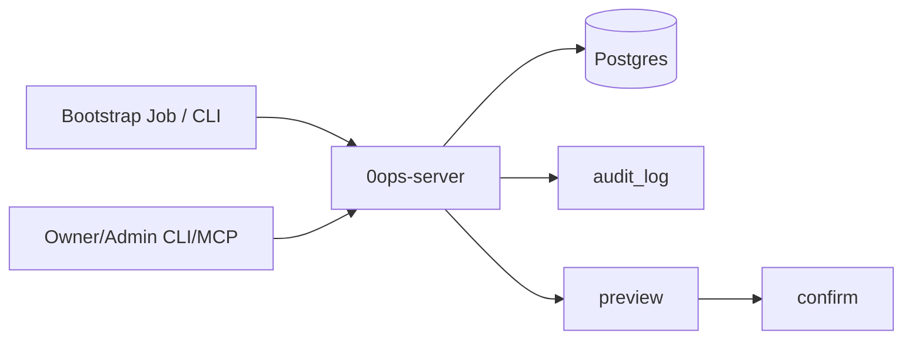

# Admin User Provisioning（bootstrap + 管理者邀請）

## 1. 問題與目標

目前系統沒有 production 可用的第一位管理者建立流程，也沒有管理者建立/邀請 team 成員的可操作機制。這會讓上線、交接與權限治理依賴手動 SQL，缺乏審計一致性與操作標準化。

本規格目標：

1. 提供一次性 bootstrap flow，安全建立第一位 owner。
2. 提供管理者邀請/移除成員流程（非開放註冊）。
3. 保持現有 team 邊界、RBAC、preview/confirm、error model 規範。

## 2. 範圍

### 2.1 包含

- production 一次性 bootstrap owner（one-shot）
- 成員管理：invite/list/remove
- 權限控管：`members:manage` scope + role gate
- 審計：`audit_log` 全流程留痕
- CLI、MCP、backend 三層 contract

### 2.2 不包含

- 開放註冊（self-service signup）
- 企業 SSO / SCIM
- 多租戶跨組織管理控制台

## 3. 方案比較（含建議）

### 方案 A（建議）：One-shot bootstrap + 邀請制成員管理

- bootstrap 僅能在「系統尚無 owner」時執行一次
- 後續只允許 owner/admin 執行 invite/remove
- 優點：風險最低、符合現有 RBAC、可快速落地
- 缺點：需要管理端流程（非完全自助）

### 方案 B：首次登入自動升級第一位使用者為 owner

- 第一個成功登入者自動成為 owner
- 優點：操作最少
- 缺點：安全風險高（搶先登入者控制權）、審計難以治理

### 方案 C：開放註冊 + 待審批入隊

- 任何人可註冊，再由管理者審批
- 優點：擴張性高
- 缺點：超出目前產品定位與安全成熟度，實作面過大

結論：採 **方案 A**。

## 4. 目標架構

- bootstrap 走單獨入口（one-shot），不給一般 user。
- invite/remove 屬 write action，必經 preview/confirm。
- 全部 team-scoped 請求維持 middleware 鏈與 404 anti-enumeration 規則。

## 5. API / CLI / MCP 設計摘要

### 5.1 Bootstrap（一次性）

- API：`POST /v1/admin/bootstrap-owner`
- CLI：`0ops admin bootstrap-owner --team-slug ... --team-name ... --github-login ...`
- 執行條件：`team_membership.role='owner'` 全系統為 0 才允許
- 效果：建立 user/team/membership(owner)（單一交易）
- 審計：寫入 `audit_log`，含 actor、subject、trace_id、reason

### 5.2 Members 管理

- API（team-scoped）：
  - `POST /v1/teams/{team_slug}/members:preview-invite`
  - `POST /v1/teams/{team_slug}/members:invite`
  - `GET /v1/teams/{team_slug}/members`
  - `POST /v1/teams/{team_slug}/members:preview-remove`
  - `POST /v1/teams/{team_slug}/members:remove`
- CLI：
  - `0ops members preview-invite --team ... --github-login|--email ... --role ...`
  - `0ops members invite --team ... --preview-id ...`
  - `0ops members list --team ...`
  - `0ops members preview-remove --team ... --user-id ...`
  - `0ops members remove --team ... --preview-id ...`
- MCP：
  - `invite_member_preview`, `invite_member`, `list_members`,
    `remove_member_preview`, `remove_member`

## 6. 安全與治理規則

1. bootstrap 僅能成功一次；第二次固定回衝突錯誤。
2. invite/remove 必須 `members:manage` 且 role 至少 `admin`。
3. 不允許跨 team 操作；保持 `404 team_not_found`。
4. 所有 write action 必經 preview/confirm，不可旁通。
5. audit 與 trace_id 必須覆蓋 bootstrap/invite/remove。

## 7. 測試與驗收

最低驗收：

1. bootstrap 首次成功、再次執行失敗（衝突）。
2. owner/admin 可 invite/remove；member/viewer 被拒。
3. cross-team 操作回 `404 team_not_found`。
4. CLI/MCP/Backend contract test 全綠。
5. `audit_log` 每次 write 都有對應記錄。

## 10. 實作狀態（2026-05-11）

- 已落地 migration：`migrations/00002_members_and_bootstrap.sql`
- 已上線 API：
  - `POST /v1/admin/bootstrap-owner`
  - `GET /v1/teams/{team_slug}/members`
  - `POST /v1/teams/{team_slug}/members:preview-invite`
  - `POST /v1/teams/{team_slug}/members:invite`
  - `POST /v1/teams/{team_slug}/members:preview-remove`
  - `POST /v1/teams/{team_slug}/members:remove`
- 已上線 CLI：`admin bootstrap-owner`、`members list/preview-invite/invite/preview-remove/remove`
- 已上線 MCP tools：`list_members`、`invite_member_preview`、`invite_member`、`remove_member_preview`、`remove_member`

## 8. Worktree 執行策略

- 分支：`feature/admin-user-bootstrap`
- worktree：`.worktrees/feature/admin-user-bootstrap`
- 範圍隔離：僅處理 `docs/0ops-plan.md` 與本 feature 規格、後續對應程式碼
- 完成後以 PR 合併，不污染既有 `main` 工作目錄

## 9. Milestone 建議

新增 `M1.5`（介於 M1 與 M2）：

- 主題：Identity bootstrap + team member provisioning
- 完成標準：
  - bootstrap owner one-shot 上線
  - members invite/list/remove 上線
  - `members:manage` scope + role gate 生效
  - preview/confirm + audit + contract test 全數通過
