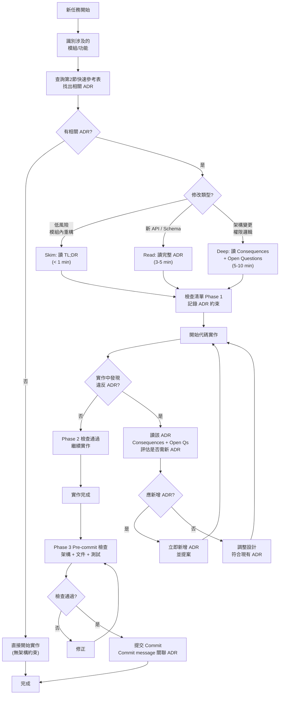

# ADR 讀取策略指南

## 0. 概述

本文件定義 ADR 讀取時機、深度與決策流程，確保 agent 與貢獻者在工作各階段執行最少必要的文件審查，同時維持架構決策的合規性。

ADR 為不可違反的架構決策。讀取策略分三層：

1. **Skim**（<1 分鐘）：TL;DR 只讀，快速認知決策邊界
2. **Read**（3-5 分鐘）：完整 ADR，理解決策理由與約束
3. **Deep**（5-10 分鐘）：Consequences + Open Questions，評估連鎖影響與預留變更空間

---

## 1. 讀取時機決策矩陣

依任務**類型**與**涉及範圍**判斷讀取深度。

| 任務類型 | 涉及範圍 | 讀取深度 | ADR 識別 | 預期時間 |
|---------|--------|--------|--------|---------|
| **功能新增** | 單模組內（無新 API） | **Skim** | 該模組所屬 ADR | <1 min |
| **功能新增** | 跨模組（新 API 端點） | **Read** | API 層 + 相關 ADR | 5 min |
| **功能新增** | 新 DTO / schema 字段 | **Read** | 0001（多租戶）+ 相關 ADR | 5 min |
| **Bug 修復** | 不涉及 API / schema | **Skim** | 相關模組 ADR | <1 min |
| **Bug 修復** | 涉及 preview/confirm 流程 | **Read** | 0002（冪等性） | 3 min |
| **重構** | 不涉及公開介面 | **Skim** | 無需讀 | 0 min |
| **重構** | 涉及 API 簽章 | **Deep** | 相關 ADR | 8 min |
| **架構變更** | 任何 | **Deep** | 所有涉及 ADR | 10+ min |
| **DB 遷移** | 任何 | **Read** | 0009（遷移策略） | 3 min |
| **權限邏輯** | 任何 | **Deep** | 0001（RBAC）+ 0008（Leader） | 10 min |
| **Webhook / 回調** | 任何 | **Read** | 0005（構建管道）+ 0002（冪等） | 5 min |
| **Deploy 工作流** | 任何 | **Read** | 0005 + 0008 + 0004 | 8 min |

### 讀取深度定義

#### Skim（TL;DR Only）

- 讀 ADR 的「## 0. TL;DR」段，通常 5-10 行
- 快速確認不違反已定案決策
- 適用：低風險修改、模組內部重構、簡單 bug 修復

**檢查點**：
- 修改涉及的模組/概念在 ADR 中有明確提及嗎？
- 修改是否違反 TL;DR 的前三項決策？
- 若無明確提及，改為 **Read**

#### Read（完整 ADR）

- 讀完整 ADR，含 Context、Decision、Consequences
- 理解決策背景與預期約束
- 適用：新 API、schema 變更、跨模組影響

**檢查點**：
- Context 中提及的問題是否仍然適用？
- Decision 中的選項取捨對我的修改有影響嗎？
- Consequences 中列舉的限制是否違反本次修改？
- 若 Consequences 超出預期，改為 **Deep**

#### Deep（Consequences + Open Questions）

- 讀完整 ADR，重點關注 Consequences、Revisit Triggers、Open Questions
- 評估長期演進影響與預留變更空間
- 適用：架構變更、重大重構、新增 ADR

**檢查點**：
- Consequences 中列舉的長期影響是否在本次修改中已考慮？
- Revisit Triggers 中有我的修改會觸發的條件嗎？
- Open Questions 是否暗示未來的不確定性會影響本次設計？
- 若需變更已決策項，應新增 ADR 而非直接修改

---

## 2. ADR 快速參考表

### 核心架構層

| ADR | 標題 | 核心決策 | 主要約束 | Revisit Triggers |
|-----|------|--------|--------|-----------------|
| **0001** | 多租戶 & RBAC | `team` 一階單位；role via `team_membership` | slug `(team_id, slug)` 複合唯一 | 租戶隔離失效、跨租戶操作需求 |
| **0002** | 冪等性 & 補償 | Preview → Confirm 兩階段；`preview_id` 兼冪等 key | 無單步寫入；preview 有 30 min TTL | 前端 UX 複雜度過高、批量操作場景 |
| **0008** | HA & 複寫 | v1 single replica；M5 升 2 replica + leader election | Leader 專屬 reconciler / polling；Follower 服務讀寫 API | 故障轉移頻繁、leader election 不穩定 |

### 工程選型層

| ADR | 標題 | 核心決策 | 主要約束 | Revisit Triggers |
|-----|------|--------|--------|-----------------|
| **0003** | MCP SDK | v1 用官方 `go-sdk`；僅 stdio transport | 無 HTTP/SSE；依賴 SDK 版本 | SDK 不支援必要功能、社群需求 HTTP |
| **0004** | K3s & Datastore | K3s single cluster；PostgreSQL via kine | 無多集群、無嵌入 etcd | 單集群瓶頸、跨地域需求 |
| **0005** | 構建管道 & 回調 | GitHub Actions + Cloud Native Buildpacks | v1.1 補 Dockerfile fallback；Paketo 版本鎖定 | 構建速度不可接受、平台相容性問題 |
| **0009** | 遷移 & 映像 | `pressly/goose`；minimal multi-stage image | 運行時僅 binary + migrations/ | 遷移耗時過長、image 大小超出預期 |
| **0010** | CLI 發佈 | `goreleaser` 預編；GitHub Release 發佈 | 支援 5 平台；`go install` 並行支援 | 跨平台相容性問題、包管理需求 |
| **0012** | Local file repo & dev build pipeline | `file://` 為第三類 scheme，dev only；LocalBuildDispatcher 共用 `Dispatcher` 介面 | production 必拒 file://（§3.1 已被 ADR-0013 supersede）；不新增 deploy_run state；callback HMAC 共用 | 引入 k3d / BYO Dockerfile / 非 GHA build pipeline |
| **0013** | Production File-Source Ingestion | `source` sum type；server 不解析 host path；upload + GHA workflow 變體 | production 必經 authenticated upload；ADR-0012 §3.1 已 supersede；CLI `--source` 是對外契約 | OCI artifact registry / self-hosted runner 網路拓撲 / 全面砍 GHA 依賴 |

### 可觀測性 & 安全層

| ADR | 標題 | 核心決策 | 主要約束 | Revisit Triggers |
|-----|------|--------|--------|-----------------|
| **0006** | 可觀測性基線 | Prometheus pull；label `{route, method, status, team_bucket}` | 無 cardinality 爆炸；team_bucket = hash(team_id) mod 64 | Metric 爆炸、查詢效能惡化 |
| **0007** | 客戶域名 TLS | Cloudflare 邊緣；Custom Hostname API | 無 origin TLS、無 DIY ACME | Cloudflare 停用、自帶 cert 需求 |

### 產品規劃層

| ADR | 標題 | 核心決策 | 主要約束 | Revisit Triggers |
|-----|------|--------|--------|-----------------|
| **0011** | 方案等級矩陣 | `free` / `starter` / `pro` / `team`；9 維能力矩陣 | free 為個人預設；team 為企業 | 市場競爭調整、付費轉化困難 |

---

## 3. Agent 工作流檢查清單

### Phase 1：任務初始化（代碼變更前）

在開始代碼修改 **之前**，執行以下檢查：

- **識別相關 ADR**
  - 列舉修改涉及的模組/功能
  - 查閱第 2 節快速參考表，找出對應 ADR
  - 多個 ADR 時按表中優先順序讀取

- **執行讀取**
  - 按第 1 節決策矩陣判斷讀取深度
  - Skim：讀 TL;DR；Read：讀完整 ADR；Deep：讀 Consequences + Open Questions
  - 記錄讀取時間與版本 SHA（若涉及 Deep）

- **記錄發現**
  - 列舉 ADR 中應強制執行的約束
  - 若發現現況與 ADR 偏差，標記為 `⚠️ Deviation`

### Phase 2：代碼變更（工作中）

邊實作邊驗證 ADR 合規性：

- **發現違反**
  - 若實作中發現違反 ADR，**立即停止**
  - 回頭讀該 ADR 的 Consequences + Open Questions
  - 評估是否應新增 ADR（提案變更決策）或調整設計

- **涉及新 API / Schema**
  - 同步更新 API 文件與 schema 註解
  - 確保文件與 ADR 內容同步

### Phase 3：Pre-commit 檢查

提交 **之前**，驗證完整性：

- **架構決策檢查**
  - [ ] 修改內容是否違反任何已定案 ADR（包括未明確讀取的）？
  - [ ] 若有衝突，是否應新增 ADR 或調整實作？
  - [ ] Commit message 是否有必要提及相關 ADR（e.g., `feat: add X (per ADR-0002, ADR-0008)`）？

- **文件同步檢查**
  - [ ] API 變更是否更新了公開文件？
  - [ ] Schema 變更是否更新了 migration 與 DTO 文件？
  - [ ] Workflow 變更是否更新了 `docs/0ops-plan.md` 或相關 ADR 的 Open Questions？

- **測試完整性**
  - [ ] 高風險變更（權限、preview/confirm、idempotency）是否有新測試？
  - [ ] 現有測試是否仍通過？

### Phase 4：Commit 時機

提交規則（參閱 `AGENTS.md` § Commits）：

- Commit 訊息應明確關聯相關 ADR（若有重要架構決策因素）
  - 範例：`feat: support custom hostname preview (per ADR-0007)`
  - 範例：`fix: enforce team scope in app queries (per ADR-0001)`

- 若變更影響多個 ADR，應在 PR 中補述決策理由

---

## 4. 工作流程圖：ADR 讀取決策樹

---

## 5. 常見情景與對應動作

### 情景 1：修改現有端點入參

**觸發**：在 API handler 中新增/修改 request DTO 字段

**檢查**：
1. Skim 0001（多租戶 DTO 約束）
2. Read 0002（preview/confirm 簽章）
3. Deep 相關 API 文件

**決策**：
- 若新字段涉及 `team_id` 或權限，必須 Deep 讀
- 若為非關鍵字段擴展，Skim 通常足夠

### 情景 2：優化 reconciler 邏輯

**觸發**：修改 leader 定期執行的背景任務

**檢查**：
1. Deep 0008（HA & 複寫）瞭解 leader 職責
2. Read 0006（可觀測性）確保 metric 標籤正確

**決策**：
- Leader 任務修改必須 Deep 讀 0008 Consequences
- 確認修改不會影響 follower 的讀寫 API 服務

### 情景 3：新增觀測指標

**觸發**：在代碼中新增 `prometheus.NewCounter()` 等指標

**檢查**：
1. Skim 0006（可觀測性基線）確認 label 名稱與值

**決策**：
- 必須確保 label cardinality 在 `{route, method, status, team_bucket}` 範圍內
- 若需超出範圍的 label，評估是否應新增 ADR

---

## 6. Revisit Triggers 早期預警

若發現以下跡象，應主動評估相關 ADR 是否需 revisit：

- **0001 (RBAC)**：發現跨租戶查詢需求、slug 衝突
- **0002 (冪等性)**：前端反饋 preview timeout、批量操作效能惡化
- **0008 (HA)**：故障轉移頻繁、leader election 失敗
- **0003 (MCP SDK)**：SDK 版本落後、功能缺失
- **0004 (K3s)**：集群瓶頸、跨地域需求
- **0006 (可觀測性)**：Prometheus metric 爆炸、查詢超時

發現任一跡象，應記錄在相應 ADR 的 Open Questions 段，供下一輪 ADR review 參考。

---

## 7. 更新本指南

本文件每當新增 ADR 時應同步更新：

- 新增 ADR 在第 2 節快速參考表
- 若涉及新決策類別，調整第 1 節矩陣
- 若新 ADR 改變現有工作流，更新第 4 節流程圖

所有更新應在 AGENTS.md 中交叉參考。
