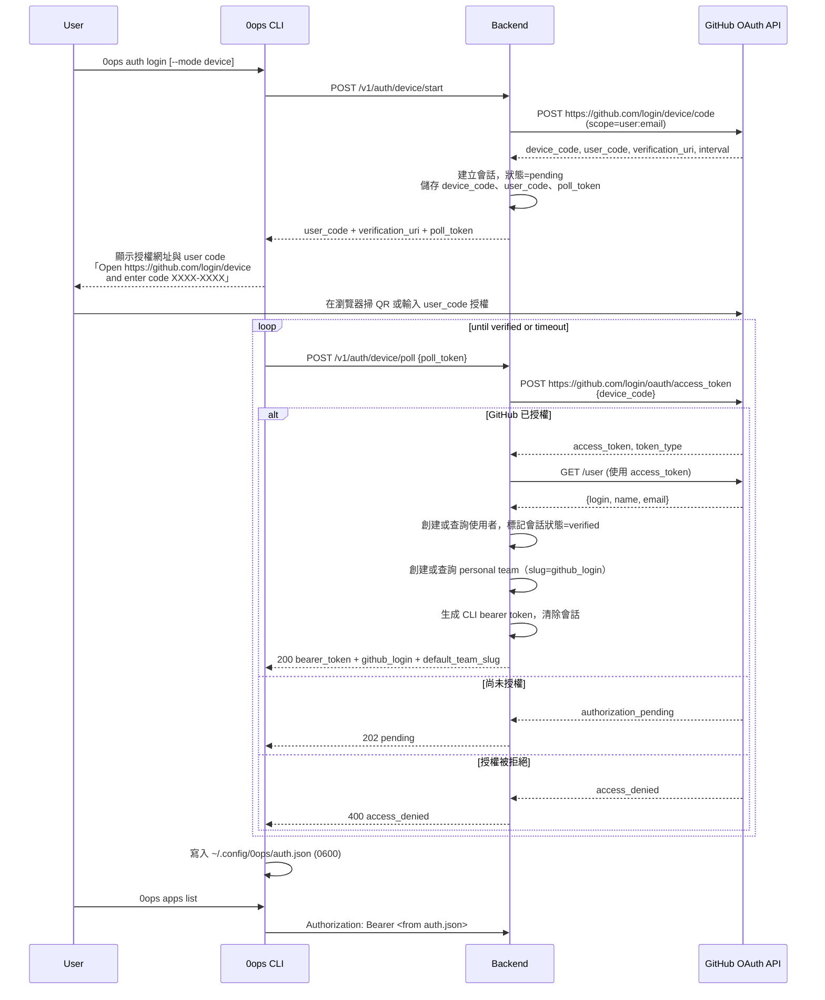

# Feature Spec：auth-login-flow

> **狀態**：draft  
> **來源**：`docs/features/auth-and-rbac/spec.md`（device flow 與 token cache 要求）  
> **適用範圍**：`0ops auth login` 首次登入、token 持久化、後續 CLI/MCP 免手動帶 token  
> **對應 Milestone**：M1（auth/device flow 前置能力）

## 1. 結論

- 使用者第一次執行 `0ops auth login`，選擇認證方式：
  - **Device Flow（預設）**：GitHub Device Flow（無需瀏覽器 redirect），適合 CLI
  - **OAuth2 Authorization Code Flow（可選）**：標準 OAuth2 + PKCE，適合 Web 應用與 IDE
- 完成 GitHub OAuth2 認證後，CLI 將 bearer token 寫入 `~/.config/0ops/auth.json`。
- 後續 CLI 指令與 MCP tool 預設從 `auth.json` 讀 token，不需再手動 `--token`。
- 只有下列情境才要求重新登入：token 過期、token 被撤銷、`auth.json` 不存在或損壞。

## 2. 需求範圍

### 2.1 包含

1. CLI 命令：`0ops auth login [--mode device|authcode]`、`0ops auth logout`、`0ops auth status`。
2. Backend auth API（GitHub 集成）：
   - **Device Flow 路徑**：
     - `POST /v1/auth/device/start` → 調用 GitHub Device Authorization API
     - `POST /v1/auth/device/poll` → 輪詢 GitHub 檢查授權狀態
   - **OAuth2 Authorization Code 路徑**：
     - `POST /v1/auth/oauth2/start` → 生成 PKCE challenge，返回 GitHub authorize URL
     - `GET /v1/auth/oauth2/callback` → 處理 GitHub redirect，交換 code for token
   - `POST /v1/auth/logout`
3. GitHub OAuth App 配置管理（Client ID/Secret 環境變數）。
4. 首次登入自動 personal team provisioning（`personal-{github_login}`）。
5. `auth.json` 格式、權限、host 對應規則。
6. CLI/MCP 的 token fallback 行為（flag/env > auth.json）。

### 2.2 不包含

1. GitHub App install/uninstall 流程。
2. PAT 建立與細部 lifecycle（另由 auth-and-rbac 主 spec 管理）。
3. Web UI 登入流程。
4. Advanced scope negotiation（未來功能）。

## 3. 使用者流程

### 3.1 Device Flow（預設，無需瀏覽器 redirect）



### 3.2 OAuth2 Authorization Code Flow（可選，適合 Web/IDE）

```mermaid
sequenceDiagram
    participant U as User
    participant C as 0ops CLI<br/>(local server)
    participant B as Backend
    participant G as GitHub OAuth

    U->>C: 0ops auth login --mode authcode
    C->>C: 生成 PKCE code_challenge
    C->>C: 啟動 localhost:xxxxx 監聽 callback
    C->>B: POST /v1/auth/oauth2/start<br/>{code_challenge, ...}
    B->>B: 建立會話，狀態=pending
    B-->>C: authorization_uri, state_token
    C-->>U: 瀏覽器打開 authorization_uri
    U->>G: 授予權限
    G->>B: redirect to /v1/auth/oauth2/callback<br/>{code, state}
    B->>G: POST /oauth/access_token<br/>{code, code_verifier}
    G-->>B: access_token, token_type
    B->>G: GET /user (使用 access_token)
    G-->>B: {login, name, email}
    B->>B: 創建或查詢使用者，生成 CLI bearer token
    B->>B: 標記會話狀態=verified
    B-->>G: redirect to localhost:xxxxx?bearer_token=...
    C<<--G: 接收 bearer_token
    C->>C: 寫入 ~/.config/0ops/auth.json (0600)
    C-->>U: 登入完成
```

## 4. API 規格

### 4.0 環境設定

**Backend 需要的環境變數**

```
# GitHub OAuth App 配置（從 https://github.com/settings/developers 取得）
GITHUB_OAUTH_CLIENT_ID=<your-client-id>
GITHUB_OAUTH_CLIENT_SECRET=<your-client-secret>

# 可選：覆寫 GitHub OAuth / API 基底 URL（測試或 GHES）
GITHUB_OAUTH_BASE_URL=https://github.com
GITHUB_API_BASE_URL=https://api.github.com

# 可選：用於 OAuth2 授權 URI 的 redirect_uri（預設為 http://localhost:8080）
GITHUB_OAUTH_REDIRECT_URI=http://localhost:8080

# CLI 本地伺服器 callback 監聽埠（預設 8888）
CLI_OAUTH_CALLBACK_PORT=8888
```

**GitHub OAuth App 註冊**

1. 訪問 https://github.com/settings/developers
2. 新增 OAuth App：
   - Authorization callback URL: `http://localhost:8080/v1/auth/oauth2/callback` (dev)
   - Device flow 不需要 redirect_uri（GitHub 自行決定）
3. 記錄 Client ID、Client Secret

### 4.1 `POST /v1/auth/device/start`

**請求**
```json
{
  "github_login": "owner"
}
```

**回應 (200 Created)**
```json
{
  "user_code": "XXXX-XXXX",
  "verification_uri": "https://github.com/login/device",
  "poll_token": "<opaque-token-for-poll>"
}
```

**流程（與 GitHub 整合版本）**
1. 後端向 GitHub 呼叫 `POST https://github.com/login/device/code`
   - 請求參數：`client_id`, `scope=user:email`
   - GitHub 回應：`device_code`, `user_code`, `verification_uri`, `interval`
2. 後端儲存會話：`{poll_token, device_code, user_code, github_login, status=pending, expires_at}`
3. 會話逾期時間：10 分鐘
4. 回應 `user_code` 與 GitHub 提供的 `verification_uri`

### 4.2 `POST /v1/auth/device/callback`

**請求**
```json
{
  "user_code": "XXXX-XXXX",
  "access_token": "<github-pat-or-oauth-token>"
}
```

**回應 (200 OK)**
```json
{
  "status": "verified"
}
```

**流程**
- 驗證 `user_code` 對應的會話是否存在且未逾期
- 若會話存在，標記為 `status=verified`，儲存 `access_token`
- 若會話不存在或已逾期，回 400 `invalid_user_code`

**說明**
- 此端點由 GitHub callback、CLI 模擬端點、或測試 fixture 呼叫
- M1 範圍：實作 endpoint，由外部決定呼叫方式

### 4.2 `POST /v1/auth/device/poll`

**請求**
```json
{
  "poll_token": "<from-device/start>"
}
```

**回應 (202 Accepted) - 仍待驗證**
```json
{
  "status": "pending"
}
```

**回應 (200 OK) - 驗證完成**
```json
{
  "bearer_token": "ops_xxxxx",
  "github_login": "owner",
  "default_team_slug": "owner",
  "issued_at": "2026-05-11T15:52:00Z",
  "expires_at": "0001-01-01T00:00:00Z"
}
```

**流程（與 GitHub 整合版本）**
1. 查詢 `poll_token` 對應的會話
2. 若會話不存在或已逾期，回 400 `invalid_poll_token`
3. 若會話 `status=pending`：
   - 後端向 GitHub 呼叫 `POST https://github.com/login/oauth/access_token`
     - 請求參數：`client_id`, `client_secret`, `device_code`, `grant_type=urn:ietf:params:oauth:grant-type:device_code`
     - 若 GitHub 回 `authorization_pending`，CLI 應繼續輪詢
     - 若 GitHub 回 `access_denied`，回 400 `access_denied`
     - 若 GitHub 回 `access_token`，則進行後續步驟
   - 若成功取得 access_token：
     - 後端用 access_token 呼叫 GitHub `GET /user` 取得 `{login, name, email}`
     - 查詢或建立 `user_account` （github_login）
     - 若使用者首次登入，建立 personal team（slug=github_login）
     - 生成 CLI bearer token
     - 標記會話 `status=verified`，清除會話
     - 回 200 with bearer_token
4. 若會話已 `status=verified`（快速重試情況）：
   - 回 200 with bearer_token

### 4.3 `POST /v1/auth/oauth2/start`（Authorization Code Flow）

**請求**
```json
{
  "code_challenge": "<base64url-encoded-sha256>"
}
```

**回應 (200 Created)**
```json
{
  "authorization_uri": "https://github.com/login/oauth/authorize?client_id=...&code_challenge=...&state=...",
  "state_token": "<opaque-state-for-callback-validation>"
}
```

**流程**
1. 驗證 `code_challenge` 格式（base64url SHA256）
2. 生成唯一 `state_token`
3. 建立會話：`{state_token, code_challenge, status=pending, expires_at}`
4. 構造 GitHub authorization URI（PKCE flow）
   - Parameters: `client_id`, `code_challenge`, `code_challenge_method=S256`, `scope=user:email`, `state`
5. 回應授權 URI，供 CLI 在瀏覽器中打開

### 4.4 `GET /v1/auth/oauth2/callback`

**Query 參數**
```
code=<authorization-code>
state=<state-token>
```

**回應 (302 Found)**
```
Location: http://localhost:8888/?bearer_token=ops_xxxxx&github_login=owner
```

**流程**
1. 驗證 `state` 與儲存的 `state_token` 是否相符（CSRF 保護）
2. 查詢對應會話，確認未逾期
3. 後端向 GitHub 呼叫 `POST https://github.com/login/oauth/access_token`
   - 請求參數：`client_id`, `client_secret`, `code`, `code_verifier`（PKCE）
   - GitHub 回應：`access_token`, `token_type`, `scope`
4. 後端用 access_token 呼叫 GitHub `GET /user` 取得用戶資訊
5. 查詢或建立 `user_account` （github_login）
6. 若使用者首次登入，建立 personal team
7. 生成 CLI bearer token
8. 標記會話 `status=verified`，清除會話
9. 重定向至 CLI callback URL，附帶 bearer_token 與 github_login
10. CLI 本地伺服器接收，寫入 auth.json

### 4.5 舊 `POST /v1/auth/device/callback`（已棄用，但為相容性保留）

此端點在 Device Flow 實現 GitHub 之前用於測試。GitHub 正式整合後，此端點應被移除或標記為廢棄。

### 4.6 `POST /v1/auth/logout`

**請求頭**
```
Authorization: Bearer <token>
```

**回應 (200 OK)**
```json
{
  "status": "ok"
}
```

**流程**
- 撤銷 bearer token
- 後續使用該 token 回 401


## 5. CLI 行為規格

### 5.1 `0ops auth login [--mode device|authcode]`

**Device Flow（預設，`--mode device`）**

- 預設 host 來源：`--host` > `OPS_HOST` > `http://127.0.0.1:8080`。
- `github_login` 來源：`--github-login` > `OPS_GITHUB_LOGIN` > `GITHUB_LOGIN` > `auth.json` 同 host 舊值。
- 呼叫 `POST /v1/auth/device/start`，拿到 user_code 與 poll_token
- 顯示 GitHub URL 與 user_code：`Open https://github.com/login/device and enter code XXXX-XXXX`
- 進入 poll loop：每秒呼叫 `POST /v1/auth/device/poll {poll_token}`
  - 回 202：繼續等待
  - 回 200：取得 bearer_token，寫入 auth.json，顯示「logged in as {github_login} on {host}」
  - 回 4xx/5xx：顯示錯誤退出
  - 10 分鐘逾時：顯示逾時錯誤退出
- 成功後寫入/覆蓋對應 host token entry：
  - `host`
  - `github_login`
  - `default_team_slug`
  - `bearer_token`
  - `issued_at`
  - `expires_at`（若 backend 有提供）
- 輸出不得印出完整 token；只可顯示遮罩（例如 `ops_xxx...`）。

**OAuth2 Authorization Code Flow（`--mode authcode`）**

- 預設 host 來源：`--host` > `OPS_HOST` > `http://127.0.0.1:8080`。
- CLI 啟動本地 HTTP 伺服器（預設 localhost:8888），監聽 callback。
- 呼叫 `POST /v1/auth/oauth2/start {code_challenge}`，拿到 authorization_uri 與 state_token。
  - CLI 生成 PKCE code_challenge（base64url SHA256）
  - CLI 儲存 code_verifier 供後續交換使用
- 在預設瀏覽器中打開 authorization_uri（GitHub 授權頁面）。
- 等待本地伺服器接收 callback（10 分鐘逾時）。
  - 接收：`?code=...&state=...&bearer_token=...&github_login=...`
  - 驗證 state 與 state_token 相符
  - 成功則寫入 auth.json，顯示「logged in as {github_login} on {host}」
  - 失敗則顯示錯誤，關閉伺服器

### 5.2 指令 token 解析順序

1. `--token`
2. `OPS_BEARER_TOKEN`
3. `auth.json` 對應 host 的 `bearer_token`

若 1/2/3 都無，回錯誤：
`no bearer token found. run 0ops auth login or pass --token`

### 5.3 `0ops auth logout`

- 呼叫 backend logout 端點撤銷目前 token。
- 刪除 `auth.json` 對應 host entry。

### 5.4 `0ops auth status`

- 顯示目前 host、github_login、default_team_slug、issued_at/expires_at。
- 不可顯示明文 token。

## 5. MCP 行為規格

- MCP server 僅讀 `auth.json`，不寫。
- 無 token 時 tool 回 `unauthorized`，訊息需明確引導：
  `請先在 terminal 執行 0ops auth login，並重啟 MCP host`。

## 6. 資料與安全規格

1. `~/.config/0ops/` 目錄權限 `0700`；`auth.json` 權限 `0600`。
2. backend DB 只存 token hash，不存明文 token。
3. 日誌、metrics、error details 不得含 token 明文。
4. cross-team 存取維持 `404 team_not_found` 規則。

## 7. 驗收標準

1. 首次 `0ops auth login` 成功後，不帶 `--token` 可直接執行：
   - `0ops teams list`
   - `0ops apps list --team <slug>`
2. 刪除 `auth.json` 後，CLI 會回「請先 login」錯誤。
3. `0ops auth logout` 後，舊 token 失效（backend 回 401）。
4. MCP 在有 `auth.json` 時可正常呼叫 read tools；無檔案時回引導錯誤。

## 8. 測試要求

1. CLI 單元測試：
   - login 寫入 auth.json
   - context fallback（flag/env/file）
   - logout 清除 entry
2. backend handler 測試：
   - device start/poll/logout
   - token revoke 後 401
3. contract test：
   - backend ↔ CLI login/logout/status DTO
   - backend ↔ MCP unauthorized message

## 9. 實作順序

1. 先補 `auth` CLI 命令（login/status/logout）與 authconfig 寫入邏輯。
2. 再補 backend `device` handlers 與 token issue/revoke。
3. 最後補 MCP unauthorized 引導訊息與 contract test。
