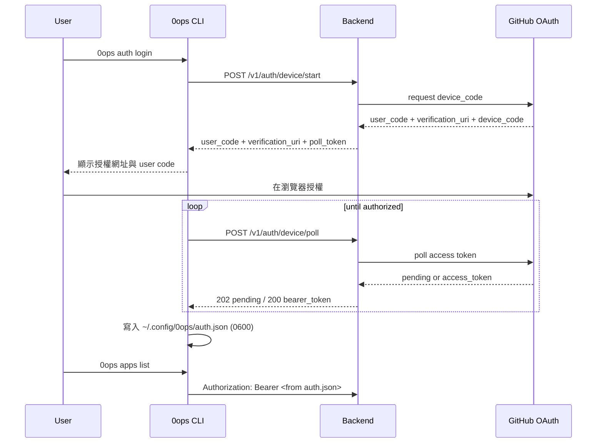

# Feature Spec：auth-login-flow

> **狀態**：draft  
> **來源**：`docs/features/auth-and-rbac/spec.md`（device flow 與 token cache 要求）  
> **適用範圍**：`0ops auth login` 首次登入、token 持久化、後續 CLI/MCP 免手動帶 token  
> **對應 Milestone**：M1（auth/device flow 前置能力）

## 1. 結論

- 使用者第一次執行 `0ops auth login`，完成 GitHub OAuth2 Device Flow 後，CLI 將 bearer token 寫入 `~/.config/0ops/auth.json`。
- 後續 CLI 指令與 MCP tool 預設從 `auth.json` 讀 token，不需再手動 `--token`。
- 只有下列情境才要求重新登入：token 過期、token 被撤銷、`auth.json` 不存在或損壞。

## 2. 需求範圍

### 2.1 包含

1. CLI 命令：`0ops auth login`、`0ops auth logout`、`0ops auth status`。
2. Backend auth API（Device Flow）：
   - `POST /v1/auth/device/start`
   - `POST /v1/auth/device/poll`
   - `POST /v1/auth/logout`
3. 首次登入自動 personal team provisioning（`personal-{github_login}`）。
4. `auth.json` 格式、權限、host 對應規則。
5. CLI/MCP 的 token fallback 行為（flag/env > auth.json）。

### 2.2 不包含

1. GitHub App install/uninstall 流程。
2. PAT 建立與細部 lifecycle（另由 auth-and-rbac 主 spec 管理）。
3. Web UI 登入流程。

## 3. 使用者流程

## 4. CLI 行為規格

### 4.1 `0ops auth login`

- 預設 host 來源：`--host` > `OPS_HOST` > `http://127.0.0.1:8080`。
- `github_login` 來源：`--github-login` > `OPS_GITHUB_LOGIN` > `GITHUB_LOGIN` > `auth.json` 同 host 舊值。
- 成功後寫入/覆蓋對應 host token entry：
  - `host`
  - `github_login`
  - `default_team_slug`
  - `bearer_token`
  - `issued_at`
  - `expires_at`（若 backend 有提供）
- 輸出不得印出完整 token；只可顯示遮罩（例如 `op_dev_xxx...`）。

### 4.2 指令 token 解析順序

1. `--token`
2. `OPS_BEARER_TOKEN`
3. `auth.json` 對應 host 的 `bearer_token`

若 1/2/3 都無，回錯誤：
`no bearer token found. run 0ops auth login or pass --token`

### 4.3 `0ops auth logout`

- 呼叫 backend logout 端點撤銷目前 token。
- 刪除 `auth.json` 對應 host entry。

### 4.4 `0ops auth status`

- 顯示目前 host、github_login、default_team_slug、issued_at/expires_at。
- 不可顯示明文 token。

## 5. MCP 行為規格

- MCP server 僅讀 `auth.json`，不寫。
- 無 token 時 tool 回 `unauthorized`，訊息需明確引導：
  `請先在 terminal 執行 0ops auth login，並重啟 MCP host`。

## 6. 資料與安全規格

1. `~/.config/0ops/` 目錄權限 `0700`；`auth.json` 權限 `0600`。
2. backend DB 只存 token hash，不存明文 token。
3. 日誌、metrics、error details 不得含 token 明文。
4. cross-team 存取維持 `404 team_not_found` 規則。

## 7. 驗收標準

1. 首次 `0ops auth login` 成功後，不帶 `--token` 可直接執行：
   - `0ops teams list`
   - `0ops apps list --team <slug>`
2. 刪除 `auth.json` 後，CLI 會回「請先 login」錯誤。
3. `0ops auth logout` 後，舊 token 失效（backend 回 401）。
4. MCP 在有 `auth.json` 時可正常呼叫 read tools；無檔案時回引導錯誤。

## 8. 測試要求

1. CLI 單元測試：
   - login 寫入 auth.json
   - context fallback（flag/env/file）
   - logout 清除 entry
2. backend handler 測試：
   - device start/poll/logout
   - token revoke 後 401
3. contract test：
   - backend ↔ CLI login/logout/status DTO
   - backend ↔ MCP unauthorized message

## 9. 實作順序

1. 先補 `auth` CLI 命令（login/status/logout）與 authconfig 寫入邏輯。
2. 再補 backend `device` handlers 與 token issue/revoke。
3. 最後補 MCP unauthorized 引導訊息與 contract test。
