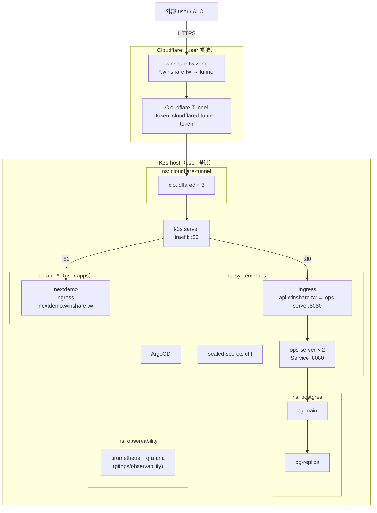
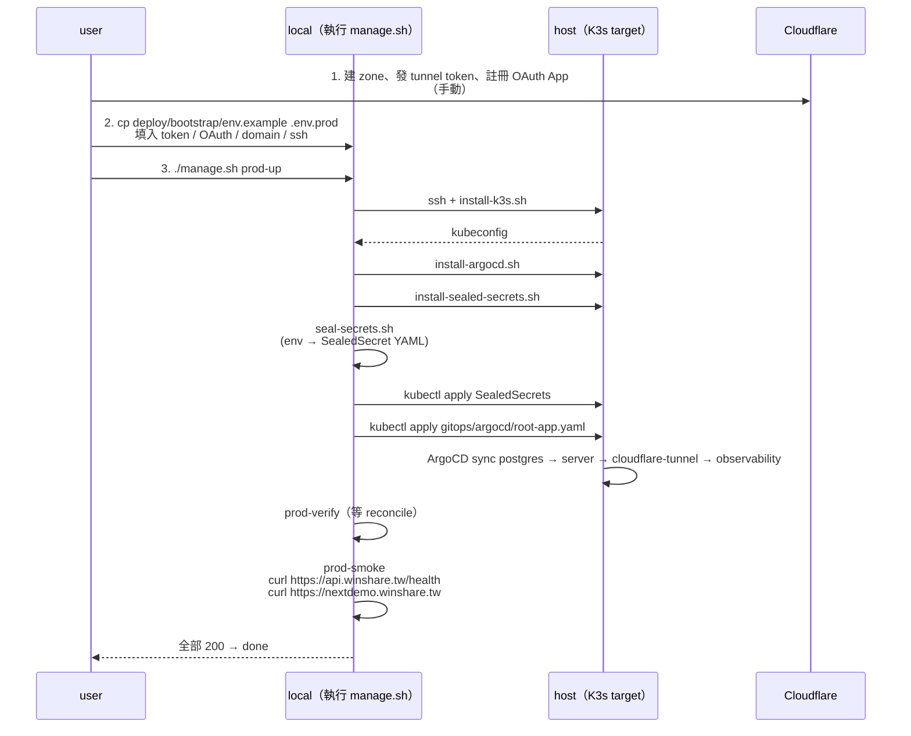

# Feature Spec：production-deployment

> **狀態**：draft
> **來源**：`tasks/todo.md` v1 收尾 #1「`nextdemo.winshare.tw` 真實外部 HTTP 200」
> **適用範圍**：把 0ops backend / Postgres / cloudflared / observability 從現有 chart
> 一鍵部署到單台 K3s host，使 `api.winshare.tw` 與 `*.winshare.tw` 對外可達。
> **對應 Milestone**：M2 驗收基準收尾 + M6 follow-up Q1

## 1. 結論

- 給定一台空 host（VPS / homelab，Linux + sshd）與一份 `deploy/bootstrap/.env`，
  一條指令 `./manage.sh prod-up` 完成：
  1. K3s 安裝
  2. ArgoCD + sealed-secrets controller 安裝
  3. Cloudflare Tunnel token、GitHub OAuth Client、DB password 以 SealedSecret 注入
  4. ArgoCD root app 拉起 postgres → server → cloudflare-tunnel → observability
  5. smoke 驗 `curl https://api.winshare.tw/health` 與 `curl https://nextdemo.winshare.tw`
     皆回 200
- 外部資源（Cloudflare zone、tunnel token、GitHub OAuth App、host）由 user 手動準備；
  其餘 100% 由 repo 內 script + chart 收斂，無 ad-hoc kubectl。
- 重跑冪等。任何步驟失敗 → 修 env 或 chart → 再次 `prod-up`，不留半成品。

## 2. 需求範圍

### 2.1 包含

1. `deploy/bootstrap/` 一鍵 bootstrap pack（`up.sh` / `down.sh` / `smoke.sh` / `env.example` / `README.md`）。
2. K3s / ArgoCD / sealed-secrets 子腳本（`install-k3s.sh` / `install-argocd.sh` /
   `install-sealed-secrets.sh` / `seal-secrets.sh`）。
3. `deploy/server` chart 補 Ingress + ConfigMap + Secret（`OPS_API_PUBLIC_URL` /
   GitHub OAuth Client / DB DSN）。
4. `deploy/gitops/argocd/` app-of-apps：`root-app.yaml` 管 postgres / server /
   cloudflare-tunnel / observability。
5. `manage.sh` 新增 `prod-up` / `prod-down` / `prod-verify` / `prod-smoke` 子命令。
6. `docs/runbooks/winshare-route-failure.md` § 2-5 補完具體指令（搭配本 PR 一起收）。
7. `tasks/e2e-create-app.sh` `E2E_MODE=production` 已存在；本 spec 提供其前置 production rollout。

### 2.2 不包含（YAGNI）

1. cert-manager：TLS 由 Cloudflare proxy 端終結，origin 走 HTTP；
   後續若要 origin TLS 走另一份 ADR。
2. 多 region / multi-cluster：v1 單 host。
3. Cloudflare zone / DNS / OAuth App 的自動申請：留人手動。
4. CDN cache rule、WAF tuning：留 Cloudflare dashboard 手動。
5. 外掛備援 host：HA postgres 已由 `deploy/postgres` 統包；backend 已 2 replica（M5.5）；
   單 host 死掉的災難復原仍走 ADR-0009 的 PITR 流程，不在本 spec 範圍。

## 3. 架構



### 3.1 邊界與假設

- K3s 自帶 traefik，cloudflared 直接打 traefik:80，不需另裝 ingress controller。
- 全部 chart 走 ArgoCD GitOps 管理；bootstrap script 只做「安裝 ArgoCD + apply root app +
  apply sealed secrets」，後續變更皆 push 到 `deploy/gitops/argocd/`。
- Secret 流：user 在 host 上跑 `seal-secrets.sh`，產出 `SealedSecret` YAML
  commit 到 repo / 直接 kubectl apply；明文 secret 不落 disk、不入 git。
- Image 來源：`ghcr.io/wusung/0ops-server:{tag}` 由 release workflow 產出，
  prod values 指定 tag；image pull 不走私有 registry credentials。
- DNS：user 在 Cloudflare zone 設定 `*.winshare.tw` CNAME 到 tunnel hostname，
  bootstrap script 不接 Cloudflare API。

## 4. 一鍵 bootstrap 流程



### 4.1 重跑冪等保證

- `install-k3s.sh`：偵測 `/usr/local/bin/k3s` 存在則跳過。
- `install-argocd.sh`：`kubectl apply` 本身冪等；版本升級走 `argocd-apps` annotation。
- `install-sealed-secrets.sh`：同上。
- `seal-secrets.sh`：每次重新 seal；output 覆寫。
- ArgoCD root app：`syncPolicy.automated.prune=true` 確保移除舊資源。

## 5. Bootstrap pack 細節

### 5.1 `deploy/bootstrap/env.example`

```bash
# === host ===
PROD_HOST=user@1.2.3.4
PROD_SSH_KEY=~/.ssh/id_ed25519
PROD_KUBECONFIG_LOCAL=~/.kube/0ops-prod

# === domain ===
PROD_BASE_DOMAIN=winshare.tw          # base zone
PROD_API_HOST=api.winshare.tw         # backend
PROD_DEMO_HOST=nextdemo.winshare.tw   # smoke target

# === Cloudflare Tunnel（從 Cloudflare zerotrust dashboard 拿）===
CF_TUNNEL_TOKEN=<base64-token>

# === GitHub OAuth App（production，從 https://github.com/settings/developers 註冊）===
GITHUB_OAUTH_CLIENT_ID=<client-id>
GITHUB_OAUTH_CLIENT_SECRET=<client-secret>
GITHUB_OAUTH_REDIRECT_URI=https://api.winshare.tw/v1/auth/oauth2/callback

# === image ===
OPS_IMAGE_TAG=v0.1.1                  # GitHub Release tag

# === Postgres ===
PG_SUPERUSER_PASSWORD=<random-strong>
PG_REPLICA_PASSWORD=<random-strong>

# === observability（可選）===
GRAFANA_ADMIN_PASSWORD=<random>
```

### 5.2 `deploy/bootstrap/up.sh` 主流程

```
1. 載 .env.prod
2. 驗 env：所有上述變數非空、URL 合法
3. install-k3s.sh   (ssh $PROD_HOST)
4. scp kubeconfig 回 local；KUBECONFIG=$PROD_KUBECONFIG_LOCAL
5. install-argocd.sh
6. install-sealed-secrets.sh
7. seal-secrets.sh  → tmp/sealed/*.yaml
8. kubectl apply -f tmp/sealed/
9. kubectl apply -f deploy/gitops/argocd/root-app.yaml
10. wait-for-sync ArgoCD root + children
11. smoke.sh
```

### 5.3 `deploy/bootstrap/smoke.sh`

```
- curl -sf https://$PROD_API_HOST/health → 200 (期 5min 內 ready)
- curl -sf https://$PROD_DEMO_HOST/      → 200 (若 demo 已 deploy)
- argocd app get root-app → Synced + Healthy
- argocd app get ops-server → Synced + Healthy
- kubectl -n system-0ops get pods → 全 Running
- 三項皆 PASS 才 exit 0
```

## 6. Server chart 擴充

`deploy/server/templates/` 新增：

1. `ingress.yaml` — host 來自 `Values.ingress.host`，class=traefik，path=`/`，
   render-time guard：未設 host 拒渲。
2. `configmap.yaml` — 注 `OPS_API_PUBLIC_URL`、`OPS_DOMAIN_BASE`、
   `OPS_GITOPS_REPO` 等非敏感配置。
3. `secret-env.yaml` — 不放明文，僅作為「期望 SealedSecret 對應 secret 名」的存在性 placeholder；
   `deployment.yaml` `envFrom.secretRef` 引用。實際 secret 由 sealed-secrets 在 cluster 內 unseal 產生。
4. `deployment.yaml` 補 `envFrom`：configmap + secret-env。

`values.yaml` 新增區塊：

```yaml
ingress:
  enabled: true
  className: traefik
  host: ""                     # render-time guard：production 必填
  path: /
  pathType: Prefix
config:
  publicURL: ""                # 同上
  domainBase: "winshare.tw"
  gitopsRepo: "git@github.com:wusung/0ops-gitops.git"
secretRef:
  name: ops-server-env        # SealedSecret 對應名
```

`chart_test.go` 加 case：
- ingress.host 空 → 拒渲
- envFrom 必含 configmap + secret-env
- ingress className 鎖 traefik

## 7. ArgoCD app-of-apps

`deploy/gitops/argocd/` 結構：

```
root-app.yaml                    # 入口；指向 deploy/gitops/argocd/apps/
apps/
  postgres.yaml                  # → deploy/postgres
  server.yaml                    # → deploy/server
  cloudflare-tunnel.yaml         # → deploy/chart/cloudflare-tunnel
  observability.yaml             # → deploy/gitops/observability (kustomize)
```

每個 child app：
- `repoURL: https://github.com/wusung/0ops.git`
- `path: <chart path>`
- `targetRevision: main`（後續可改 release tag）
- `destination.namespace: <ns>`
- `syncPolicy: automated + prune + selfHeal`

## 8. 驗收

1. `./manage.sh prod-up` 在空 host 上跑完，5 分鐘內 `prod-smoke` 全 PASS。
2. 殺 K3s host 之 backend pod，1 分鐘內 ArgoCD 自癒，外部 `curl` 不中斷 ≥ 1 個 sample。
3. `./manage.sh prod-down` 後重跑 `prod-up`，仍 PASS（冪等性）。
4. `tasks/e2e-create-app.sh` 走 `E2E_MODE=production`：create_app → callback →
   ArgoCD sync → ingress → curl `<slug>.winshare.tw` HTTP 200。
5. runbook `winshare-route-failure.md` § 2-5 指令在故障注入情境下可被機械式跟。

## 9. 測試要求

| 範圍 | 形式 |
|---|---|
| 新 Ingress / ConfigMap / Secret template | `chart_test.go` 補 case |
| Bootstrap script 參數驗證 | `tasks/bootstrap-up-test.sh`（bats 風格 / `set -e` smoke） |
| seal-secrets 轉換 | 對 sample env 跑 → 驗 output 為 valid SealedSecret YAML |
| ArgoCD root app 結構 | `tasks/lint-argocd-apps.sh`（驗 path / repoURL / 必填欄位） |
| Smoke | `deploy/bootstrap/smoke.sh` 本身可 `--dry-run` |

## 10. 風險與緩解

| 風險 | 緩解 |
|---|---|
| user 把明文 secret commit 入 repo | `seal-secrets.sh` 輸出走 `tmp/sealed/`，已加入 `.gitignore`；README 強調 |
| Cloudflare tunnel token 漏出 | tunnel token 僅以 SealedSecret 形式 commit；明文僅在 `.env.prod`，加入 `.gitignore` |
| K3s 升級破壞 traefik 行為 | image tag 在 install-k3s.sh 固定，升級走 ADR |
| ArgoCD 失控 prune 掉 postgres PVC | postgres chart `metadata.annotations.argocd.argoproj.io/sync-options=Prune=false` |
| 單 host 死掉 | 不在本 spec 範圍，走 ADR-0009 PITR；spec § 2.2 已聲明 |

## 11. 開放問題

1. backend image pull 是否走 private registry？v1 假設 `ghcr.io` public；
   未來收費版若改 private，需追加 `imagePullSecrets`。
2. winshare zone TLS mode 應為 `Full (strict)` 還是 `Flexible`？
   spec 假設 Full（cloudflared 端到 origin 走 HTTP，CF→cloudflared 走 mTLS）；
   待 ADR 補。
3. ArgoCD UI 是否對外暴露？v1 預設不暴露，admin 走 `argocd port-forward`。

## 12. 後續

- 收 #1 之後，`tasks/todo.md` v1 收尾僅剩 trace_id 全鏈路驗證；
- production GHA self-hosted runner（M6 Q1）走獨立 PR，不在本 spec 範圍但會
  consume 本 spec 提供的 `OPS_API_PUBLIC_URL` 與 OAuth callback。
