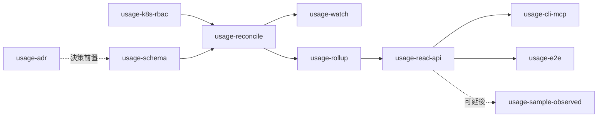

# Implementation Plan：resource-usage-metering

> **對應 spec**：`docs/features/resource-usage-metering/spec.md`（allocation 為主軌）
> **狀態**：F0–F9 完成，四路對抗審查後修正 10 項缺陷（分支 `feat/resource-usage-metering`）。
> MCP tool 與 watch 降級 alert 為 deferred，見下方後記。
> **前置**：backend ServiceAccount 需 pod `list` + `watch`（跨 namespace）。**主軌不需要 metrics-server**

## 0. 結論（先讀本段）

- 拆為 **8 個可獨立 review / 獨立 merge 的功能**。主鏈為 `F1 → F2 → F3 → F4 → F5 → F6`。
- **F1–F4 完成即已是一本正確的秒級帳本**；F5 起是讓它可讀、可長存、可驗證。
- **F7（metrics-server 輔軌）與主鏈完全解耦**，可無限期延後，不影響任何主軌數值。這是 allocation 模型相對採樣模型的另一個好處：少一個 runtime 依賴。
- 先做 **F3（relist-only）再做 F4（watch）**：relist 單獨即構成可用帳本（終止時間誤差 ≤ 5 min 且 under-bill），watch 是精度升級而非前置條件。這個順序讓第一個可 merge 的版本不必先打通 informer。
- 每個功能各跑一次 AGENTS.md 之 Mandatory Agent Loop。

## 1. 功能拆解與依賴

| ID | 功能 | 依賴 | 產出 |
|---|---|---|---|
| ✅ F0 | `usage-adr` | 無 | ADR-0018「runtime 計量以 allocation 為基準」：釘死分配 vs 用量之分野、under-bill 原則、時間戳來源；影響日後定價模型，屬架構決策（spec § 12 第 8 點） |
| ✅ F1 | `usage-k8s-rbac` | 無 | ClusterRole 增 pod `list`/`watch`；`security-hardening` 最小權限表同步；helmchart test 斷言 |
| ✅ F2 | `usage-schema` | 無 | `migrations/00020_usage_allocation.sql`：`usage_allocation_interval` + `usage_daily_rollup`；`db/usage.go` repository（全 query 帶 team_id） |
| ✅ F3 | `usage-reconcile` | F1, F2 | `k3s/pods.go` ListManagedPods；`usage/ledger.go`（開/關/last_seen 純邏輯）+ `usage/reconcile.go`（full relist 對帳）+ reconciler loop（5 min, leader-only）→ **此處即產出可用帳本** |
| ✅ F4 | `usage-watch` | F3 | `usage/watcher.go`（dynamic informer：ADD/UPDATE/DELETE → ledger op）+ 降級回 relist-only + `zeroops_usage_watch_degraded` |
| ✅ F5 | `usage-rollup` | F2, F3 | `usage/rollup.go`：`Integrate` 純函式（UTC 日界切割、閉式積分）+ 1 h loop（只處理封閉日）+ 13 個月 GC |
| ✅ F6 | `usage-read-api` | F5 | `usage_handlers.go` 兩條路由；DTO 含 `allocated_*` / `estimated_ratio` / `billing_disclaimer`；RBAC viewer |
| ✅ F7 | `usage-cli-mcp` | F6 | CLI `0ops usage` / `0ops apps usage`；MCP read-only `get_usage`；contract test |
| ✅ F8 | `usage-e2e` | F6 | `src/cmd/devtools/mock-k8s-pods`（list + watch，可腳本化 pod 起訖）、`compose.e2e.yaml` overlay、`tasks/e2e-usage-metering.sh`、`manage.sh e2e-usage-metering` |
| ✅ F9 | `usage-sample-observed`（輔軌，可延後） | F2, F6 | `usage/sampler.go` 寫 `usage_sample`；API 增 `used_*` 併列欄位；另需 `metrics.k8s.io` 讀權 |

## 2. 各功能實作要點

### F0 `usage-adr`
- MADR 9-section，接續編號 ADR-0018；同步更新 `docs/adr-reading-strategy.md` § 2 快速參考表。
- 必須釘死的三件事：① 計費基底為分配非利用率（含 RAM / GPU 之理由）② 時間戳一律取自 K8s 物件 ③ 不確定時 under-bill。
- 理由：這三點一旦日後被「順手改成用實際用量」就會產生對外收費爭議，屬不可違反之架構決策，不宜只活在 feature spec。

### F1 `usage-k8s-rbac`
- `deploy/chart/` backend ClusterRole 增 `apiGroups: [""], resources: ["pods"], verbs: ["list","watch"]`。
- 不需 `metrics.k8s.io`（留給 F9）。
- 驗證：`internal/helmchart/chart_test.go` 既有樣式斷言該 rule 存在。

### F2 `usage-schema`
- goose migration，含 `-- +goose Down`。
- `memory_byte_seconds numeric(30,0)`：128Gi × 86400 已逼近 bigint 邊緣，直接用 numeric。
- 部分索引 `where ended_at is null`：open 區間掃描是最熱路徑（每 5 min 全掃）。
- `db/usage.go` 手寫 SQL（與 `db/uploads.go` 同樣式）：`OpenInterval`（`on conflict (pod_uid) do nothing`）、`CloseInterval`（`where ended_at is null`）、`TouchLastSeen(batch)`、`ListOpenIntervals`、`ListIntervals(team, app, from, to)`、`UpsertDailyRollup`、`ListRollups`、`DeleteIntervalsBefore`。每個 query 必含 `team_id = $1`（`OpenInterval` 除外：寫入時 team_id 由 label 解析後帶入）。
- 驗證：DB 整合測試含跨 team 讀不到、冪等開關區間之斷言；`db/migrationlint` 通過。

### F3 `usage-reconcile`
- `k3s.Client.ListManagedPods(ctx)`：跨 namespace list，`labelSelector=app.0ops.io/managed-by=0ops`，走既有 `dynamic` client（GVR 常數置檔頭，同 `client.go` 慣例）。
- `ledger.go` 設計為**純函式**：輸入（cluster pod 快照、DB open 區間快照、now），輸出（要開的、要關的、要 touch 的）。DB 與 K8s 皆不在此層，測試不需任何 fake client。這是本 feature 最該被測穿的部分。
- 時間解析：`startTime`、`finishedAt`、`deletionTimestamp` 皆為 RFC3339；缺任一即依 § 4.1 順位往下取。
- 分配值解析用 `resource.Quantity`。
- reconciler wiring：`UsageReconcileScanner` + `UsageReconcileInterval`(5m)，沿用 `runner.go` 之 `spawn` + leader gate + panic recover。
- 驗證：spec § 11 之「停機補回起始時間」「停機期間結束者 under-bill」「Pending 不計費」「orphan pod」「重複事件冪等」五列，全部可在 ledger 純函式層覆蓋。

### F4 `usage-watch`
- `dynamic informer`（`dynamicinformer.NewFilteredDynamicSharedInformerFactory`），label selector 同 F3。
- handler 只做「轉譯為 ledger op 後寫 DB」，**不持有狀態**；狀態的唯一真相是 DB。這讓 watch 與 relist 可並行而不衝突（兩者寫入皆冪等）。
- DELETE 事件須處理 `DeletedFinalStateUnknown`（tombstone）：取不到最終物件時**不猜**，交給下一輪 relist 以 `last_seen_at` 關閉。
- 降級：informer 啟動失敗或 watch 中斷且重試失敗 → 設 `watch_degraded = 1`，relist loop 照常運作；持續 30 min 寫 `reconciliation_job{kind:'usage_watch_degraded'}`（以 kind 去重，避免洪水）。
- 驗證：「秒級精度」「時間戳來源（延遲送達之 DELETE）」「短命 pod」「滾動更新時間相接」四列。

### F5 `usage-rollup`
- `Integrate(intervals []Interval, day time.Time) Rollup` 純函式，先單元測試打穿再接 DB。**F6 的即時查詢必須呼叫同一函式**（spec § 14 規則 6）。
- loop 每小時掃缺口：對每 (team, app) 找最舊未 rollup 之封閉日，逐日全量重算 upsert。
- GC 併入同 loop：刪 13 個月前之 `usage_allocation_interval`（rollup 不刪）。
- `zeroops_usage_rollup_lag_days` 每 tick 更新。
- 驗證：「跨日切割」「冪等」「即時與 rollup 一致」三列。

### F6 `usage-read-api`
- handler closure factory 樣式，註冊於 `apps.go` 之 `NewRouterWithIngestion`。
- 封閉日讀 rollup、當日即時算，同一回應中合併；`estimated_ratio = estimated_seconds / pod_seconds`。
- `detail=interval` 逾 13 個月 → `apperror.CodeInvalidArgument`(400)，訊息含保留期上限。
- DTO 置 `internal/shared/dto`。
- 驗證：handler test（httptest）+ 跨 team 404 + DTO contract test。

### F7 `usage-cli-mcp`
- 單位換算只在呈現層。`estimated_ratio > 0` 之列標 `*` + footer 說明「含保守估計，實際用量不低於此值」。
- MCP tool description 須過 `mcp-tool-description-lint`。
- 驗證：CLI output contract test（AGENTS.md 強制）。

### F8 `usage-e2e`
- `mock-k8s-pods`：最小 HTTP server，實作 `GET /api/v1/pods`（list，支援 labelSelector）與 `?watch=true`（chunked event stream），pod 起訖由腳本經控制端點驅動。
- 腳本流程：起 stack → 建 app → 令 mock 在 T 開一個 pod、T+40s 關掉 → 等一輪 reconcile → 觸發 rollup（縮短 tick）→ `0ops apps usage` → 斷言 core-hours = `100m × 40s`（±1s）。
- **不得用 SQL 直接塞區間**（AGENTS.md e2e 硬規約）。
- 真 K3s 路徑列 deferred，記於 `release/`。

### F9 `usage-sample-observed`（輔軌）
- 依 spec § 8。ClusterRole 增 `metrics.k8s.io/pods` 讀權；`install-k3s.sh` 於安裝後檢查 metrics-server，缺席時警示而非失敗。
- API 以獨立 `observed` 區塊呈現（非 `used_*` 平鋪欄位）：allocation 與 consumption 是兩個問題，分開的結構讓它們不可能被誤加總。
- 讀取為 opt-in（`?include=observed` / `--observed`），未要求時不多跑查詢。
- 缺資料時該區塊 **absent**（`omitempty`），CLI 顯示 `-`：「未量測」與「量測為零」是不同主張。
- 視窗平均以樣本數加權——3 筆樣本的一天不得與 288 筆的一天等重。
- **驗收前提已驗**：`TestUsageMeteringSurvivesMissingMetricsServer` 證明 metrics API 完全不可用時，主軌數值仍精確。

## 3. 風險與對策

| 風險 | 對策 |
|---|---|
| backend 長時間停機 → 期間起訖之 pod 帳本失真 | 起始時間可由 relist 自 pod 物件補回（無損）；終止時間以 `last_seen_at` under-bill；`reconciled_missing` 比率上 metric，長期 > 5% 即告警 |
| watch 事件遺漏或 tombstone | 不猜，交 relist 收斂；兩者寫入皆冪等 |
| 分配值被誤改為讀 `app` 表 | spec § 14 規則 2 + code review 檢查點；`app-resource-spec` 落地後仍讀 pod spec，無須改動 |
| open 區間洩漏（pod 早已消失卻未關閉） | 部分索引 + 每輪 relist 全量對帳；`zeroops_usage_intervals_open` 與實際 pod 數比對可直接看出 |
| 資料量 | 每 pod 一列（非每 5 min 一列）。1000 apps × 每日 3 次 redeploy ≈ 3000 列/日 ≈ 110 萬列/年，遠小於採樣模型的 864 萬列/月 |
| 被誤當帳單依據 | F0 之 ADR + spec § 14 規則 10：DTO / CLI 強制帶註記 |
| in-place resize（K8s v1.33+）使分配值中途變動 | v1 不支援；spec Open issue 已記；schema 可容納（關舊開新） |

## 4. 不做的事（本 plan 範圍外）

- 不實作 `app-resource-spec`（per-app request/limit render）。本 feature 對其完全無依賴——分配值恆自 pod spec 讀取，該 spec 落地後帳本自動反映新值，無須改動任何一行
- 不建 billing 表、不接 Stripe、不做 overage 擋下
- 不部署 Prometheus / kube-state-metrics；主軌亦不部署 metrics-server
- 不動 `deploy_run.build_minutes`

## 5. 實作後記（2026-09-22）

F0–F8 完成，`go test ./...` 於 src/ 全綠（既有例外見下）。與本 plan 的偏離：

1. **e2e 採 composition test 而非 compose-stack**。dev compose 以 `DisableNamespaceIsolation=true` 啟動，沒有 cluster 可讀 pod；要在 stack 內跑就得把 K8s API 換成 mock 容器，等於用更多零件 mock 同一個邊界。改以 `src/internal/server/e2e_usage_metering_test.go` 驅動真 Postgres + 真 reconciler + 真 rollup + 真 router/RBAC，只替換 K8s API（AGENTS.md 允許的外部依賴）。入口仍為 `./manage.sh e2e-usage-metering`。
2. **實作順序為 F3 → F5 → F6 → F7 → F8 → F4**。watch 是精度升級而非前置條件，把它排在可讀可驗之後，讓每一步都有可驗收的產出。
3. **讀取權限沿用 `apps:read`**，未新增 scope。新增 scope 會牽動 token 簽發、CLI、文件三處；「看見自己 app 被配置多少」與「看見自己的 app」是同一層權限。
4. **輔軌 DTO 為獨立 `observed` 區塊**，非 plan 原寫的 `used_*` 平鋪欄位。平鋪會讓 allocation 與 consumption 並排在同一層，遲早被誰加總；分開的結構讓那件事寫不出來。
5. **F4 的 30 分鐘降級 job 未實作**，且實作時判定該規格設計不當：`reconciliation_job` 是補償工作佇列（有 handler、有重試、有終態），而 watch 降級沒有任何 handler 能「修好」它。正確出口是 gauge + alert rule，已於 spec § 4.4 改寫並標記 alert rule 為 deferred。
6. **metric 前綴為 `zeroops_`**，非 spec 文件的 `0ops_`——Prometheus metric 名不得以數字開頭，這是既有實作現況，未一併整理。

### 已知的既存缺陷（非本次引入，未修）

- `audit_log` 的月分區只建到 `2026_08`（migration `00007`），之後由 runtime rollover service 建立。在乾淨的測試 DB 上，`internal/server/db` 與 `services/audit/notify` 的 audit 相關測試會因缺當月分區而失敗；手動建立 `audit_log_2026_09` 後即全綠。與本 feature 無關。
- `src/sqlc.yaml` 的 `schema:` 清單與 `src/migrations/` 已漂移（列到 00003 且檔名寫成 `00003_tool_grants_and_auth_status.sql`，實際為 `00009_`）。本 feature 的 query 為手寫 SQL，未受影響。
- backend 以 in-cluster SA 連線，但 chart 只授予 lease Role；`EnsureNamespace` / `EnsureResourceQuota` 所需的 namespace 寫權未由 chart 授予。本次只新增唯讀的 pod `list`/`watch`，未擴大範圍去修補。

## 6. 對抗審查後記（2026-09-22）

依 CLAUDE.md 規定，完成後並行派出四路審查（正確性 / 規格偏離 / security / e2e）。
結果：**兩個 blocker、五個 major**，全部帶實測重現，已全數修正並補迴歸測試。
其中 rollup 重算缺陷由三路獨立指向同一處。

### 修正的缺陷

| # | 缺陷 | 方向 | 修法 |
|---|---|---|---|
| 1 | rollup 一旦寫入永不重算 | **超收**（open 區間 clamp 成滿日後不修正）＋**少計**（晚到區間不入帳） | migration 00020 加 `closed_at`；pending 判定改比對 `computed_at` vs `COALESCE(closed_at, created_at)` |
| 2 | crashloop pod 第一次崩潰即永久停帳 | 少計 | `terminationTime` 加 `status.phase ∈ {Succeeded, Failed}` 閘門 |
| 3 | 誤關後無法復原（pod_uid 為 PK） | 少計 | 新增 `ReopenGuessedInterval`：僅 `reconciled_missing` 可復原，權威關閉不可 |
| 4 | 封閉但未結算的日回報 0 | 誤導 | 讀取層對缺 rollup 的封閉日改為即時積分 |
| 5 | `TouchAllocationIntervals` 無 `GREATEST`，`last_seen_at` 會倒退 | 少計 | 補 `GREATEST`（`CloseAllocationInterval` 本來就有，兩者不一致） |
| 6 | native sidecar 不計入分配值 | 少計（最差可達一個數量級） | `initContainers` 中 `restartPolicy: Always` 者計入 |
| 7 | open-interval gauge 用計畫數而非實際生效數 | 指標漂移 | 改讀帳本 |
| 8 | e2e 每日 UTC 00:00–01:00 必 flake | CI | 測試時間錨定當日而非「一小時前」 |
| 9 | `detail=interval` 無筆數上限 | DoS | `MaxIntervalRows` 上限 + 超出回 400 |
| 10 | `($2 = '' OR app_id = $2::uuid)` 依賴 OR 短路（PostgreSQL 不保證） | 潛在 500 | 改傳真 NULL |

另：ClusterRole 改為 `usage.enabled` 可關（它是 backend 最寬的權限）。

### 審查推翻的指控（列出以免重複調查）

DST／跨月對 `generate_series` 安全（`AT TIME ZONE 'UTC'` 先轉 naive）；`LIMIT` + `ORDER BY day`
不會餓死任何 (team,app)；`numericToBigInt` 的 Exp 處理正確；`addDay` 的 map 不會讓 rollup 與 live
撞同一天；多租戶隔離、SQL 注入面、Prometheus label、e2e 憑證處理四項查無問題。

### 仍未處理（已知、已申報）

- MCP `get_usage`：無 MCP server 可掛載
- watch 降級 alert rule：屬 `slo-and-alerting` 範圍
- `ListPendingRollupDays` 的 `generate_series` 全表展開：已加 14 個月 WHERE 限制，
  但長期仍應改為 watermark；目前非瓶頸
- `usage_allocation_interval` 與 `audit_log` 同樣可被 app DB role 竄改（既有缺口，
  一旦開計費其嚴重度會自動升級）
