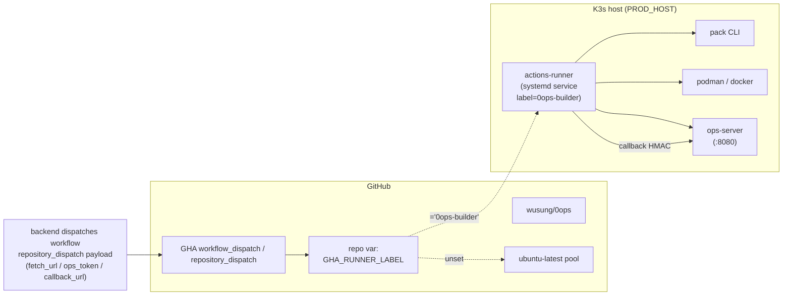

# Feature Spec：self-hosted-runner

> **狀態**：draft
> **來源**：M6 follow-up Q1（`docs/features/app-source-ingestion/spec.md` § 17）
> 「production CI workflow 對 self-hosted runner + `OPS_API_PUBLIC_URL` 對外可達驗證」。
> **適用範圍**：在 0ops 自身的 K3s host 上跑 GitHub Actions self-hosted runner，
> 讓 `deploy/workflows/*.yml` 對齊 self-hosted 模式，端到端驗 build → push GHCR →
> render gitops → callback HMAC 全鏈路。
> **對應 Milestone**：M6 Q1 收尾。

## 1. 結論

- 一台 K3s host 上跑一個 long-lived self-hosted runner，label = `0ops-builder`。
- Workflow 透過 `runs-on: ${{ vars.GHA_RUNNER_LABEL || 'ubuntu-latest' }}` 切換來源：
  user 不設變數 → 走 GitHub-hosted；設 `GHA_RUNNER_LABEL=0ops-builder` → 走 self-hosted。
  無破壞性改動，user 可隨時切回。
- `./manage.sh prod-install-runner` 一條指令：ssh 到 PROD_HOST → 安裝 `pack` /
  `podman`-or-`docker` / `zstd` → 註冊 runner → 設 systemd service 自動啟動。冪等。
- `./manage.sh prod-runner-status` 顯示 runner 線上狀態 + GitHub 端最近 N runs。
- `tasks/m6-q1-runner-validate.sh` 端到端驗證腳本：觸發一個 dummy dispatch →
  觀察 callback 表 → 報 PASS / FAIL。

## 2. 需求範圍

### 2.1 包含

| 元件 | 路徑 |
|---|---|
| spec | `docs/features/self-hosted-runner/spec.md`（本檔） |
| 安裝 script | `deploy/runner/install-runner.sh`（ssh-driven） |
| systemd template | `deploy/runner/0ops-runner.service.template` |
| runner config | `deploy/runner/values.yaml`（labels / 路徑 / version） |
| workflow opt-in | `deploy/workflows/{deploy-app-from-upload,deploy-app}.yml` `runs-on` |
| `manage.sh` | `prod-install-runner` / `prod-runner-status` |
| `.env.prod` | 新增 `GHA_RUNNER_LABEL` / `GHA_RUNNER_VERSION` / runner registration via `gh` CLI |
| validation | `tasks/m6-q1-runner-validate.sh` |
| runbook | `docs/runbooks/gha-self-hosted-runner.md` |

### 2.2 不包含（YAGNI）

1. actions-runner-controller (ARC) Helm chart：v1 單 host 用不到 autoscaling；
   多 runner / 多 host 時走 v2。
2. 短 TTL ephemeral runner（每次 job 啟動 / 銷毀）：v1 long-lived；
   若 trivy DB 緩存 / pack cache 表現變差再走 ephemeral。
3. multi-arch 建置（buildx）：v1 走 host 原生 arch。
4. workflow 內 cache 優化（actions/cache）：與 self-hosted local fs 相關，留 v1.1。
5. 自動撤銷 runner 註冊：v1 走 `gh actions-runner-controller` UI / `gh api` 手動。

## 3. 架構



### 3.1 邊界與假設

- Runner host 與 0ops backend **同一台 K3s host**；callback 走 ingress (api.<domain>) 的 public path，
  不走 cluster internal DNS（與 GitHub-hosted 路徑一致；M6 spec § 17 Q1 已釐清）。
- Backend 對 runner 而言為「外部 service」；驗證 trust boundary 與 GitHub-hosted 相同。
- runner 透過 ghcr.io 推 image（與 GitHub-hosted 行為相同）。
- 預設 1 個 runner；若 concurrency 不足，scale 走「同樣 install-runner.sh 帶不同 RUNNER_NAME 跑」。

## 4. Workflow opt-in 機制

### 4.1 改法

`deploy/workflows/{deploy-app-from-upload,deploy-app}.yml`：

```yaml
jobs:
  deploy:
    runs-on: ${{ vars.GHA_RUNNER_LABEL || 'ubuntu-latest' }}
```

`vars.X` 為 GitHub Actions repository variable，與 secrets 不同（不加密、不敏感）。
不設 → fallback 字面值 `ubuntu-latest`。

### 4.2 切換

```bash
# 切到 self-hosted
gh variable set GHA_RUNNER_LABEL --repo wusung/0ops --body 0ops-builder

# 切回 GitHub-hosted
gh variable delete GHA_RUNNER_LABEL --repo wusung/0ops
```

切換不需重新 deploy backend；下一次 workflow run 即生效。

### 4.3 Label 約定

| Label | 用途 |
|---|---|
| `0ops-builder` | 本 spec 用；意指「能跑 CNB build + Trivy + gitops push 的 runner」 |
| `linux` | 隱含；actions-runner 自帶 |
| `x64` / `arm64` | actions-runner 自帶 |

未來 multi-arch 走 `runs-on: [self-hosted, 0ops-builder, arm64]` 之矩陣。

## 5. install-runner.sh 細節

### 5.1 介面

```bash
./manage.sh prod-install-runner
# 或：
bash deploy/runner/install-runner.sh
```

### 5.2 行為

```
1. 讀 .env.prod 拿 PROD_HOST / PROD_SSH_KEY / GHA_REPO / GHA_RUNNER_LABEL /
   GHA_RUNNER_VERSION
2. local 走 gh api 拿 registration-token：
     gh api -X POST "/repos/${GHA_REPO}/actions/runners/registration-token"
   token TTL 1 hr，jit 取 jit 用
3. ssh 到 PROD_HOST 跑安裝：
   a. 建 user 'ghrunner' 與 /opt/0ops-runner 目錄（若不存在）
   b. 下載 actions-runner tar.gz（version 自 ${GHA_RUNNER_VERSION:-2.319.1}）
   c. 解壓 + ./config.sh --unattended --url ... --token ... --labels 0ops-builder
      --name "0ops-prod-1" --replace（冪等：name 已存在則覆寫）
   d. 裝 svc.sh as systemd unit；啟用 + start
   e. 裝 build 工具：
        - podman（Arch / Ubuntu 22.04 都自帶 podman 套件）
        - pack CLI（從 GitHub Release 拉 buildpacks/pack）
        - zstd
        - jq（多數預裝；缺則 apt/pacman install）
4. local 驗：gh api /repos/.../actions/runners | jq 找 0ops-prod-1 status=online
```

### 5.3 冪等

- runner 已 online → script 印「already registered」並更新 label 後 exit 0。
- pack / podman 已裝 → skip。
- systemd unit 已啟用 → skip。

### 5.4 安全

- registration-token 不入 git、不入 .env.prod（每次重新跑 install 都 fetch 新 token）。
- ghrunner user 不在 docker group（用 podman rootless 或 podman socket）；
  避免 runner job 取得 root。
- /opt/0ops-runner 限 ghrunner ownership 0700。

## 6. Validation script

### 6.1 介面

```bash
bash tasks/m6-q1-runner-validate.sh
```

### 6.2 行為

```
1. 驗 GHA_RUNNER_LABEL 已設（gh variable list）
2. 驗 runner online（gh api /repos/.../actions/runners）
3. 觸發一個 minimal dispatch：
   gh api -X POST /repos/.../dispatches \
     -f event_type=deploy-app-from-upload-smoke \
     -f client_payload='{ ... }'
   （payload 走 fake fetch_url 到 backend echo endpoint，或 skip 真實 build）
4. poll GHA run status；timeout 5 min
5. 驗 backend audit_log 收到對應 callback（trace_id 比對）
```

### 6.3 退出碼

- 0：runner online、workflow PASS、callback 收到、trace_id 對齊
- 1：runner offline / GHA_RUNNER_LABEL 未設
- 2：workflow run 失敗
- 3：callback 沒收到 / trace_id 不對

## 7. 驗收

1. 跑 `./manage.sh prod-install-runner` 在 PROD_HOST 上裝 runner，5 分鐘內 `online`。
2. `gh variable set GHA_RUNNER_LABEL --body 0ops-builder` 後，
   下次 `deploy-app-from-upload` workflow 自動走 self-hosted runner。
3. `tasks/m6-q1-runner-validate.sh` 全綠。
4. 刪掉 `GHA_RUNNER_LABEL` 變數後，workflow 自動回 fallback `ubuntu-latest`，無破壞。
5. runner 關機後重啟，systemd 自動 re-attach；workflow 不卡。

## 8. 不在本 spec 範圍

- self-host backend 之 `OPS_API_PUBLIC_URL`：屬 `docs/features/production-deployment/spec.md`。
- repo_url（v1.M5.6 dev-only）path：屬 `docs/features/app-source-ingestion/spec.md`。

## 9. 風險與緩解

| 風險 | 緩解 |
|---|---|
| Runner host 死掉，所有 job 卡住 | 走 fallback：刪 `GHA_RUNNER_LABEL` → 立即切回 ubuntu-latest |
| Runner 被惡意 PR 偷用（fork repo） | `deploy/workflows/*.yml` 為 `repository_dispatch`，需要 PAT，非 PR 觸發；不受影響 |
| Pack cache 撑爆 disk | install-runner.sh 設 cron `pack prune` 每週一次 |
| Registration token 漏出 | TTL 1 hr；script run 後 token 進 actions-runner config，不入 .env.prod |
