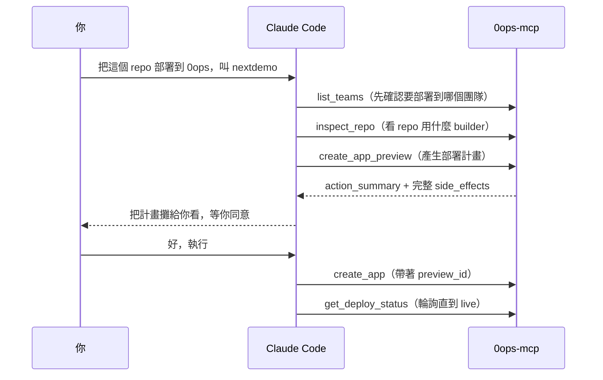

# [Day 2] 30 秒 demo：一句話讓 AI 把 repo 部署上線

- 原文連結: （未發佈）
- 發布時間:

---

前言

昨天 [Day 1] 筆者跟大家把場景講清楚了：AI coding agent 讓開發變快了十倍，但「出貨」這最後一哩還是斷的，而 0ops 想補的就是這一哩。理論講完，今天筆者想少講一點、多秀一點，直接帶大家看一個 30 秒的 demo——在 Claude Code 裡打一句話，看它怎麼把一個 GitHub repo 部署上線。這也是當初讓筆者第一次覺得「喔，原來出貨可以這樣」的那個瞬間。

今天大概會看到三件事：

- 在對話框打一句自然語言，agent 背後跑了哪些 MCP 工具；
- 那個「你點頭才執行」的 preview 長什麼樣子；
- 部署完拿到一個 `<你的 app>.jesontech.com` 的網址，狀態怎麼從 building 轉成 live。

先說明一下：這篇是「先看結果」。中間每一個工具、每一道確認閘，後面幾天筆者都會拆開細講——今天的目的，只是想讓大家先感受一次「意圖直接變結果」是什麼體驗。

想做的事

假設手上有一個 Next.js 的 repo，已經在本機跑得好好的，現在只想把它丟上線，讓別人能用網址打得開。傳統上要 build image、推 registry、寫 K8s manifest、設 ingress、掛網域、接 TLS——十幾步，全手工。筆者自己以前就是這樣一步步敲過來的。

今天換一種做法：打開已經接好 0ops 的 Claude Code（怎麼接，[Day 8] 會教），直接對它說話。

在 Claude Code 打一句話

```
把這個 repo 部署到 0ops，app 叫 nextdemo
```

就這樣。接下來的事情，agent 會自己接手，但它不會偷偷做完——它會停在關鍵的那一步等你點頭。第一次看到它停下來等筆者確認的時候，其實還蠻安心的。

agent 背後做了什麼

Claude Code 收到這句話後，會依序呼叫 0ops 的 MCP 工具。整條鏈大概是這樣：



筆者覺得重點在中間那一步 `create_app_preview`。這是一個**唯讀**的預覽工具，它不會真的建立任何東西，只會回一份「如果你批准，接下來會發生什麼」的清單。agent 拿到這份清單後，必須先把它秀給你看、取得你明確的同意，才能呼叫真正會寫入的 `create_app`。

這道閘是後端強制的，agent 繞不過去——這正是筆者敢放手讓 AI 執行部署的原因。（完整的 preview/confirm 機制，[Day 4] 會專篇細講。）

你會看到什麼：preview

agent 攤給你看的內容，核心是兩塊：`action_summary`（一句話講清楚它要做什麼）和 `side_effects`（完整列出會產生哪些副作用）。大致像這樣：

```
action_summary: 在團隊 my-team 建立新 app「nextdemo」，來源為 GitHub repo，
                首次部署會自動觸發。

side_effects:
  - 建立 app 記錄（slug=nextdemo）
  - 觸發首次 deploy run（build image → 推映像 → 產生 manifest → GitOps 上線）
  - 配發子網域 nextdemo.jesontech.com
  - 消耗團隊配額

需要你的同意才會執行。
```

讀完覺得沒問題，回一句「好，執行」，agent 才會呼叫 `create_app`。

你會看到什麼：結果

`create_app` 執行後，會回一批識別資訊，重點是這幾個：

```
app_id:         app_01hf...
deploy_run_id:  run_01hf...
subdomain_url:  https://nextdemo.jesontech.com
trace_id:       trace_01hf...
```

拿到 `subdomain_url` 不代表馬上就通——build 和上線需要一點時間。agent 會接著輪詢 `get_deploy_status`，你會看到狀態一路從 `building`（正在打包映像）走到 `syncing`（GitOps 正在同步到叢集），最後收斂成 `live`。筆者第一次看到這幾個狀態自己跑完，還特別去重新整理了幾次網頁確認：

```
status: building   →   status: syncing   →   status: live
```

等它變成 `live`，你打開 `https://nextdemo.jesontech.com`，站就在那了。

對比一下傳統流程

同樣一件事，如果純手工，大概要做這些：寫 Dockerfile、`docker build`、`docker push` 到 registry、寫 Deployment / Service / Ingress 三份 YAML、設定 TLS 憑證、在 DNS 加一筆記錄、`kubectl apply`、然後盯著 pod 看它有沒有起來。中間任何一步打錯，就得回頭 debug——這些筆者都親身踩過，所以特別有感。

剛剛那句「把這個 repo 部署到 0ops，叫 nextdemo」，把這十幾步全吸收掉了。你要做的只有一件事：讀 preview、點頭。

一個提醒：這不是魔法

這裡筆者想誠實講清楚，免得大家有錯誤期待：

- **0ops 後端本身不跑 LLM**。做決策、串工具的是你的 Claude Code；0ops 只是提供 agent 可以呼叫的部署能力。
- **首次能這樣跑，前面有前置**：你得先裝好 0ops、登入、把它接上 Claude Code，而且團隊要先裝好 GitHub App 才能拉 GitHub repo。這些 [Day 7] 到 [Day 10] 會一步步帶你做。
- **agent 不會替你跳過確認**。就算你說「不用問我，直接部署」，那道 preview/confirm 閘仍然在後端把關。

總結

今天筆者帶大家看了 0ops 的招牌體驗：一句自然語言，經過 `create_app_preview` → 你點頭 → `create_app` → 輪詢到 `live`，就把一個 repo 送上線，還配了一個網址。中間十幾步的部署儀式，被工具整個吸收掉了。

不過大家可能已經注意到，整個 demo 最關鍵的其實是那道「你點頭才執行」的閘。明天 [Day 3]，筆者想先退一步，跟大家聊聊「誰該用 0ops、什麼情況最適合」——先幫忙判斷這套工具是不是對症下藥，再往下深入。

Q&A

大家平常都用哪套 AI CLI 呢？如果它能一句話幫你部署，你最想先丟哪個 repo 上去？筆者自己也還在試不同的組合，歡迎留言跟我聊聊唷 : )

參考連結

- 0ops repo：`README.md`（產品定位與一行安裝）
- `docs/quickstart.md`（端到端 happy path）
- 事實源：`src/internal/cli/root.go`（CLI verb）、MCP 工具清單（24 個）
