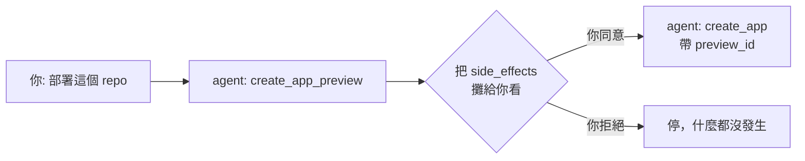

# [Day 4] agent 出貨的安全網 - preview/confirm 是什麼

- 原文連結: （未發佈）
- 發布時間:

---

前言

[Day 2] 的 demo 裡，agent 在真正建立 app 之前停下來、把計畫攤給你看、等你點頭；[Day 3] 我們判斷了誰該用 0ops。今天要回答一個核心問題：**你憑什麼敢讓一個 AI 去執行部署，甚至去刪除正式環境？**

答案就是這道安全網：preview/confirm（預覽/確認）。它是 0ops 讓你敢放手的關鍵設計，也是整個平台的招牌保證。

今天你會搞懂三件事：

- 為什麼所有「寫入操作」都被拆成兩階段；
- 你在 CLI 手動操作時，實際會被要求打什麼（尤其是刪除）；
- 你透過 AI agent 操作時，那道閘怎麼運作、為什麼 agent 繞不過。

核心概念：寫入操作一律兩階段

0ops 把操作分成兩類。**唯讀**的（列出 app、看狀態、看 log）可以隨便呼叫，反正不改東西。但**寫入**的——建立 app、重新部署、刪除、邀請/移除成員、安裝/移除 GitHub App——一律拆成兩階段：

1. **preview（預覽）**：先產生一份「如果你批准，會發生什麼」的計畫。這一步本身不改任何東西。
2. **confirm（確認）**：帶著預覽產生的識別碼，真正執行。

preview 回給你的東西，核心是兩塊：

- `action_summary`：一句話講清楚「這個操作要做什麼」（意圖）。
- `side_effects`：完整列出「會產生哪些副作用」（代價）。

你看意圖、看代價，覺得可以接受，才進到 confirm。這個設計的精神很簡單：**讓你在付出代價之前，先看清楚代價。**

CLI 體驗：create 的 [y/N]

當你手動用 CLI 建立或重新部署時，0ops 會先印出計畫摘要，然後停在一個 `[y/N]`：

```
$ 0ops apps create --slug nextdemo --source ./my-app
（印出計畫摘要：要建立什麼、會觸發什麼）
Proceed? [y/N]
```

打 `y` 才執行。如果你在腳本裡不想被卡住，可以加 `--yes` 跳過這個確認；或者加 `--dry-run` 只看 preview、完全不執行。這是最輕量的一道閘——因為建立 app 是可回復的（大不了刪掉重來）。

CLI 體驗：delete 的三道閘

刪除就不一樣了。刪 app 是**不可逆**的（預設連 PV 都清掉），所以 CLI 用了明顯更嚴格的儀式。你會依序遇到三關：

```
$ 0ops apps delete nextdemo
（先印出 side-effects 警告：會刪掉什麼、清掉哪些資料）

Type the app slug to confirm:            ← 第一關：完整打出 app slug（須完全相符）
> nextdemo

Type "DELETE nextdemo" to confirm:       ← 第二關：高風險再打 required_phrase
> DELETE nextdemo

Proceed? [y/N]                           ← 第三關：最後 y/N
> y
```

三關的用意：**要你「打得出全名」，證明你真的知道自己在刪哪個東西。**手滑打 `y` 可以很快，但要你一字不差打出 `DELETE nextdemo`，就逼你停下來看清楚。

如果你加 `--yes`，只會跳過**最後**那道 `[y/N]`；前面「打 slug」和「打 required_phrase」的關卡仍然在。這是刻意的——不可逆操作不給你一個旗標全部跳過。

AI 體驗：agent 必須先展示 side_effects

換成 AI agent 操作時，同一道閘換了個形式，但保證不變。

寫入類的 MCP 工具都是成對的：`create_app_preview` → `create_app`、`redeploy_preview` → `redeploy`、`delete_app_preview` → `delete_app`，以此類推。agent 的流程被規定成：

1. 先呼叫 `*_preview`，拿到 `action_summary` + 完整 `side_effects` + `expires_at`（預覽有效期限）。
2. **把這份 side_effects 完整展示給你，取得你明確的同意。**
3. 你同意後，才呼叫對應的 confirm 工具，並帶上 preview 產生的 `preview_id`。



這裡有幾個後端強制的細節，讓 agent「繞不過」：

- confirm 工具**必須**帶正確的 `preview_id`。後端會拒絕**過期**或**未核准**的 id——所以 agent 不能亂編一個 id 硬闖。
- 同一個 `preview_id` 的 confirm 是**冪等**的：重複呼叫不會重複執行，避免 agent 不小心部署兩次。

delete 的特別要求

刪除是風險最高的（標為 CRITICAL），MCP 這邊多加一道：agent 呼叫 `delete_app` 時，**必須傳一個 `confirmation_phrase`，而且它要等於 preview 回傳的 `required_phrase`**（例如 `DELETE nextdemo`）。傳錯或沒傳，後端直接回 `confirmation_phrase_mismatch`，拒絕執行。

換句話說，就算 agent 想「幫你省事」直接刪，它也得先拿到 preview、讀出正確的 phrase、原樣傳回去——而這個 phrase 就藏在那份它必須先展示給你看的 side_effects 裡。閘和展示是綁在一起的。

為什麼這道閘 agent 繞不過

關鍵在於：**這道閘是後端強制的，不是 agent 自律的。**

很多人以為「AI 安不安全」取決於 prompt 寫得好不好、agent 乖不乖。0ops 的設計不賭這個。就算你對 agent 說「不要問我，全部自動執行」，agent 頂多能連續呼叫 preview 和 confirm——但它**沒有一個「跳過 preview 直接寫入」的工具可以呼叫**。寫入能力只存在於 confirm 工具，而 confirm 工具一定要有效的 `preview_id` 才動。

這就是 [Day 3] 說的那個判斷原則的落地：**讓 AI 有權執行，但無權略過人的確認。**權力和確認被拆開，放在不同的地方，agent 只拿到前者。

總結

今天我們拆開了 0ops 的招牌安全網：所有寫入操作都是 preview（看意圖＋看代價）→ confirm（帶 preview_id 執行）兩階段。CLI 上，create 是一道 `[y/N]`，delete 是「打 slug → 打 `DELETE <slug>` → `[y/N]`」三道閘；AI 上，agent 必須先展示 side_effects 取得同意、confirm 必帶有效 preview_id、delete 還要傳對 `confirmation_phrase`。而這一切都是後端強制的，agent 繞不過。

理解了這道閘，你就理解了「為什麼敢放手」。明天 [Day 5]，我們把 0ops 放到擂台上，和 Vercel、Railway、自建 K8s 做一次從約束出發的選型對照。

Q&A

你覺得刪除要打三次確認會不會太囉唆？還是你反而希望正式環境的刪除門檻越高越好？歡迎留言 : )

參考連結

- 事實源：`src/internal/cli/root.go`（CLI 的 preview/confirm 行為）
- MCP 工具規格：兩階段寫入 7 對、`confirmation_phrase` / `required_phrase` 語意
- `docs/ironman-30day-notes/drafts/_source-pack.md`（preview/confirm UX）
