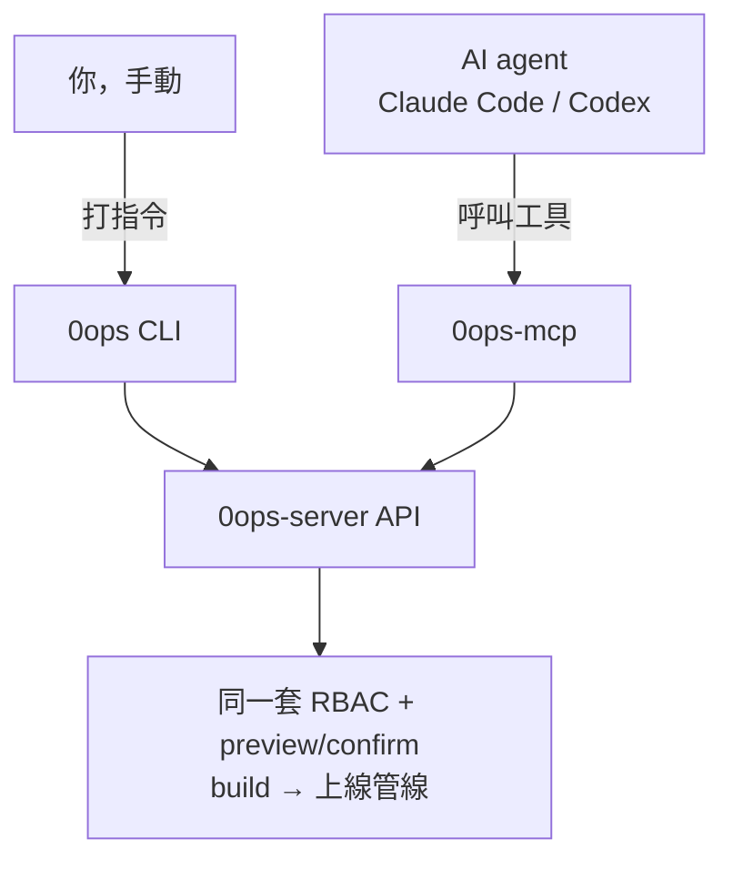

# [Day 6] 兩種用法 - CLI 與 MCP 雙入口

- 原文連結: （未發佈）
- 發布時間:

---

前言

過去幾天我們建立了整體認識：[Day 2] 看了 AI 一句話部署的 demo、[Day 4] 拆了 preview/confirm 安全網、[Day 5] 和其他平台做了選型對照。不知道你有沒有注意到，同一件「建立 app」的事，[Day 2] 是 agent 呼叫 MCP 工具做的，但 [Day 4]、[Day 5] 又出現了 `0ops apps create` 這種手打的指令。筆者剛開始也困惑過：到底哪個才是「正宗用法」？

後來才想通，答案是：**兩個都是，而且它們走的是同一條路。**今天就跟大家把 0ops「一套後端、兩個入口」的設計講清楚。

今天大概會一起搞懂三件事：

- CLI 和 MCP 這兩個入口分別是什麼、給誰用；
- 同一件事，兩種入口各怎麼做（對照示範）；
- 為什麼「換入口不換保證」——權限與 preview/confirm 兩條路完全一致。

雙入口模型

回顧 [Day 1] 講的三個組成：`0ops-server`（後端）、`0ops`（CLI）、`0ops-mcp`（MCP server）。筆者覺得關鍵在於後兩者的關係——它們是同一個後端的兩張臉：



- **`0ops` CLI**：給**人**用的。你在終端機手動下指令，適合探索、腳本化、CI。
- **`0ops-mcp`**：給 **AI agent** 用的 MCP server，走 stdio。Claude Code / Codex 這類 agent 透過它呼叫部署能力，適合對話式開發。

兩者都往下打到同一個 `0ops-server` API，經過**同一套權限、同一道 preview/confirm 閘**。入口不同，底層是同一個。

同一件事，兩種做法

筆者覺得最直觀的理解方式，是把幾個常見操作並排看。左邊是你手動打的 CLI，右邊是 agent 呼叫的 MCP 工具：

| 你想做的事 | CLI（人手動） | MCP（AI 呼叫） |
|---|---|---|
| 看有哪些團隊 | `0ops teams list` | `list_teams` |
| 列出 app | `0ops apps list` | `list_apps` |
| 查 app 詳情 | `0ops apps get <slug>` | `get_app` |
| 看部署狀態 | `0ops deploys status <slug>` | `get_deploy_status` |
| 看 log | `0ops deploys logs <slug>` | `tail_logs` |
| 建立 app | `0ops apps create ...` | `create_app_preview` → `create_app` |
| 重新部署 | `0ops deploys redeploy <slug>` | `redeploy_preview` → `redeploy` |
| 列出網域 | `0ops domains list <slug>` | `list_domains` |

（注意這裡用的都是真實 verb：查詳情是 `apps get` 不是 `apps show`；重新部署是 `deploys redeploy` 不是 `redeploy`；網域 CLI 只有 `list`。後面幾天實作時會反覆用到。）

看一個具體對照：列出 app。你在終端機打——

```
$ 0ops apps list
SLUG      NAME        REPO_URL                        STATUS
nextdemo  nextdemo    https://github.com/you/next...  live
apidemo   apidemo     https://github.com/you/api...   building
```

而在 Claude Code 裡，你只要問「我現在有哪些 app？」，agent 會替你呼叫 `list_apps`（帶上 team_slug），拿到同一份資料，再用自然語言回你。筆者常常兩邊交替著用。**同一份後端資料，兩種取用方式。**

寫入操作也一樣配對

讀取如此，寫入更是刻意對齊。CLI 的 `0ops apps create` 背後就是 preview + confirm 兩步（[Day 4] 講過的 `[y/N]`）；MCP 這邊則是明確的兩個工具 `create_app_preview` → `create_app`。形式不同，但「先看計畫、再執行」的兩階段結構是一模一樣的。

MCP 這側總共有 **24 個工具**：10 個唯讀，7 對兩階段寫入。每一對寫入工具（如 `delete_app_preview` → `delete_app`）都對應 CLI 上的一段確認流程。這種「一一對應」不是巧合，是設計目標——就是要讓兩個入口的行為可預期地一致。

什麼時候用哪個

既然兩條路等價，實務上怎麼選？看你當下在做什麼：

- **探索、腳本、CI → 用 CLI。** 你要串一個部署腳本、在 GitHub Actions 裡跑非互動部署、或單純想快速查個狀態，CLI 直接、可組合、輸出可以 `OPS_OUTPUT=json` 給程式吃。（[Day 18] 會講 token + CI。）
- **對話式開發 → 用 MCP。** 你正在 Claude Code 裡寫 code，寫完想順手上線，不想切終端機——直接對 agent 說一句話最順。

而且這不是二選一。你完全可以早上用 CLI 寫腳本、下午在 Claude Code 裡對話部署，兩邊操作的是同一批 app、同一個團隊、同一份狀態——筆者自己就是這樣混著用的。

關鍵：換入口不換保證

這是筆者覺得今天最重要的一點。因為兩個入口打到的是同一個後端，所以：

- **權限一致**：兩條路走同一套 RBAC。你在 CLI 沒權限做的事，agent 透過 MCP 也一樣做不到——角色（owner/admin/member/viewer）在後端判定，跟你從哪個入口進來無關。
- **安全網一致**：兩條路都經過同一道 preview/confirm。CLI 的 `[y/N]` 和 MCP 的「展示 side_effects → 帶 preview_id confirm」是同一道閘的兩種呈現，[Day 4] 已經拆過。

換句話說，**授權與保證不因入口而異。**你不會因為「改用 AI」就意外獲得更高權限，也不會因為「改用 AI」就繞過了確認。這正是 [Day 4] 那句原則的延伸：能力放在後端，入口只是門，門換了，門後的規矩沒換。

（補充一個規劃中的狀態：MCP 工具權限是 deny-by-default 的兩層設計，但 spec 中「invocation-time enforcement / token claim 編碼」部分仍標為 TODO，[Day 9] 會專篇講授權，並標清楚哪些已落地、哪些規劃中。）

總結

今天筆者跟大家把 0ops 的雙入口模型講清楚了：`0ops` CLI 給人手動用、`0ops-mcp` 給 AI agent 呼叫，兩者打到同一個後端。同一件事兩種做法（`apps list` vs `list_apps`），24 個 MCP 工具和 CLI 動作一一對應；探索/腳本用 CLI、對話式開發用 MCP。最關鍵的是——換入口不換保證，權限與 preview/confirm 兩條路完全一致。

到這裡，第一章的「觀念地基」就鋪完了：你知道 0ops 是什麼、誰該用、安全網怎麼運作、和別人怎麼比、有哪兩個入口。明天 [Day 7] 開始動真格——一條 curl 指令，三分鐘把 0ops 裝好、登入、接上你的 AI CLI。

Q&A

你猜自己之後會偏用哪個入口多一點呢，CLI 還是 MCP？還是看場合混著用？筆者自己也還在找最順手的節奏，歡迎留言聊聊你的工作流唷 : )

參考連結

- 事實源：`src/internal/cli/root.go`（CLI verb）、MCP 24 個工具清單
- 0ops repo：`README.md`（三組成：server / CLI / mcp）
- `docs/ironman-30day-notes/drafts/_source-pack.md`（CLI 指令表與 MCP 工具對照）
