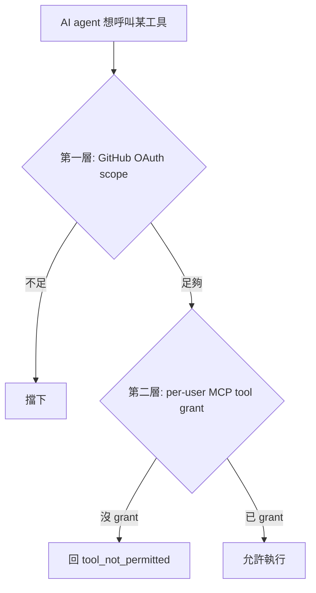

# [Day 9] 工具授權 - deny-by-default 與 grant

- 原文連結: （未發佈）
- 發布時間:

---

前言

昨天 [Day 8] 我們把 0ops 接上了 AI CLI，也驗證 agent 能呼叫 `list_teams`。但這裡留了一個沒回答的問題：接上之後，agent 到底能碰**哪些**工具？24 個全開嗎？

答案是——**預設什麼都不開**。今天要講的就是 0ops 的授權模型：deny-by-default，能力預設關閉，你要哪個工具、就逐項打開哪個。這呼應 Day 4「讓 AI 有權執行、但無權略過人」的精神，只是這次管的是「有沒有權執行」這件事本身。

今天三件事：

1. 搞懂兩層權限——GitHub OAuth scope 加上 per-user 的 MCP tool grant；
2. 看未授權時 agent 會撞到什麼（`tool_not_permitted`），以及登入時怎麼授權；
3. 事後怎麼用 `0ops auth grant` / `revoke` 調整。

過程中我會誠實標出：這套模型裡有一部分（token claim 編碼、invocation-time enforcement）在 spec 裡還是 TODO，屬規劃中，不能當成已經完全落地。

兩層權限：OAuth scope + tool grant

0ops 的授權其實疊了兩層，兩層都得過，agent 才碰得到某個能力：



- **第一層，GitHub OAuth scope**：你登入 0ops 時透過 GitHub 授權，決定了這個身分在 GitHub 側能做的事的粗粒度範圍。
- **第二層，per-user MCP tool grant**：這是 0ops 自己的細粒度控制——就算 OAuth scope 夠，你還是得**逐個工具**授權給自己的 agent 用。沒授權的工具，agent 呼叫時直接被擋。

deny-by-default 的意思就是：第二層預設是空的。你剛接好 0ops，agent 手上其實一個寫入工具都還沒被授權。要它能建 app，你得先把對應的工具開給它。

未授權會怎樣：tool_not_permitted

假設 agent 試著呼叫一個你還沒授權的工具，它拿到的不是「悄悄成功」，而是一個明確的拒絕碼：

```text
（agent 呼叫 create_app_preview）
error: tool_not_permitted
This tool has not been granted for your user. Grant it with:
    0ops auth grant create_app_preview
```

`tool_not_permitted` 就是 deny-by-default 的具體長相。它不會讓 agent 繞過，也不會半途才失敗——它在你沒開權限時就直接說「這個工具沒授權」，並告訴你怎麼開。

授權的時機有兩個。第一個是**登入時**：0ops 登入流程可以用互動選單讓你挑要授權哪些工具，或用 `--grants=...` 一次帶進來。第二個是**事後隨時調整**，也就是下面的 grant / revoke。

事後調整：grant 與 revoke

登入之後想加減工具，用 `0ops auth grant` 和 `0ops auth revoke`，一次一個工具：

```sh
# 把某個工具授權給你的 agent 使用
$ 0ops auth grant create_app_preview
Granted: create_app_preview

# 收回授權
$ 0ops auth revoke create_app_preview
Revoked: create_app_preview
```

實務上的節奏會是：你想讓 agent 幫你部署，就把 `create_app_preview`（還有它的 confirm 對手 `create_app`）grant 起來；某段時間不希望 agent 能刪 app，就把 `delete_app_preview` / `delete_app` revoke 掉。最小權限的操作方式，就是「預設全關，用到才開，用完可收」。

搭配 Day 8 的驗證習慣：grant 完某個工具後，回 AI CLI 叫 agent 呼叫看看，本來回 `tool_not_permitted` 的工具現在應該能正常走 preview 流程了。

規劃中的部分：先講清楚狀態

這裡必須誠實交代——授權模型不是每一塊都已經完全落地。spec 裡標了兩件事仍是 TODO：

- **token claim 編碼**：把 grant 過的工具清單編碼進 token claim 這件事，還沒完全實作；
- **invocation-time enforcement**：在「工具真正被呼叫的那一刻」由後端強制檢查授權，這層 enforcement 在 spec 裡標為 TODO。

意思是：deny-by-default 的**模型與 grant / revoke 介面已經在**，你現在就能用 `0ops auth grant` / `revoke` 管理授權；但「呼叫當下由後端強制擋下」這一段的完整 enforcement 還在規劃中，不能宣稱它已經像 preview/confirm 那樣是「後端硬性強制、agent 完全繞不過」。這條界線要分清楚，才不會對安全性有過度期待。

對照一下 Day 4 講的 preview/confirm：那道閘是**後端強制、已落地**的招牌保證；而今天講的 tool grant，介面已落地、invocation-time 的強制執行還在路上。兩者都屬「約束 agent」的機制，但成熟度不同。

總結

今天我們看了 0ops 的授權模型：兩層權限（GitHub OAuth scope + per-user MCP tool grant）、deny-by-default（預設全關）、未授權回 `tool_not_permitted`、登入時用選單或 `--grants` 授權、事後用 `0ops auth grant / revoke <tool>` 逐項調整。同時標清楚：grant / revoke 介面已可用，但 token claim 編碼與 invocation-time enforcement 在 spec 中仍是 TODO，屬規劃中。原則是——給 agent 的能力預設關閉，逐項打開，最小權限。

第一章「介紹與環境架設」到這裡告一段落：你已經裝好 0ops、接上 AI CLI、也懂了怎麼控制 agent 的權限。明天 [Day 10] 進入第二章，我們正式動手部署第一個 app——從一個 GitHub repo 一路到上線。

Q&A

你會傾向一次把常用工具都 grant 起來，還是每次用到才開？對 agent 授權的粒度你有什麼想法，歡迎留言聊聊 : )

參考連結

- 0ops repo：`src/internal/cli/root.go`（`auth grant` / `auth revoke` verb）
- 0ops spec：MCP tool 權限模型（deny-by-default；token claim 編碼 / invocation-time enforcement 標為 TODO）
- 0ops repo：`0ops-mcp`（未授權回 `tool_not_permitted`）
