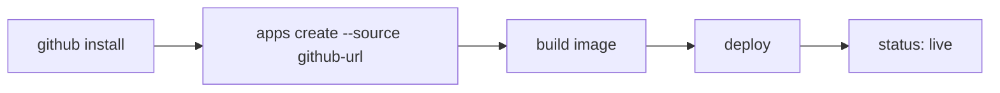

# [Day 10] 部署第一個 app - 從 GitHub repo 到上線

- 原文連結: （未發佈）
- 發布時間:

---

前言

第一章我們把地基打好了：裝 0ops、登入（Day 7）、接上 AI CLI（Day 8）、搞懂工具授權（Day 9）。今天進入第二章第一篇，也是整個系列最關鍵的一步——**真的把一個 app 部署上線**。

我們走最經典的路徑：從一個 GitHub repo 開始。這條路要先讓 0ops 有權讀你的 repo（裝 GitHub App），再建立 app、讓它 build 並部署，最後查結果確認上線。今天三件事：

1. 裝 GitHub App：`0ops teams github install`，走一遍 preview → confirm → 瀏覽器授權 → 輪詢；
2. 建 app：`0ops apps create --slug nextdemo --source <github-url>`；
3. 查結果：`0ops apps get nextdemo`，看 status、image_ref、subdomain_url。

先讓 0ops 讀得到你的 repo：裝 GitHub App

0ops 要能從你的 GitHub repo 拉原始碼、build 成 image，得先在你的 GitHub 帳號或組織上安裝 0ops 的 GitHub App。指令是：

```sh
$ 0ops teams github install
```

這是一個寫入操作，所以它照 Day 4 講的 preview/confirm 走。你會先看到一段計畫摘要，確認後（`[y/N]`）它給你一個授權用的 URL，你去瀏覽器完成 GitHub 授權，CLI 這邊則開始輪詢、等安裝完成：

```text
$ 0ops teams github install
Plan: install the 0ops GitHub App for team "acme".
Proceed? [y/N] y

Open this URL in your browser to authorize:
    https://github.com/apps/0ops/installations/new?...

Waiting for installation to complete...
Installed. GitHub App is now active for team "acme".
```

裝好之後可以隨時用 `0ops teams github status` 確認狀態。這個 GitHub App 之後還有一個大用途——push 到 repo 自動觸發 redeploy，那是 Day 14 和 Day 21 的主題，今天先讓它把「讀 repo」這件事撐起來就好。

建立你的第一個 app

repo 讀得到了，來建 app。指令是 `0ops apps create`，最關鍵的兩個旗標是 `--slug`（app 的短名，必填）和 `--source`（原始碼來源）：

```sh
$ 0ops apps create --slug nextdemo --source https://github.com/acme/nextdemo
```

`--source` 可以是三種東西：一個 GitHub URL（今天用這個）、一個本機路徑（明天 Day 11 講）、或 `upload://<id>`。其他常用旗標：`--ref`（要部署的分支，預設 `main`）、`--builder`（指定 builder）、`--yes`（跳過確認）、`--dry-run`（只 preview 不真的建）。

因為建 app 也是寫入操作，同樣先給你 preview 再執行。確認後輸出大概長這樣：

```text
$ 0ops apps create --slug nextdemo --source https://github.com/acme/nextdemo
Plan: create app "nextdemo" from https://github.com/acme/nextdemo (ref: main)
Proceed? [y/N] y

app_id:         app_01H...
app_slug:       nextdemo
deploy_run_id:  run_01H...
trace_id:       trace_01H...
subdomain_url:  https://nextdemo.jesontech.com
initial_deploy: started
```

幾個欄位值得記住：`subdomain_url` 是你 app 上線後的預設網址（`<slug>.jesontech.com`）；`deploy_run_id` 是這次部署的執行 ID；`trace_id` 之後排錯、查稽核時可以拿來串整條軌跡。`initial_deploy: started` 代表第一次部署已經在跑了——但「started」不等於「live」，得等 build 和部署完成。

查結果：從 building 到 live

用 `0ops apps get <slug>`（注意是 **get**，不是 show）查 app 現況：

```sh
$ 0ops apps get nextdemo
id:                   app_01H...
team_id:              team_01H...
slug:                 nextdemo
name:                 nextdemo
repo_url:             https://github.com/acme/nextdemo
repo_default_branch:  main
image_ref:            (pending)
builder:              auto
status:               building
created_at:           2026-07-06T09:12:03Z
updated_at:           2026-07-06T09:12:20Z
```

剛建好時 `status` 通常是 `building`，`image_ref` 還是 pending。等 build 完、image 推上去、部署收斂之後再查一次，`status` 會變 `live`、`image_ref` 也會填上實際的 image：

```sh
$ 0ops apps get nextdemo
slug:       nextdemo
image_ref:  ghcr.io/acme/nextdemo@sha256:...
status:     live
subdomain_url: https://nextdemo.jesontech.com
```

看到 `live`，代表 app 真的上線了，打開 `subdomain_url` 就能訪問。如果它卡在 `building` 或 `syncing` 好一陣子先別慌——reconciler 會自己收斂，這類卡住的排查是 Day 23 的主題。查即時部署狀態與 log（`0ops deploys status` / `0ops deploys logs`）則是 Day 13 會細講。

一條最短路徑的心智圖

把今天做的事串起來，就是這條 happy path：



先安裝 GitHub App 讓 0ops 讀得到 repo，再 `apps create` 觸發 build 與部署，最後 `apps get` 看到 `live`。這是整個 0ops 使用體驗的骨幹——後面所有進階功能（自訂網域、團隊、自動部署）都是掛在這條主線上的分支。今天的重點就是：**先把最短的一條路跑通，再談進階選項。**

總結

今天我們從一個 GitHub repo 走完了完整的部署：`0ops teams github install` 讓 0ops 讀得到 repo（preview → confirm → 瀏覽器授權 → 輪詢），`0ops apps create --slug nextdemo --source <github-url>` 建立並觸發部署，`0ops apps get nextdemo` 確認 `status` 收斂為 `live`、拿到 `subdomain_url`。這是你在 0ops 上的第一個上線 app。

但不是每個專案都已經推上 GitHub——有時候你只有本機一個資料夾，還沒開 repo，或根本是私有專案不想推。明天 [Day 11]，我們看怎麼直接從本機資料夾部署，連 GitHub 都不用。

Q&A

你第一個部署上 0ops 的會是什麼專案？裝 GitHub App 或 create 時遇到什麼狀況，歡迎留言一起看 : )

參考連結

- 0ops repo：`src/internal/cli/root.go`（`teams github install`、`apps create`、`apps get` verb）
- `_source-pack.md` §端到端 happy path（install → create → get）
- 0ops repo：`README.md`（一句話部署定位）
