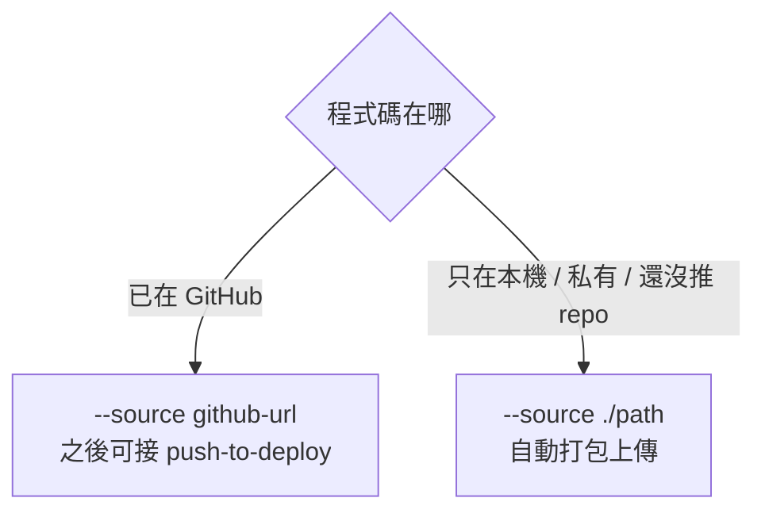

# [Day 11] 從本機資料夾部署 - local source

- 原文連結: （未發佈）
- 發布時間:

---

前言

昨天 [Day 10] 我們從一個 GitHub repo 把第一個 app 部署上線：裝 GitHub App、`apps create --source <github-url>`、`apps get` 看到 `live`。整條路很順，但它有個前提——你的程式碼得先在 GitHub 上。

現實中常常不是這樣，筆者自己就常遇到。你可能剛開一個專案，還沒推 repo；可能是內部私有的東西，不想推上 GitHub；也可能只是想「先跑起來看看」，懶得為了一個實驗建 repo。這時候 0ops 有另一條路：**直接從本機資料夾部署**，連 GitHub 都不用。

今天筆者想跟大家一起看三件事：

1. 一行從本機資料夾部署：`0ops apps create --slug demo --source ./my-app`；
2. 搞懂打包規則：它尊重 `.dockerignore` / `git ls-files`，以及 `--upload-max-bytes` / `--upload-max-entries` 兩道上限；
3. 幾個實用旗標：`--ref`、`--builder`、`--dry-run`。

一行從本機部署

跟昨天唯一的差別，就是 `--source` 從一個 GitHub URL 換成一個**本機路徑**：

```sh
$ 0ops apps create --slug demo --source ./my-app
```

當 `--source` 指向本機目錄時，0ops 會自動幫你把這個資料夾**打包上傳**，再走跟昨天一樣的 build → deploy 流程。你不用自己 tar、不用自己推到哪，CLI 全包了。輸出跟 GitHub 那條路長得幾乎一樣：

```text
$ 0ops apps create --slug demo --source ./my-app
Packing ./my-app ... 128 files, 4.2 MiB
Uploading ... done (upload_01H...)
Plan: create app "demo" from upload://upload_01H...
Proceed? [y/N] y

app_id:         app_01H...
app_slug:       demo
deploy_run_id:  run_01H...
trace_id:       trace_01H...
subdomain_url:  https://demo.jesontech.com
initial_deploy: started
```

注意中間那步 `upload://upload_01H...`——本機資料夾被打包後，其實是變成一個 upload，再由 upload 建 app。這也是為什麼 Day 10 提過 `--source` 能吃 `upload://<id>` 這種形式。之後一樣用 `0ops apps get demo` 追它從 `building` 到 `live`。

打包規則：它上傳了哪些檔

「自動打包」聽起來方便，但筆者一開始會想知道它到底把哪些檔案送上去了——你大概也不會希望 `node_modules`、`.env`、build 產物這種東西被一起打包。0ops 的打包尊重你已經在用的忽略規則：

- **`.dockerignore` / `git ls-files`**：打包時會參考這些規則決定哪些檔案該收、哪些該略過。已經被 git 忽略、或列在 `.dockerignore` 裡的東西不會被塞進上傳包。

所以筆者養成的習慣是：部署前先把該忽略的東西寫進 `.dockerignore`（或確定它們已被 git ignore）。這跟你平常建 Docker image 的直覺一致，不用另外學一套忽略語法。

另外有兩道保護上限，避免你不小心把一整個巨大的目錄送上去：

- `--upload-max-bytes`：上傳總大小上限，預設 **100 MiB**；
- `--upload-max-entries`：上傳檔案數上限，預設 **10000**。

如果打包超過這兩道線，create 會被擋下。這時先回頭檢查是不是有該忽略的大目錄（例如 `node_modules`、`.git`、dataset）漏進來了；真的需要更大的額度，再用旗標調高：

```sh
$ 0ops apps create --slug demo --source ./my-app \
    --upload-max-bytes 209715200 --upload-max-entries 20000
```

但通常你需要的是「把該忽略的忽略掉」，而不是「把上限調高」。

實用旗標：--ref、--builder、--dry-run

本機部署跟 GitHub 部署共用同一組旗標，這幾個特別有用：

- **`--dry-run`**：只做 preview，不真的建 app。想先確認「它打算打包什麼、建成什麼」再決定，用這個最安全：

```sh
$ 0ops apps create --slug demo --source ./my-app --dry-run
Packing ./my-app ... 128 files, 4.2 MiB
Plan: create app "demo" from upload://upload_01H... (ref: main)
(dry run — app not created)
```

- **`--ref`**：指定要用的 ref（預設 `main`）。本機部署時如果你的目錄是個 git repo，這個 ref 資訊會被帶上。
- **`--builder`**：指定要用哪個 builder 來 build。不指定時 0ops 會自動選。

什麼時候用本機 source

把 GitHub 部署（Day 10）和本機部署（今天）擺在一起，選擇其實很直覺：



- **本機 source 適合**：私有專案不想推 GitHub、還沒開 repo、或只是想快速試一把「先跑起來」。
- **GitHub source 適合**：已經在 GitHub 上、而且你想要之後的 push-to-deploy 自動化（Day 14、Day 21）——這條路才接得上 webhook 自動部署。

換句話說，本機 source 讓「先跑起來」這件事永遠可行，不被「你得先有一個 GitHub repo」這種前置條件卡住。等專案穩定了、想要自動部署，再切到 GitHub source 也不遲。降低前置條件、讓最短路徑隨時能走——這是今天的原則。

總結

今天我們學會不靠 GitHub 也能部署：`0ops apps create --slug demo --source ./my-app` 自動打包上傳本機資料夾，打包尊重 `.dockerignore` / `git ls-files`，並有 `--upload-max-bytes`（100 MiB）與 `--upload-max-entries`（10000）兩道上限保護；`--dry-run` 讓你先 preview、`--ref` / `--builder` 微調行為。私有、還沒推 repo、想快速試的場景，這條路最順。

到這裡你已經會用兩種方式部署 app 了——但都是「你自己在終端機打指令」。明天 [Day 12]，我們回到系列的招牌體驗：用自然語言讓 AI agent 幫你部署，把 MCP 的整條工具鏈（`list_teams` → `create_app_preview` → 你審 → `create_app` → 輪詢）走一遍。

Q&A

你的本機專案打包時檔案數 / 大小會踩到上限嗎？有沒有哪些目錄是你覺得該預設忽略的，歡迎留言一起補 : )

參考連結

- 0ops repo：`src/internal/cli/root.go`（`apps create` 的 `--source` / `--upload-max-bytes` / `--upload-max-entries` / `--ref` / `--builder` / `--dry-run`）
- `_source-pack.md` §CLI 指令表 apps（本機 source 自動打包上傳，尊重 `.dockerignore` / `git ls-files`）
- 0ops repo：`README.md`（一句話部署定位）
