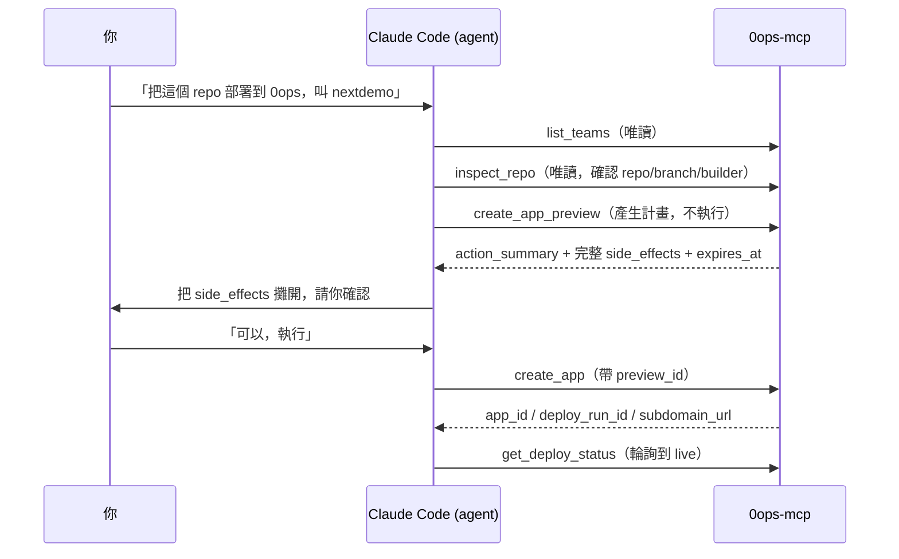

# [Day 12] 用自然語言部署 - MCP 工具鏈全流程

- 原文連結: （未發佈）
- 發布時間:

---

前言

過去兩天，筆者帶大家用 CLI 親手把 app 部署上線：[Day 10] 從 GitHub repo 建立 app，[Day 11] 直接從本機資料夾打包上傳。這兩條路都得自己敲 `0ops apps create`、自己看輸出。老實說筆者一開始也是這樣一步步敲慣了，直到某天偷懶，乾脆在 Claude Code 裡打一句話試試看——結果 agent 真的把整條流程跑完了。今天就換個開法跟大家分享：**完全不碰 CLI**，只丟一句話給 AI agent。

這正是 [Day 6] 提過的第二個入口：人用 CLI，AI 用 MCP，共用同一個後端。今天筆者想跟大家一起看清楚三件事：

- 拆解 agent 收到「幫我部署」這句話後，背後串了哪幾個 MCP 工具；
- 看清楚流程裡**唯一需要你動腦**的那一步：審 `side_effects`、點頭；
- 了解部署失敗時，agent 會怎麼把 `error_summary` 回報給你。

一句話觸發整條工具鏈

假設你已經照 [Day 8] 把 0ops 接上 Claude Code、重啟過 AI CLI，agent 現在看得到 0ops 的 24 個 MCP 工具。這時在對話框打：

```
把這個 repo 部署到 0ops，app 叫 nextdemo
```

agent 不會馬上動手寫入。它會先跑一段**唯讀**的偵察，把該知道的資訊湊齊，再走到需要你批准的那一步。整條鏈長這樣：



前兩步 `list_teams`、`inspect_repo` 都是唯讀工具，agent 用它們搞清楚「要部署到哪個 team、這個 repo 的預設分支跟 builder 是什麼」，不會對系統造成任何改變。筆者第一次看到 agent 自己跑這段偵察時還蠻驚訝的——它其實比人還謹慎，沒把資訊湊齊之前不會亂動。

關鍵一步：審 side_effects 再點頭

真正的重點在 `create_app_preview`。這是一個**兩階段寫入**工具的前半段——它不會真的建立 app，只回傳一份計畫，包含三樣東西：`action_summary`（這次操作要做什麼）、完整的 `side_effects`（會產生哪些副作用），以及 `expires_at`（這份 preview 的有效期限）。

agent 會把這份計畫攤在你面前，大致像這樣：

```
[create_app_preview]
action_summary: 在 team "acme" 建立 app "nextdemo"，來源為 GitHub repo，
                首次部署會自動觸發。
side_effects:
  - 建立新的 app 記錄 (slug=nextdemo)
  - 觸發 initial deploy（build image → 推 registry → GitOps sync）
  - 佔用預設子網域 nextdemo.jesontech.com
preview_id: prv_8f2c...
expires_at: 2026-07-06T09:15:00Z
```

這一步是**你**的責任，agent 幫不了你。你要看的是：team 對不對、slug 對不對、副作用是不是你預期的。確認沒問題，你回一句「執行」，agent 才會呼叫後半段的 `create_app`，並帶上剛才那個 `preview_id`。後端會拿 preview_id 去核對——它對同一個 preview_id 是冪等的，而且會拒絕過期或未核准的 id。這道閘是後端強制的，agent 繞不過去（這點 [Day 4] 談過，[Day 20] 還會再深入）。

`create_app` 回來後，你會拿到 `app_id`、`deploy_run_id` 跟 `subdomain_url`：

```
[create_app]
app_id: app_01J...
deploy_run_id: run_01J...
subdomain_url: https://nextdemo.jesontech.com
```

輪詢狀態，等它轉 live

建好之後，部署不是瞬間完成的——要 build image、推 registry、跑 GitOps sync。agent 會用唯讀的 `get_deploy_status` 輪詢，必要時搭配 `tail_logs` 看建置日誌，直到狀態轉成 `live`：

```
[get_deploy_status] status=building ...
[get_deploy_status] status=syncing ...
[get_deploy_status] status=live   url=https://nextdemo.jesontech.com
```

看到 `live`，agent 就會回你一句「部署完成，可以打開 https://nextdemo.jesontech.com 了」。這些狀態各代表什麼、卡住怎麼辦，明天 [Day 13] 專門講。

失敗時 agent 怎麼回報

如果 build 掛了或 sync 失敗，`get_deploy_status` 會帶回 `error_summary`。agent 不會假裝成功，它會把這段摘要轉述給你，例如：

```
[get_deploy_status] status=failed
error_summary: build failed: no Dockerfile found and buildpack detection failed
```

這時你就知道問題出在哪——這個 repo 沒有 Dockerfile，builder 也偵測不出語言。你可以請 agent 補個 Dockerfile 再重新部署，或改用別的 builder。筆者覺得這點最讓人安心：**agent 把錯誤原文交給你，決策權還在你手上。**

總結

今天我們看的是同一件「部署 app」的事，換成 AI 入口怎麼跑：agent 先用唯讀工具偵察（`list_teams`、`inspect_repo`），再用兩階段寫入的 `create_app_preview` → `create_app` 完成建立，最後輪詢 `get_deploy_status` 到 `live`。你在整條鏈裡只需要做一件事——**在寫入前審 side_effects、點頭**，其餘交給 agent。明天 [Day 13]，我們回到 CLI，把 `deploys status` 跟 `deploys logs` 講清楚，讓你看得懂「現在到哪、卡在哪」。

Q&A

筆者自己還在調整「哪些交給 agent、哪些自己敲」的分寸，你都讓 AI agent 幫你部署，還是習慣自己敲 CLI 呢？審 side_effects 時最在意哪一項？歡迎留言給我唷 : )

參考連結

- 0ops repo：`src/internal/cli/root.go`（CLI verb 對照）
- `docs/ironman-30day-notes/drafts/_source-pack.md`（MCP 24 工具與兩階段寫入）
- 端到端 happy path：AI agent 串一次部署的工具序列
