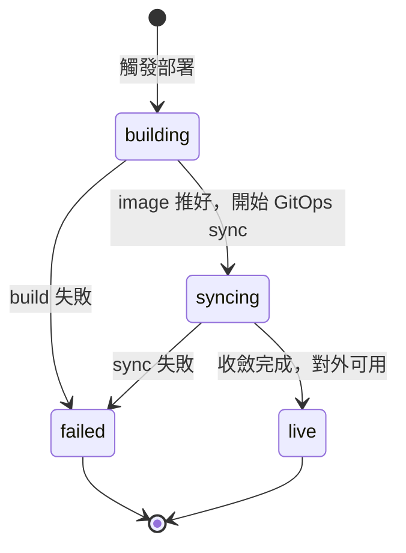

# [Day 13] 查部署狀態與看 log

- 原文連結: （未發佈）
- 發布時間:

---

前言

前面幾天，我們用 CLI（[Day 10]、[Day 11]）和自然語言（[Day 12]）把 app 部署上線。不論走哪條路，部署都不是按下去就瞬間完成——後端要 build image、推 registry、跑 GitOps sync，這中間 app 會經過好幾個狀態。今天的主題就是**可觀測性的第一步：知道現在到哪、卡在哪**。

今天要做的三件事：

- 用 `0ops deploys status` 查一次部署的當前狀態與關鍵欄位；
- 用 `0ops deploys logs --follow` 即時串流建置與執行日誌；
- 讀懂常見的 status 轉移，以及失敗時哪個欄位告訴你原因。

查部署狀態：deploys status

最快確認「app 現在怎樣了」的指令是 `0ops deploys status <app-slug>`：

```sh
$ 0ops deploys status nextdemo
```

它會回傳這次部署的核心欄位：

```
DEPLOY_ID     dep_01J8xq...
STATUS        building
COMMIT_SHA    a1b2c3d
REF           main
ERROR_SUMMARY -
STARTED_AT    2026-07-06T08:41:12Z
FINISHED_AT   -
```

幾個欄位值得記住：

- `status`：目前的部署狀態（`building` / `syncing` / `live` / `failed` 等）。
- `commit_sha` 與 `ref`：這次部署跑的是哪個 commit、哪個分支——很適合用來確認「我剛 push 的東西有沒有上到」。
- `error_summary`：失敗時的原因摘要；成功時為空。
- `started_at` / `finished_at`：起訖時間，`finished_at` 為空代表還在跑。

想要機器可讀的輸出（例如塞進腳本），加全域旗標 `--output json`（或設環境變數 `OPS_OUTPUT=json`）：

```sh
$ 0ops deploys status nextdemo --output json
```

即時看 log：deploys logs --follow

狀態告訴你「在哪一階段」，但要知道 build 為什麼慢、為什麼掛，得看日誌。用 `0ops deploys logs <app-slug>`：

```sh
$ 0ops deploys logs nextdemo --follow
```

`--follow` 會開一條 SSE（Server-Sent Events）串流，日誌即時往下捲，就像 `tail -f`：

```
[08:41:15] pulling base image node:20-alpine ...
[08:41:29] installing dependencies (npm ci) ...
[08:42:03] building Next.js production bundle ...
[08:42:51] pushing image to registry ...
[08:43:10] GitOps sync started ...
[08:43:44] deployment live: https://nextdemo.jesontech.com
```

不加 `--follow` 就是印出當前的一批日誌然後結束；想控制回看多少行，用 `--limit`（預設 100）：

```sh
$ 0ops deploys logs nextdemo --limit 200
```

MCP 對應：get_deploy_status 與 tail_logs

如果你是在 AI CLI 裡對話，agent 用的是對應的兩個唯讀工具：`get_deploy_status`（對應 `deploys status`）和 `tail_logs`（對應 `deploys logs`，接受 `limit` 參數）。這也是 [Day 12] 裡 agent 部署完後拿來輪詢的那兩個工具。你只要說「幫我看 nextdemo 的部署狀態」或「把最近的 log 給我」，agent 就會呼叫它們，把結果轉述給你。因為是唯讀工具，不需要 preview/confirm。

讀懂狀態轉移與失敗訊號

一次正常的部署，狀態大致這樣走：



- `building`：正在 build image、推 registry。卡在這裡通常是相依安裝慢、或 Dockerfile/buildpack 出問題。
- `syncing`：image 已就緒，GitOps 正在把新版本收斂到叢集。
- `live`：對外可用，可以打開 `subdomain_url` 了。
- `failed`：這時第一件事就是看 `error_summary`。它會直接告訴你失敗類型，例如 `build failed: no Dockerfile found` 或 sync 逾時。

要提醒的是，0ops 的 reconciler 會自動收斂——`building` 有 30 分鐘、`syncing` 有 15 分鐘的逾時保護，逾時後約 30 秒內會收斂成 `live` 或 `failed`。所以看到卡住時，**先等一個收斂週期再動手**，別急著介入。真的卡住怎麼逐級排查，留到 [Day 23] 專門講。

總結

今天我們補上了部署的「儀表板」：`deploys status` 看當前狀態與 `commit_sha` / `error_summary` 這些關鍵欄位，`deploys logs --follow` 用 SSE 即時追日誌，AI 端則對應 `get_deploy_status` 和 `tail_logs`。看懂 `building → syncing → live` 的轉移，你就能判斷部署到哪、卡哪。明天 [Day 14]，我們讓部署動起來——手動 `deploys redeploy` 重新部署，以及 push 到 GitHub 自動觸發的 push-to-deploy。

Q&A

你查部署狀態習慣用 table 還是 json 輸出？有沒有遇過看不懂的 status 卡住？歡迎留言，我們一起拆解。

參考連結

- 0ops repo：`src/internal/cli/root.go`（`deploys status` / `logs` 定義）
- `docs/ironman-30day-notes/drafts/_source-pack.md`（deploys 指令與 MCP 唯讀工具）
- reconciler 逾時與自動收斂：排錯 `create-app-stuck.md`
