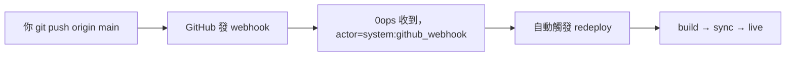

# [Day 14] 重新部署與 push-to-deploy 自動化

- 原文連結: （未發佈）
- 發布時間:

---

前言

到目前為止，我們會建立 app（[Day 10]、[Day 11]、[Day 12]），也會查狀態、看 log（[Day 13]）。但真實開發是持續的——你會一直改 code、一直要把新版本推上去。筆者早期最累的就是這個環節：每改一版就手動重跑一次部署，敲到手軟。今天就來解決「**部署第二次、第三次、第 N 次**」這件事，而且要讓它盡量自動。

今天筆者想跟大家一起做三件事：

- 用 `0ops deploys redeploy` 手動重新部署指定的 `ref` 或 `commit`；
- 設定 push-to-deploy，讓 push 到 GitHub 自動觸發 redeploy；
- 搞清楚兩者的差異與適用場景，以及 redeploy 對舊 run 的影響。

手動重新部署：deploys redeploy

先講手動路徑。這裡筆者要特別提醒一個當初自己踩過的雷：正確的 verb 是 `0ops deploys redeploy`（**不是** `0ops redeploy`）：

```sh
$ 0ops deploys redeploy nextdemo --ref main
```

它會先給你一份計畫摘要，接著 `[y/N]` 讓你確認（想跳過確認加 `--yes`，只想看計畫不執行加 `--dry-run`）。確認後輸出：

```
DEPLOY_RUN_ID  run_01J9...
TRACE_ID       trc_01J9...
COMMIT_SHA     d4e5f6a
REF            main
SOURCE         manual
SUBDOMAIN_URL  https://nextdemo.jesontech.com
```

如果你要部署的不是分支最新，而是某個特定 commit，用 `--commit-sha` 取代 `--ref`：

```sh
$ 0ops deploys redeploy nextdemo --commit-sha d4e5f6a
```

留意輸出裡的 `SOURCE=manual`——這代表這次是你手動觸發的。等一下自動觸發的來源會不一樣。

自動部署：push-to-deploy

手動 redeploy 適合例外情況（例如回滾到某個 commit），但日常開發你不會想每次都手動敲一次——這也是筆者前面說「敲到手軟」的痛點。好在 0ops 支援 push-to-deploy：只要 push 到 app 綁定的 `repo_url` + `ref`，webhook 就會自動觸發一次 redeploy。

前提是這個 team 已經裝好 GitHub App（`0ops teams github install`，preview→confirm→開瀏覽器授權→輪詢完成，這步 [Day 21] 會詳談）。裝好之後，流程變成：



你什麼指令都不用敲，只要正常 `git push`。這時如果你去查狀態，會看到這次部署的觸發來源是系統 webhook——稽核記錄裡的 actor 是 `system:github_webhook`，跟手動 redeploy 的 `manual` 明顯區隔，之後查「這次上線是誰觸發的」一目了然（[Day 22] 會用得上）。

驗證自動部署

要確認 push-to-deploy 真的通了，最直接的方法就是推一個 commit 然後看狀態變化：

```sh
$ git commit --allow-empty -m "test: trigger push-to-deploy"
$ git push origin main
```

接著開另一個終端追狀態，你會看到它自動從 `building` 一路走到 `live`：

```sh
$ 0ops deploys status nextdemo
```

```
STATUS      building
COMMIT_SHA  <你剛 push 的 sha>
REF         main
```

`commit_sha` 對上你剛推的那個，就代表 webhook 有收到、自動部署有觸發。想看細節就配 [Day 13] 的 `deploys logs --follow`。

兩者的差異與 redeploy 的副作用

手動與自動，本質都是「起一次新的 deploy run」，差別在觸發者與時機：

| | 手動 redeploy | push-to-deploy |
|---|---|---|
| 觸發 | 你敲 `0ops deploys redeploy` | `git push` 到綁定的 ref |
| 觸發者（actor） | 你（登入身分） | `system:github_webhook` |
| 適用 | 回滾、指定 commit、例外重試 | 日常持續部署 |
| 需要確認 | `[y/N]`（可 `--yes`） | 無，自動 |

不論哪種，redeploy 都會**起一個新的 deploy run，舊的 run 會被回收**。也就是說你不會累積一堆殭屍 run，永遠以最新一次為準。這也意味著：如果你手動 redeploy 一個舊 commit，它會蓋掉目前線上的版本——這是回滾的正常行為，但推之前要想清楚。

AI 端對應的是兩階段寫入工具 `redeploy_preview` → `redeploy`（接受 `app_slug`，可選 `ref` / `commit_sha`），一樣要先審 side_effects 再 confirm，跟 [Day 12] 建立 app 的節奏一致。

總結

今天我們讓部署動起來：手動用 `0ops deploys redeploy` 指定 `ref` 或 `--commit-sha`（記得是 `deploys redeploy`，不是 `0ops redeploy`），自動則靠 push-to-deploy——`git push` 就觸發，actor 記為 `system:github_webhook`。原則很簡單：**常態部署交給自動化，手動 redeploy 留給回滾與例外**。明天 [Day 15]，我們把 app 從預設子網域搬到你自己的網域上。

Q&A

筆者自己現在幾乎全交給 push-to-deploy，只在回滾時才動手動 redeploy。你的專案偏好每次 push 都自動上線，還是保留手動關卡呢？回滾時你都怎麼指定要退回哪個 commit？歡迎留言給我唷 : )

參考連結

- 0ops repo：`src/internal/cli/root.go`（`deploys redeploy` 旗標）
- `docs/ironman-30day-notes/drafts/_source-pack.md`（push-to-deploy 與 webhook actor）
- 端到端 happy path §8（redeploy 與自動觸發）
