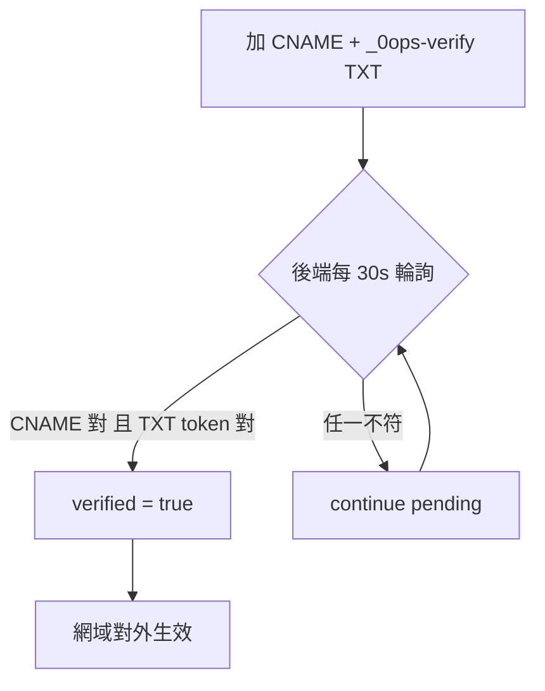

# [Day 15] 綁定你的自訂網域

- 原文連結: （未發佈）
- 發布時間:

---

前言

到 [Day 14] 為止，你的 app 已經能穩定部署、自動更新，跑在預設子網域 `nextdemo.jesontech.com` 上。這對測試很夠用，但要真的對外，你會想掛上自己的網域——`app.yourdomain.com`，甚至是 apex 的 `yourdomain.com`。今天就來做這件事。

先講清楚一個**重要狀態**：目前 CLI 在網域這塊**只有 `0ops domains list`**——查詢用。新增與驗證網域目前走的是 API / spec 面，**尚未 CLI 化**，也就是說沒有 `0ops apps add-domain` 這種指令（別被漂移文件誤導）。所以今天的重點分兩半：DNS 你怎麼設、以及用 `domains list` 查驗證狀態。

今天要做的三件事：

- 在你的 DNS 加上 CNAME 與 `_0ops-verify` TXT 兩筆記錄；
- 理解 0ops 的網域驗證機制：雙條件、30 秒輪詢、24 小時 token TTL；
- 用 `0ops domains list` 查 hostname / kind / verified 狀態。

第一步：設定 DNS 兩筆記錄

綁定自訂網域的核心，是向 0ops 證明「這個網域確實是你的」。做法是在你的 DNS 供應商加兩筆記錄：

1. 一筆 **CNAME**，把你要用的 host 指向 0ops：

```
app.yourdomain.com.   CNAME   nextdemo.jesontech.com.
```

2. 一筆 **TXT** 驗證記錄，主機名是 `_0ops-verify.<host>`，值是 0ops 發給你的驗證 token：

```
_0ops-verify.app.yourdomain.com.   TXT   "0ops-verify=<token>"
```

CNAME 負責「把流量導過來」，TXT 負責「證明歸屬」。兩筆缺一不可。

驗證機制：雙條件、30 秒輪詢、24 小時 TTL

DNS 設好之後，你不用手動觸發驗證——**後端會每 30 秒輪詢一次**，自動檢查。它採**雙條件**：CNAME 要正確指向、`_0ops-verify` TXT 的值要對得上發給你的 token，兩者同時成立才算通過。

驗證 token 有 **24 小時的 TTL**。如果你 DNS 一時改不完（例如要等供應商審核、或 propagation 很慢），可以用 `--extend` 把有效期延長，最長到 **2 倍**（也就是 48 小時）。超過期限沒驗過，就得重新取得 token。



apex 網域的眉角

如果你要綁的是 apex（也就是根網域 `yourdomain.com`，沒有子網域前綴），會踩到 DNS 的一個經典限制：**apex 不能直接放 CNAME**（RFC 不允許 CNAME 與其他記錄共存於根）。這時要用供應商提供的等效機制：**ALIAS、ANAME、或 CNAME flattening**（不同家名字不一樣，Cloudflare 叫 CNAME flattening）。效果是讓 apex 也能「像 CNAME 一樣」指到 0ops，同時保留必要的 NS/SOA 記錄。

用 domains list 查驗證狀態

DNS 設好、等後端輪詢的期間，你要怎麼知道驗過了沒？用查詢指令：

```sh
$ 0ops domains list nextdemo
```

輸出會列出這個 app 綁定的每個網域及其狀態：

```
HOSTNAME              KIND    VERIFIED  VERIFIED_AT
app.yourdomain.com    custom  true      2026-07-06T09:02:44Z
nextdemo.jesontech.com default true      2026-07-05T11:20:10Z
```

四個欄位：`hostname`（網域）、`kind`（custom 自訂 / default 預設子網域）、`verified`（是否已驗證）、`verified_at`（驗證通過的時間）。看到你的自訂網域 `verified=true`，就代表雙條件都過了，可以對外用了。

再次提醒狀態：**`domains list` 是目前 CLI 唯一的網域指令**。新增網域、觸發驗證這些寫入動作，現階段是 API / spec 面的能力，CLI 尚未提供對應 verb。所以實務上你會：透過 API（或 spec 定義的流程）拿到 token 並登記網域 → 自己在 DNS 設好兩筆記錄 → 用 `domains list` 追蹤驗證結果。

總結

今天我們把 app 掛上自訂網域：DNS 設 CNAME + `_0ops-verify` TXT 兩筆，後端每 30 秒雙條件輪詢、token 24 小時 TTL（可 `--extend` 到 2 倍），apex 要用 ALIAS/ANAME/CNAME flattening，狀態用 `0ops domains list` 查。核心原則是——**網域歸屬要用不可偽造的驗證證明，不能只靠「設了就信」**。也別忘了 CLI 目前只有 `domains list`，新增/驗證仍在 API/spec 面。明天 [Day 16]，我們把場景從「你一個人」擴到「一個團隊」，講邀請成員與角色。

Q&A

你綁自訂網域時最常卡在哪一步——CNAME、TXT、還是 apex 的 flattening？DNS propagation 等到不耐煩過嗎？留言分享。

參考連結

- 0ops repo：`src/internal/cli/root.go`（`domains list` 是唯一網域 verb）
- `docs/ironman-30day-notes/drafts/_source-pack.md`（驗證機制：雙條件 / 30s 輪詢 / 24h TTL / apex）
- 端到端 happy path §5（自訂網域設定）
