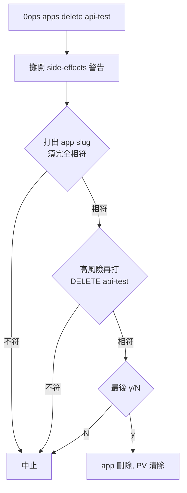

# [Day 17] 管理 app 生命週期 - 列出 / 查詳情 / 安全刪除

- 原文連結: （未發佈）
- 發布時間:

---

前言

前面幾天，筆者陪著大家把「建立」這一段練得很熟了：Day 10 從 GitHub repo 部署第一個 app、Day 11 從本機資料夾直接上、Day 12 讓 AI agent 用自然語言幫你建，Day 13 到 Day 15 又補上了看狀態、看 log、redeploy、綁網域。Day 16 則把場景擴到團隊，學會邀請成員與角色。

不過筆者自己用一個平台用久了，手上的 app 就會越來越多——這個是正式站、那個是上週開的 demo、還有三個是試驗到一半忘了收的殘骸。今天想跟大家補齊的，是 app 的另一半生命週期：**怎麼把手上所有 app 攤開來看、怎麼查單一 app 的完整細節、以及怎麼「安全地」刪掉一個你不要的 app**。

今天會做三件事：

1. 用 `0ops apps list` 把團隊裡所有 app 列出來，包含分頁。
2. 用 `0ops apps get <slug>` 查一個 app 的完整詳情。
3. 用 `0ops apps delete <slug>` 走完整的多重確認刪除流程，理解為什麼刪除要這麼「囉唆」。

列出你團隊裡的所有 app

先從最無害的操作開始。想知道目前團隊底下有哪些 app，用 `list`：

```sh
$ 0ops apps list
SLUG        NAME        REPO_URL                              STATUS
nextdemo    nextdemo    https://github.com/you/nextdemo       live
blog        blog        https://github.com/you/blog           live
api-test    api-test    https://github.com/you/api-test       failed
```

預設一頁 50 筆。如果 app 很多，會用 cursor 分頁。你可以自己控制每頁筆數與翻頁：

```sh
$ 0ops apps list --page-size 20
$ 0ops apps list --page-size 20 --cursor <next-cursor>
```

想一次把所有頁都抓完、不想自己拿 cursor 一頁一頁翻，加 `--all` 讓 CLI 幫你把分頁走完：

```sh
$ 0ops apps list --all
```

`list` 回傳的是每個 app 的骨架資訊：`slug`、`name`、`repo_url`、`status`。這是你日常「巡一下場」的第一個指令——看哪個 app 掛了、哪個還活著。若要在腳本裡處理，記得可以加全域旗標 `--output json`（或設 `OPS_OUTPUT=json`），把表格換成好解析的 JSON。

查單一 app 的完整詳情

`list` 給的是概觀，`get` 給的是全貌。當你發現 `api-test` 是 `failed`，想知道到底怎麼回事，就 `get` 它：

```sh
$ 0ops apps get api-test
id:                    app_01J...
team_id:               team_01H...
slug:                  api-test
name:                  api-test
repo_url:              https://github.com/you/api-test
repo_default_branch:   main
image_ref:             registry.jesontech.com/api-test@sha256:...
builder:               buildpacks
status:                failed
created_at:            2026-07-01T09:12:03Z
updated_at:            2026-07-04T14:20:51Z
```

`get` 比 `list` 多了 `id`、`team_id`、`repo_default_branch`、`image_ref`、`builder`，以及建立與最後更新的時間戳。這裡有幾個常用欄位值得記住：

- `image_ref`：這個 app 目前跑的映像，帶 digest。要確認「線上到底是哪一版」時看它。
- `builder`：用哪套 builder 打包（例如 buildpacks）。
- `status`：app 的收斂狀態。`live` 代表上線中，`failed` 代表這次收斂失敗。

順帶一提，這裡有一條 Day 1 就立下的正確性紅線，筆者也踩過所以特別提醒：查詳情的 verb 是 `0ops apps get`，**不是** `apps show`。如果你在某些舊文件看到 `apps show`，那是已經漂移的寫法，照著打會找不到指令。

安全刪除：為什麼刪一個 app 要打三次確認

現在來到今天的重點。刪除是**不可逆**操作——app 一旦刪掉，連同它的資料（Persistent Volume 預設會被清除）都不會回來。筆者第一次看到刪除流程這麼囉唆時也覺得有點煩，後來才明白這份謹慎是必要的：0ops 對 `delete` 的態度，跟 `list`／`get` 完全不同，它會逼你一步一步證明「你確實知道自己在刪什麼」。

先看一次完整的互動流程：

```sh
$ 0ops apps delete api-test
WARNING: This action is irreversible.
The following resources will be removed:
  - app "api-test" (app_01J...)
  - all deploy runs and build history
  - persistent volumes (data will be permanently deleted)
  - ingress / domain bindings

Type the app slug to confirm: api-test
This is a high-risk deletion. Type "DELETE api-test" to confirm: DELETE api-test
Delete app "api-test"? [y/N]: y

App "api-test" deleted.
```

拆解這三道閘：

1. **先攤開 side-effects**：告訴你這一刀會砍掉什麼——app 本體、所有 deploy run 與 build 歷史、Persistent Volume（資料永久刪除）、ingress／網域綁定。這不是嚇你，是讓你在動手前把代價看清楚。
2. **打出 app slug**：`Type the app slug to confirm:`——你要**完全相符**地把 slug 打出來（`api-test`）。打錯就中止。這一步擋掉「複製貼上錯 app」的手滑。
3. **高風險再打 required_phrase**：對高風險刪除，還要再打一次 `required_phrase`，格式是 `DELETE <slug>`（這裡是 `DELETE api-test`）。這是刻意設計的摩擦——要你打得出這個 app 的全名，證明你不是在無意識地按 Enter。
4. **最後 `[y/N]`**：確認鍵。

如果你在腳本裡、確定要刪，可以加 `--yes`。但注意它的語意很克制：**`--yes` 只跳過最後那個 `[y/N]`**，前面「打 slug」與「打 required_phrase」的確認**不會**被略過。也就是說，即使自動化，你還是得在指令裡把正確的 phrase 提供出來——這道紅線不給你一鍵繞過。



這套設計的原則很單純：**不可逆的操作，要用「打得出全名」來證明你知道自己在做什麼**。它不是為了刁難你，而是把「手滑砍掉正式站」這種災難，擋在一個你必須清醒才能通過的閘門後面。

刪完之後，回頭 `list` 確認它真的消失了：

```sh
$ 0ops apps list
SLUG        NAME        REPO_URL                          STATUS
nextdemo    nextdemo    https://github.com/you/nextdemo   live
blog        blog        https://github.com/you/blog       live
```

如果刪除卡在 `deleting` 狀態遲遲不消失，那是另一個故事——牽涉到底層 PVC／namespace／ingress 的 finalizer 還沒清乾淨。這種情況的自救（`0ops admin retry-delete`）筆者留到 Day 24 的排錯篇再跟大家細談，今天先把正常路徑走通就好。

總結

今天補齊了 app 生命週期的另一半：`list` 巡場、`get` 查全貌、`delete` 走多重確認的安全刪除。核心心法是——**列出與查詢無害，儘管用；刪除不可逆，用「打得出全名」證明你清醒**。這也呼應了整個 0ops 的設計哲學：讓危險操作有摩擦，讓安全操作零負擔。

明天 [Day 18]，筆者要帶大家離開互動式的終端機，走進 CI。你不可能在 GitHub Actions 裡手動打 `[y/N]`，那自動化流程要怎麼用 0ops？答案是 **token**——建立短期、限範圍的機器憑證，讓部署在無人值守時也能安全地跑。

Q&A

筆者自己手上也還有幾個「開了忘了收」的 demo app，今天正好陪大家一起清一輪。如果你對 `--yes` 的邊界、或 PV 清除的行為有任何疑問或建議，非常歡迎留言給我唷 : )

參考連結

- 0ops repo：`src/internal/cli/root.go`（`apps list` / `apps get` / `apps delete` 的 verb 與旗標）
- `docs/ironman-30day-notes/drafts/_source-pack.md`（apps 指令表與 preview/confirm UX）
- `docs/runbooks/delete-app-residue.md`（刪除卡 deleting 的自救，Day 24 詳談）
