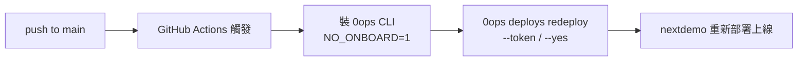

# [Day 18] token 與 CI - 非互動式部署

- 原文連結: （未發佈）
- 發布時間:

---

前言

到 Day 17 為止，我們用 0ops 做的每一件事，背後都靠著同一個東西：**你的個人登入態**。Day 7 一行 curl 裝好、走 device flow 登入之後，token 就存在 `~/.config/0ops/auth.json`，之後每個子指令都自動附帶它。這在你自己的終端機上很方便——但一放到 CI 就行不通了。

想像 GitHub Actions 跑到一半，跳出 `Delete app "..."? [y/N]:` 等你按鍵；或是它需要你的個人 device flow 授權才能動。無人值守的自動化，不能靠一個人的登入態，更不能停下來等互動。今天就來解決這件事。

今天會做三件事：

1. 用 `0ops auth tokens create` 建立一個短期、限範圍的機器 token。
2. 用 `tokens list` / `tokens revoke` 管理 token 的生命週期。
3. 把 token 塞進 GitHub Actions，跑一次完全非互動的 `0ops deploys redeploy`。

為什麼 CI 不能用你的個人登入態

先講清楚動機，你才知道 token 在解決什麼。用個人登入態跑 CI 有三個問題：

- **權限過大**：你的個人帳號可能是 owner，能刪 app、改團隊。CI 只需要「redeploy 某個 app」，卻繼承了你的全部權限——一旦 CI 環境外洩，等於把你整個帳號交出去。
- **無法輪替**：個人 token 綁著你這個人，你不會為了換 CI 憑證去把自己登出。
- **無法審計歸屬**：所有操作都記在「你」名下，分不出哪些是你手動做的、哪些是 pipeline 做的。

解法就是**為機器發一張獨立的 token**：範圍最小、有到期日、可以隨時單獨撤銷、且在稽核紀錄裡是獨立的身分。

建立一個 CI 專用 token

用 `tokens create`。給它一個好認的名字、限定範圍、設一個到期日：

```sh
$ 0ops auth tokens create --name ci-redeploy --scopes deploys:write --expires 90d
Token created.
  name:       ci-redeploy
  scopes:     deploys:write
  expires_at: 2026-10-04T00:00:00Z

  token: ops_tok_9f3c2a...   # 只會顯示這一次，請立刻保存

WARNING: This token is shown only once. Store it in your CI secret manager now.
```

幾個要點：

- `--name`：token 的識別名稱，之後 `list` / `revoke` 都靠它。取個能一眼看出用途的名字（`ci-redeploy`、`ci-nightly`）。
- `--scopes`：這張 token 能做什麼。**只給它真正需要的範圍**——如果 CI 只做 redeploy，就別給它刪除或團隊管理的權限。
- `--expires`：到期日，**預設 90d**。到期後 token 自動失效，強迫你定期輪替，降低長命 token 外洩的風險。

最重要的一句話：**token 明文只會顯示這一次**。當下就把它存進你的 CI secret manager（GitHub Actions 的 Repository secrets、或你團隊的 vault），關掉終端機就再也拿不回來了。

管理 token 的生命週期

發出去的 token 要能盤點、能回收。列出目前有效的 token：

```sh
$ 0ops auth tokens list
NAME           SCOPES          EXPIRES_AT             LAST_USED_AT
ci-redeploy    deploys:write   2026-10-04T00:00:00Z   2026-07-05T22:10:03Z
ci-nightly     deploys:write   2026-09-01T00:00:00Z   2026-07-06T02:00:11Z
```

注意 `list` 只給你 metadata（名稱、範圍、到期、最後使用時間），**不會再給你明文** token——這就是為什麼建立當下一定要存好。

當某張 token 不再需要、或你懷疑它外洩了，立刻撤銷：

```sh
$ 0ops auth tokens revoke ci-redeploy --yes
Token "ci-redeploy" revoked.
```

`revoke` 是資安事件的第一反應動作——只要 token 可能外洩，先 revoke 再說，撤銷後它立刻失效，不影響其他 token。

在腳本／CI 裡非互動呼叫

有了 token，剩下的就是讓 0ops 在沒有登入態、沒有互動的環境裡也能跑。靠三個東西：

- `--host`：直接指定 API host，不依賴本機設定。
- `--token`：直接把 token 帶進來，繞過 `~/.config/0ops/auth.json` 的登入態。
- `OPS_OUTPUT=json`：把輸出換成 JSON，方便在 pipeline 裡解析、判斷成敗。

一個最小的非互動 redeploy 長這樣：

```sh
$ OPS_OUTPUT=json 0ops deploys redeploy nextdemo \
    --host https://api.jesontech.com \
    --token "$OPS_TOKEN" \
    --ref main \
    --yes
{
  "deploy_run_id": "run_01J...",
  "trace_id": "trace_...",
  "commit_sha": "a1b2c3d",
  "ref": "main",
  "source": "cli",
  "subdomain_url": "https://nextdemo.jesontech.com"
}
```

這裡再標一次紅線：重新部署的 verb 是 **`0ops deploys redeploy`**，不是 `0ops redeploy`。`--yes` 在這裡跳過 redeploy 的 `[y/N]` 確認（redeploy 不是不可逆操作，可以整段跳過），讓它在 CI 裡不卡住。

放進 GitHub Actions

把上面這段包成一個 workflow。假設你想在每次 push 到 `main` 時，主動觸發一次 0ops redeploy：

```yaml
name: deploy-to-0ops
on:
  push:
    branches: [main]

jobs:
  redeploy:
    runs-on: ubuntu-latest
    steps:
      - name: Install 0ops CLI
        run: |
          NO_ONBOARD=1 curl -fsSL \
            https://raw.githubusercontent.com/wusung/0ops/main/scripts/install.sh | sh

      - name: Redeploy nextdemo
        env:
          OPS_TOKEN: ${{ secrets.OPS_CI_TOKEN }}
          OPS_OUTPUT: json
        run: |
          0ops deploys redeploy nextdemo \
            --host https://api.jesontech.com \
            --token "$OPS_TOKEN" \
            --ref main \
            --yes
```

幾個設計選擇值得說明：

- 裝 CLI 時用 `NO_ONBOARD=1`——CI 裡**只需要 binary**，不需要 device flow 登入、也不需要接 AI CLI。這個變體我們 Day 7 介紹過，在這裡剛好派上用場。
- token 從 `secrets.OPS_CI_TOKEN` 注入，絕不寫死在 workflow 裡。
- 全程沒有任何互動提示，靠 `--token` + `--yes` + `OPS_OUTPUT=json` 走完。



一個誠實的提醒：如果你只是想「push 就自動部署」，其實還有**更省事**的路——直接裝 0ops 的 GitHub App，讓 webhook 幫你觸發 redeploy，連 workflow 都不用寫。那條路我們 Day 21 專門講。今天的 token 路徑，適合你需要**在 CI 裡自訂邏輯**（跑完測試才部署、部署前做額外檢查、或部署非當前 repo 的 app）的情境。

總結

今天把 0ops 從「一個人在終端機前操作」帶進了「無人值守的自動化」：用 `tokens create` 發一張短期、限範圍的機器 token，用 `list` / `revoke` 管它的生命週期，再靠 `--host` / `--token` / `OPS_OUTPUT=json` 在 CI 裡完全非互動地部署。核心原則是——**自動化用短期、限範圍的 token，絕不用個人登入態**。

到這裡，第二章「基礎概念與實作」就告一段落了。明天 [Day 19] 我們進入第三章，把前面 Day 10 到 18 學到的所有零件串成一個連貫的實戰案例：**讓 Claude Code 從一句話開始，把一個 Next.js 專案從零部署上線**。分開學十個指令，不如端到端跑一次。

Q&A

你的 CI 目前是怎麼觸發部署的？打算走 token 這條自訂路徑，還是等 Day 21 的 GitHub App 全自動路徑？對 scope 該給多細有疑問，歡迎留言討論 : )

參考連結

- 0ops repo：`src/internal/cli/root.go`（`auth tokens create/list/revoke`、`deploys redeploy` 的旗標）
- `docs/ironman-30day-notes/drafts/_source-pack.md`（auth 指令表、全域旗標、非互動呼叫）
- `scripts/install.sh`（`NO_ONBOARD` 等安裝變體）
