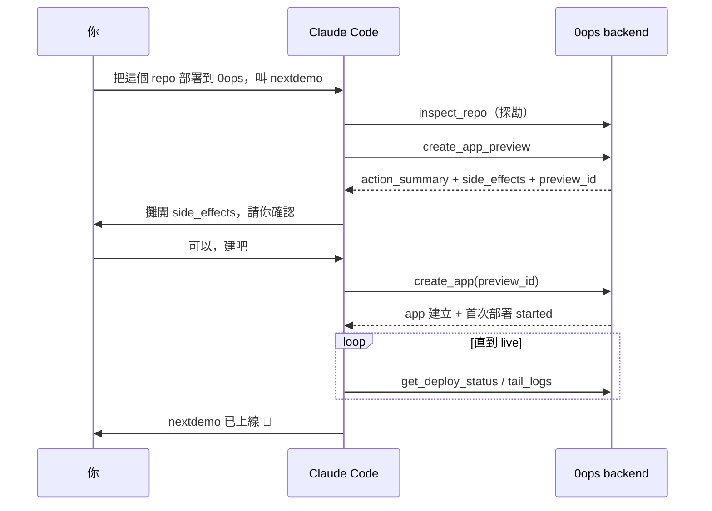

# [Day 19] Demo：讓 Claude Code 從零部署 Next.js 上線

- 原文連結: （未發佈）
- 發布時間:

---

前言

歡迎來到第三章。前面兩章筆者跟大家把零件一個一個磨亮了：Day 7 到 9 裝好 0ops、接上 AI CLI、設定工具授權；Day 10 到 18 學會建 app、看狀態、看 log、redeploy、綁網域、邀成員、管生命週期、發 CI token。每一個指令你都會了——但筆者自己的體會是，真正上線一次專案，不是照著指令清單一條一條打，而是在一個連貫的情境裡，讓這些零件彼此接上。

今天就來做這件事：**開一個 Claude Code 對話，從一句話開始，把一個 Next.js 專案從零部署到 `nextdemo.jesontech.com` 上線**。筆者會把整段對話、agent 背後呼叫的 MCP 工具、以及每個決策點「你做了什麼、agent 做了什麼」都攤開來跟大家看。

今天會走完一條完整旅程：

1. 對話開需求 → agent 檢查 repo → 建 app（你審 side_effects 後點頭）。
2. 輪詢部署狀態、看 log，等它轉 `live`。
3. 上線後驗證，並補上綁網域、邀夥伴的收尾。

前置：確認 agent 看得到 0ops

開始前，筆者假設你已經照 Day 8 把 0ops 接上 Claude Code（`0ops mcp setup claude-code` 後重啟過），也照 Day 21 會講的方式裝好了團隊的 GitHub App（讓 0ops 讀得到你的 repo）。筆者自己最常用的確認方式，是在對話裡先問一句無害的：

> 你：列一下我 0ops 團隊底下有哪些 app。

agent 會呼叫唯讀工具 `list_teams`／`list_apps`，回給你目前的清單。如果它能正常回應，代表工具鏈是通的，可以開始。

第一步：一句話開需求

現在講出你要做的事。不用講任何指令，就講意圖：

> 你：把我這個 repo `github.com/you/nextdemo` 部署到 0ops，app 叫 nextdemo。

agent 收到後，不會直接動手建。它會先**探勘**——呼叫 `inspect_repo` 這個唯讀工具，確認 repo 的預設分支、偵測到的 builder 等資訊：

```text
[agent → inspect_repo]
  app_slug:            nextdemo
  repo_url:            https://github.com/you/nextdemo
  repo_default_branch: main
  builder:             buildpacks
```

這一步是 agent 在幫你把「意圖」對齊「現實」——確認它理解的 repo、分支、打包方式，跟你想的一致。

第二步：agent 攤開 side_effects，等你點頭

探勘完，agent 進入**寫入操作的關鍵決策點**。這裡是整個流程的核心——它**不會直接建 app**，而是先呼叫 `create_app_preview`，把後端回傳的 `action_summary`（意圖摘要）與完整 `side_effects`（會發生什麼）原封不動攤給你看：

```text
[agent → create_app_preview]
action_summary: 在團隊 "acme" 建立 app "nextdemo"，來源
                github.com/you/nextdemo@main，以 buildpacks 打包並首次部署。

side_effects:
  - 建立 app 記錄 nextdemo（team: acme）
  - 觸發首次 build（buildpacks）與部署
  - 配置子網域 https://nextdemo.jesontech.com
  - 建立 Persistent Volume 與 ingress 綁定

preview_id: prev_01J...
expires_at: 2026-07-06T04:15:00Z
```

然後 agent 會停下來，用自然語言問你要不要繼續。**這道閘是後端強制的**——agent 手上只有 `preview_id`，要真正建立 app，必須再呼叫 `create_app` 並帶著這個 `preview_id`。它繞不過去。所以主動權在你：

> 你：可以，建吧。

你點頭這一步，就是 0ops 整套安全設計的支點。怎麼「審」得專業一點（哪些該批准、哪些該擋下），筆者明天 Day 20 會給大家一張 checklist。今天先把 happy path 走完。

第三步：agent 帶 preview_id 執行建立

得到你的明確同意後，agent 呼叫 `create_app`（帶 `preview_id`），後端回傳建立結果：

```text
[agent → create_app(preview_id=prev_01J...)]
  app_id:        app_01J...
  app_slug:      nextdemo
  deploy_run_id: run_01J...
  subdomain_url: https://nextdemo.jesontech.com
  initial_deploy: started
```

app 記錄建好了，首次部署也開跑了。注意此刻它還沒 `live`——build 與部署需要時間收斂。

第四步：輪詢狀態、看 log，等它轉 live

接著 agent 會**輪詢** `get_deploy_status`，把進度回報給你；如果你想看細節，它也能 `tail_logs` 把 build log 串出來：

```text
[agent → get_deploy_status]  status: building
[agent → tail_logs(limit=20)]
  ==> Detecting buildpack: nodejs
  ==> Installing dependencies (npm ci)
  ==> Running build (next build)
  ==> Compiled successfully
[agent → get_deploy_status]  status: syncing
[agent → get_deploy_status]  status: live   ✅
```

狀態一路從 `building` → `syncing` → `live`。這幾個狀態的細節與失敗訊號筆者 Day 13 講過；如果中途卡在 `building` 或 `syncing`，別急著介入——reconciler 會自己收斂，這是 Day 23 排錯篇的主題。今天它順利轉 `live`。



第五步：上線後驗證

agent 說上線了，你自己驗一次最實在。切回終端機，用 CLI 交叉確認（同一後端、同一權限，兩個入口都看得到）：

```sh
$ 0ops apps get nextdemo
slug:          nextdemo
status:        live
image_ref:     registry.jesontech.com/nextdemo@sha256:...
```

再直接打它的網址，確認真的在服務：

```sh
$ curl -I https://nextdemo.jesontech.com/
HTTP/2 200
content-type: text/html; charset=utf-8
```

`200` 到手，Next.js 站正式上線。

收尾：綁網域與邀夥伴

上線只是起點。把前面幾天學的收尾動作也接上，這個案例才算完整。

想讓別人一起維護？回到 Day 16 的成員邀請，走 preview→confirm：

```sh
$ 0ops members preview-invite --role member --github-login teammate
preview_id: prev_...
$ 0ops members invite --preview-id prev_...
Invitation sent to "teammate" (role: member).
```

想換成自己的網域？Day 15 講過：DNS 加 CNAME + `_0ops-verify.<host>` TXT 記錄，後端每 30s 輪詢驗證，之後用 `0ops domains list nextdemo` 查驗證狀態。這裡筆者再標一次紅線——CLI 目前**只有 `domains list`**，新增與驗證走的是 API/spec 面，還沒 CLI 化，所以你不會看到 `apps add-domain` 這種指令。

```sh
$ 0ops domains list nextdemo
HOSTNAME              KIND     VERIFIED   VERIFIED_AT
nextdemo.example.com  custom   true       2026-07-06T04:40:12Z
```

回顧：這一趟你做了什麼、agent 做了什麼

把角色分工攤開，你會看到 0ops 的設計意圖：

- **agent 做的**：探勘 repo、產生 preview、執行建立、輪詢狀態、串 log——所有機械、重複、需要呼叫 API 的活。
- **你做的**：講出意圖、**審 side_effects、點那一次頭**、最後驗證。你只出現在真正需要判斷的決策點。

這就是 agent-native 部署的樣子：把人放在寫入操作的關鍵決策點，其餘全部交給 agent。

總結

今天把 Day 10 到 18 的零件，串成一趟從「一句話」到「`curl` 拿到 200」的完整旅程：`inspect_repo` 探勘 → `create_app_preview` 攤開代價 → 你點頭 → `create_app` 執行 → 輪詢到 `live` → 驗證 → 綁網域、邀夥伴收尾。端到端跑一次，勝過分開學十個指令——你現在對「agent 幫你出貨」這件事，應該有了完整的體感。

明天 [Day 20]，筆者要把鏡頭停在最關鍵的那一步——**你點頭之前，到底該看什麼**。preview/confirm 實戰：怎麼審 `action_summary` 與 `side_effects`、哪些該批准、哪些該擋下，還有 delete 那個容易踩的 `confirmation_phrase_mismatch`。

Q&A

筆者自己第一次讓 agent 幫忙部署時，最不放心的是「怕它繞過我直接動手」那一刻。你最不放心的是哪一步呢？歡迎留言給我唷，明天正好接著談「怎麼審才安全」: )

參考連結

- 0ops repo：`README.md`（雙入口：人用 CLI、AI 用 MCP）
- `docs/ironman-30day-notes/drafts/_source-pack.md`（MCP 工具鏈：list_teams → inspect_repo → create_app_preview → create_app → get_deploy_status/tail_logs）
- `src/internal/cli/root.go`（`apps get` / `domains list` / `members` verb）
