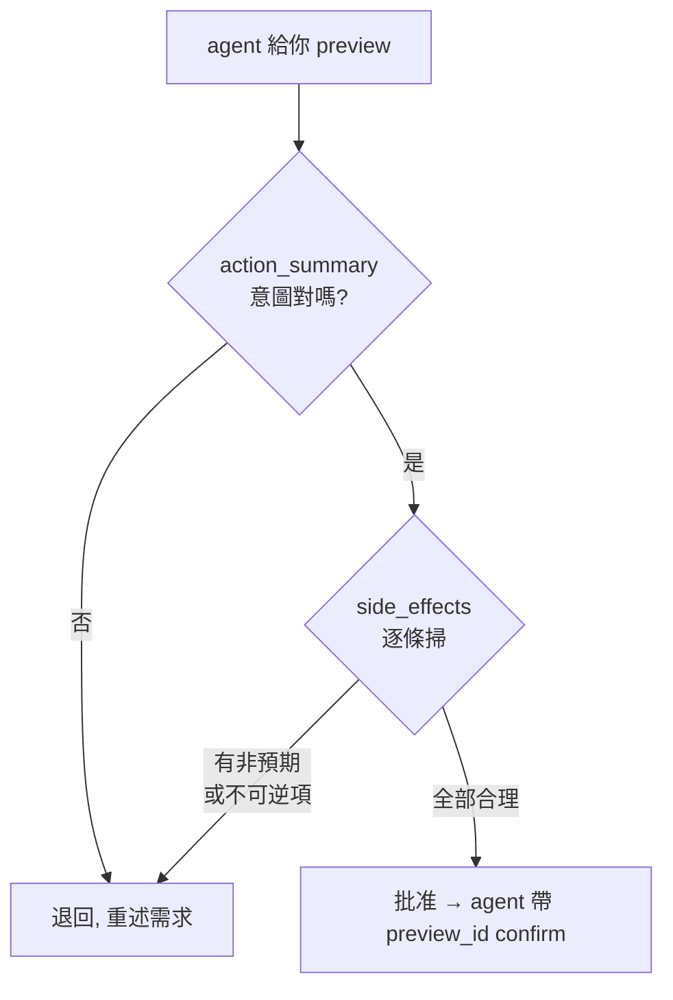

# [Day 20] preview/confirm 實戰 - 安全地放手讓 agent 寫入

- 原文連結: （未發佈）
- 發布時間:

---

前言

Day 4 筆者第一次跟大家介紹 preview/confirm 這道安全網，Day 19 又在實戰裡看到 agent 怎麼把 `side_effects` 攤給你、停下來等你點頭。但那時候你點頭得有點快——因為 happy path 一切正常，看起來就是該批准。

問題是：**真實情境不會每次都是 happy path**。筆者自己就遇過幾次，agent 產生的 preview 會透露出「它理解錯了我的意圖」。如果你把 confirm 當成橡皮圖章，看都不看就蓋下去，那這道安全網等於形同虛設。今天要一起練的，就是**怎麼審**——讓你在真正放手讓 agent 寫入時，看得懂、擋得住。

今天會做三件事：

1. 拆解 `action_summary` 與 `side_effects` 各自該看什麼。
2. 用兩個對照範例，練習「該批准」與「該擋下」的判斷。
3. 搞懂 delete 特有的 `confirmation_phrase`，以及最常見的 `confirmation_phrase_mismatch`。

先分清楚：兩個入口，同一道閘

preview/confirm 在 CLI 和 MCP 兩個入口，長得不太一樣，但本質是同一道後端強制的閘：

- **CLI（你手動）**：create／redeploy 會印出計畫摘要後問 `[y/N]`；`--yes` 可跳過、`--dry-run` 只 preview 不執行。delete 更嚴——side-effects 警告 → 打 app slug（須完全相符）→ 高風險再打 `required_phrase`（如 `DELETE nextdemo`）→ 最後 `[y/N]`。
- **MCP（AI agent）**：寫入工具都是兩階段。agent 先呼叫 `*_preview` 拿到 `action_summary` + 完整 `side_effects` + `expires_at`，**必須把這些展示給你、取得明確同意**，才能帶著 `preview_id` 呼叫對應的 confirm 工具。

今天筆者把重點放在 MCP 入口——因為那才是「放手讓 agent 寫入」真正需要判斷力的地方。

怎麼審 action_summary：看「意圖」

`action_summary` 是一句話的意圖摘要。你讀它的時候，問自己一個問題：**這跟我剛剛要求的事，是同一件事嗎？**

```text
action_summary: 在團隊 "acme" 建立 app "nextdemo"，來源
                github.com/you/nextdemo@main，以 buildpacks 打包並首次部署。
```

檢查點：團隊對不對（是 `acme` 不是別的團隊）？app 名字對不對？來源 repo 與分支對不對？如果你要求的是「部署 nextdemo」，但 summary 說的是「部署 oldapp」或指到錯的分支，那就是 agent 理解偏了——先別批准。

`action_summary` 看的是**方向對不對**。

怎麼審 side_effects：看「代價」

`side_effects` 是完整的後果清單——這次寫入到底會動到什麼。`action_summary` 告訴你方向，`side_effects` 告訴你代價。你要**逐條讀**，特別留意任何「不可逆」或「超出預期範圍」的項目。

範例 A：一個**該批准**的 create side_effects

```text
side_effects:
  - 建立 app 記錄 nextdemo（team: acme）
  - 觸發首次 build（buildpacks）與部署
  - 配置子網域 https://nextdemo.jesontech.com
  - 建立 Persistent Volume 與 ingress 綁定
```

逐條看：全部都是「建立新東西」，沒有刪除、沒有動到既有 app、範圍就在你要的 `nextdemo` 上。方向對、代價合理——**批准**。

範例 B：一個**該擋下**的 side_effects

假設你只是想「重新部署 nextdemo」，但 agent 回來的 preview 是這樣：

```text
action_summary: 刪除 app "nextdemo" 並以新設定重新建立。

side_effects:
  - 刪除 app nextdemo（team: acme）
  - 永久刪除 Persistent Volume（資料不可回復）
  - 移除既有 ingress / 網域綁定
  - 重新建立 app 記錄與部署
```

停。你要的是「redeploy」，agent 卻理解成「delete + recreate」。這裡有一個致命項：**永久刪除 Persistent Volume**——你的資料會沒掉。方向錯了（redeploy 不該碰資料）、代價不可逆。筆者遇到這種 preview 一定會**擋下**：不要 confirm，回頭跟 agent 說「我要的是重新部署，不要刪除，用 redeploy」。

這就是為什麼 preview 不能當橡皮圖章——**同樣一句「幫我更新一下」，agent 可能走 redeploy，也可能走 delete+recreate，只有 side_effects 會誠實告訴你它選了哪條路**。

一張審閱 checklist

筆者自己放手前，都會對著 preview 過一遍這五點：

1. **意圖對齊**：`action_summary` 是不是我要的那件事？團隊／app／來源／分支對不對？
2. **範圍收斂**：`side_effects` 有沒有動到我沒提到的其他 app 或資源？
3. **不可逆掃描**：有沒有「刪除」「永久」「資料不可回復」這類字眼？有的話，這代價我願意付嗎？
4. **過期確認**：`expires_at` 還沒到嗎？（preview 有時效，過期的要重新產生。）
5. **懷疑就退回**：只要有一條看不懂或不對勁，**不要 confirm**，退回去問 agent 或改用 CLI 手動做。



delete 特別關卡：confirmation_phrase

刪除是所有寫入操作裡最危險的，所以它在 MCP 這邊多了一道 CLI 沒有的機制。當 agent 呼叫 `delete_app_preview`，後端會回傳一個 `required_phrase`（格式是 `DELETE <slug>`，例如 `DELETE nextdemo`）。要真正刪除，agent 呼叫 `delete_app` 時**必須傳一個 `confirmation_phrase`，而且它要精準等於 preview 給的 `required_phrase`**。

```text
[agent → delete_app_preview]
  risk_level:      CRITICAL
  required_phrase: DELETE nextdemo
  side_effects:
    - 刪除 app nextdemo，永久刪除 Persistent Volume（預設清 PV）
    - 移除所有 deploy run 與 build 歷史
  preview_id: prev_...

[agent → delete_app(preview_id=prev_..., confirmation_phrase="DELETE nextdemo")]
  deleted: nextdemo
```

如果 `confirmation_phrase` 對不上（打錯、少字、或 agent 自作聰明填了別的），後端直接回：

```text
error: confirmation_phrase_mismatch
```

這個設計的用意是：**刪除不能靠「按個同意」就成立，必須有人打得出這個 app 的全名**。它把「不小心刪掉正式站」擋在一個需要精準輸入的關卡後面——即使是 agent 代打，也得從 preview 拿到正確的 phrase 才過得了。所以當 agent 要幫你刪東西，你除了審 side_effects，還要確認它要刪的 slug 跟 `required_phrase` 裡的是同一個。

一個心法：agent 有權執行、無權略過你

整套 preview/confirm 的設計哲學，可以濃縮成一句話：**讓 AI 有權執行、但無權略過人的確認**。agent 可以呼叫 preview、可以在你同意後呼叫 confirm，但它拿不到「跳過你」的能力——這道閘是後端強制的，不是 agent 客氣。你要做的，就是別把這份權力浪費掉：**批准前先讀 side_effects，別把 confirm 當橡皮圖章**。

總結

今天把「放手讓 agent 寫入」從一句口號，變成可操作的審閱能力：`action_summary` 看意圖方向、`side_effects` 逐條看代價、對照範例練「該批准 vs 該擋下」、delete 另外盯緊 `confirmation_phrase` 與 `confirmation_phrase_mismatch`。核心原則——**preview 不是儀式，是你最後一次看清代價的機會**。

明天 [Day 21]，筆者要帶大家回到自動化：**GitHub App 與 push-to-deploy**。裝好之後，你 push 一個 commit 就自動 redeploy 上線，連指令都不用打。但在按下那個「全自動」開關前，筆者會先帶你確認一件事——關掉它的後果，你清楚嗎？

Q&A

筆者自己也還在磨這套審閱的直覺，你有沒有遇過 agent「理解錯意圖」的時候？當時是 preview 幫你擋下來的，還是事後才發現的呢？非常歡迎留言分享你的審閱心得給我唷 : )

參考連結

- 0ops repo：`src/internal/cli/root.go`（delete 的 typed slug + required_phrase 流程）
- `docs/ironman-30day-notes/drafts/_source-pack.md`（preview/confirm UX、`confirmation_phrase_mismatch`、兩階段寫入工具）
- `docs/ironman-30day-notes/drafts/04_[Day 4] agent 出貨的安全網 - preview_confirm 是什麼.md`（安全網的第一次介紹）
