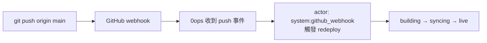

# [Day 21] GitHub App 與 push-to-deploy 全自動化

- 原文連結: （未發佈）
- 發布時間:

---

前言

Day 18 我們用 token + GitHub Actions 走了一條「自訂邏輯」的 CI 部署路徑，Day 19 讓 Claude Code 端到端把 Next.js 部署上線，Day 20 練會了怎麼審 preview、安全地放手。這三天累積下來，你手上已經有好幾種把 app 部署／更新的方法了。

但這些方法都還有一個共通點：**每次要更新，你（或你的 agent、你的 CI 腳本）都得主動觸發**。今天要裝上最後一塊自動化拼圖——**GitHub App**：裝好之後，你只要 `git push`，0ops 就自動幫你 redeploy 上線，中間不用打任何指令、不用寫任何 workflow。

不過，全自動是把雙面刃。所以今天除了教你開它，也要認真教你「關它的後果」。今天會做三件事：

1. 用 `0ops teams github install` 裝好團隊的 GitHub App（preview→confirm→瀏覽器授權→輪詢）。
2. push 一個 commit，驗證自動 redeploy。
3. 用 `0ops teams github status` 查狀態、理解 `uninstall` 為什麼要謹慎。

安裝團隊的 GitHub App

GitHub App 是 0ops 讀取你 repo、接收 push 事件的橋樑。裝它是一個團隊層級的動作，走的是標準的 preview→confirm 流程：

```sh
$ 0ops teams github install
This will install the 0ops GitHub App for team "acme".
side_effects:
  - 於 GitHub 建立 App 安裝，授予 0ops 讀取所選 repo 的權限
  - 啟用 push 事件 webhook（觸發自動 redeploy）
Proceed? [y/N]: y

Open this URL in your browser to authorize:
  https://github.com/apps/0ops/installations/new?state=...

Waiting for installation to complete...
Installation completed for team "acme".
```

拆解這個流程：

1. **preview**：先攤開 side_effects——會在 GitHub 建立一個 App 安裝、授予 0ops 讀取你選定 repo 的權限、並啟用 push webhook。
2. **confirm**：`[y/N]` 你點頭。
3. **開瀏覽器授權**：CLI 給你一個 `install_url`，你到瀏覽器完成 GitHub 端的 OAuth 授權，並選擇要讓 0ops 存取哪些 repo。
4. **輪詢完成**：CLI 在背景輪詢，等 GitHub 那邊授權完成後回報成功。

你可以用旗標調整行為：`--yes` 跳過確認、`--status` 只查狀態不安裝、`--poll-interval` 調整輪詢頻率。

同樣一件事，如果是透過 AI agent 做，走的是 MCP 的 `install_github_app_preview` → `install_github_app`，後端會回一個 `install_url` 讓你開瀏覽器完成——底層是同一套授權，只是入口不同。

push 一個 commit，看它自動上線

裝好之後，push-to-deploy 就活了。它的觸發條件很明確：**當你 push 到某個 app 的 `repo_url` + `ref`（例如 `main`），webhook 就會觸發那個 app 的 redeploy**。

實際驗證一次。改一行、commit、push：

```sh
$ git commit -am "chore: tweak homepage copy"
$ git push origin main
```

然後回 0ops 這邊看狀態。你會看到一個**你沒有手動觸發**的新部署跑起來：

```sh
$ 0ops deploys status nextdemo
deploy_id:     run_01J...
status:        building
commit_sha:    a1b2c3d
ref:           main
started_at:    2026-07-06T05:12:44Z
```

這裡有一個值得注意的細節：這次部署的**觸發者（actor）是 `system:github_webhook`**，不是你個人。也就是說，在稽核紀錄裡，這是一筆「系統因 webhook 而觸發」的部署，跟你手動打 `0ops deploys redeploy` 的紀錄是分得開的——這對日後追「這次上線到底是誰／什麼觸發的」很重要。

等它收斂到 `live`，你的改動就上線了。整個過程你只做了 `git push` 這一件事。



手動 redeploy 與自動 push-to-deploy 怎麼分工

裝了 GitHub App 之後，你其實有兩條 redeploy 路徑，適用不同場景：

- **自動（push-to-deploy）**：常態部署。你正常開發、push 到 `main`，就自動上線。這應該是你日常的預設。
- **手動（`0ops deploys redeploy nextdemo`）**：留給例外。例如你想重跑某個沒有新 commit 的部署、或想部署一個特定的 `--commit-sha`、或臨時想不透過 push 就重來一次。

原則是——**常態部署該自動化，手動 redeploy 留給例外**。這也呼應 Day 18 的分工：GitHub App 這條路適合「push 就上」的單純情境；Day 18 的 token + Actions 那條路，適合你需要在部署前後插入自訂邏輯（跑測試、做檢查）的情境。

查狀態與排查常見卡點

想確認 GitHub App 目前的安裝狀態，用 `status`：

```sh
$ 0ops teams github status
team:         acme
installed:    true
installation: 上次 push 事件 2026-07-06T05:12:44Z
```

如果 push 了卻沒有自動部署，通常是這幾個卡點，逐一排查：

- **App 沒裝到這個 repo**：安裝時 repo 選擇範圍沒包含它。回 GitHub 的 App 安裝設定，把該 repo 加進授權範圍。
- **push 的 ref 不對**：webhook 只觸發 app 綁定的 `ref`。你 push 到 `dev`，但 app 綁的是 `main`，那當然不會動。
- **repo_url 對不上**：app 記錄裡的 `repo_url` 要跟你 push 的 repo 一致。可以用 `0ops apps get nextdemo` 核對。

謹慎：uninstall 會暫停該團隊「所有」app

最後這段最重要，也是今天的原則所在。移除 GitHub App 不是一個局部動作——**`uninstall` 會暫停該團隊底下的「所有」app，不只是某一個**。

```sh
$ 0ops teams github uninstall
WARNING: Uninstalling the GitHub App will suspend ALL apps in team "acme".
...
```

為什麼影響這麼大？因為 GitHub App 是整個團隊與 GitHub 之間的那條橋。橋一拆，團隊裡所有依賴它的 app（無論是要讀 repo、還是要接收 push 事件）都會受影響、被暫停。這不是「只停掉我剛剛那個 demo」，而是「這個團隊的部署能力整個下線」。

透過 MCP 做也一樣——`uninstall_github_app` 在 server 端刪除安裝並暫停該團隊所有 app。入口不同，後果相同。

所以今天的原則很直接：**自動化上線前，先確認「關掉它」的後果你清楚**。開啟 push-to-deploy 很爽，但在你（或某個 agent）手滑 `uninstall` 之前，你要先知道——那一刀砍的是整個團隊，不是一個 app。這也是為什麼 `uninstall` 同樣走 preview/confirm：讓你在拆橋之前，先把 side_effects 看清楚。

總結

今天裝上了自動化的最後一塊：`0ops teams github install` 接好 GitHub App，之後 `git push` 就由 webhook（actor `system:github_webhook`）自動觸發 redeploy 上線；用 `0ops teams github status` 查狀態，並認清 `uninstall` 會暫停**整個團隊**所有 app 的重量。核心原則——**push-to-deploy 讓常態部署零摩擦，但開它之前，先確認你懂得關它的後果**。

到這裡，你已經把 0ops 從「一句話部署」一路練到「push 就自動上線」。明天 [Day 22] 我們轉向另一個維度：**團隊權限與稽核**——誰能做什麼、以及誰做了什麼。當多人與多個 agent 共用一個團隊，「system:github_webhook 觸發的部署」這種紀錄要怎麼查、怎麼追，就是下一篇的主題。

Q&A

你會讓所有 repo 都走 push-to-deploy，還是只開給特定幾個？對 `uninstall` 的「團隊級」影響範圍有疑慮，歡迎留言討論 : )

參考連結

- 0ops repo：`src/internal/cli/root.go`（`teams github install/uninstall/status` 旗標）
- `docs/ironman-30day-notes/drafts/_source-pack.md`（GitHub App 安裝流程、push-to-deploy webhook actor `system:github_webhook`、MCP `install_github_app` / `uninstall_github_app`）
- `docs/ironman-30day-notes/drafts/18_[Day 18] token 與 CI - 非互動式部署.md`（另一條 CI 部署路徑的分工對照）
