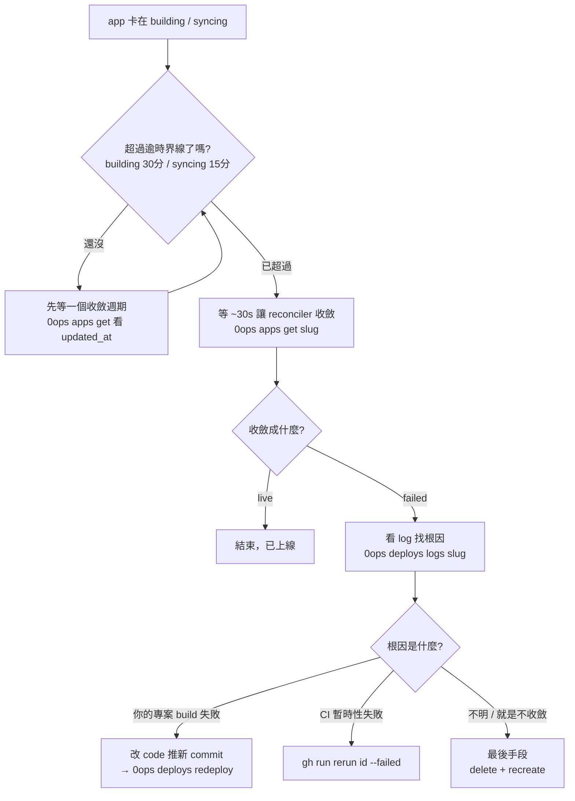

# [Day 23] 排錯（一）- app 卡在 building / syncing

- 原文連結: （未發佈）
- 發布時間:

---

前言

到 [Day 22] 為止，「正常路徑」我們已經全部走完了：裝好、接上 AI CLI、部署、看 log、redeploy、綁網域、管團隊、查稽核。但真實世界不會永遠 happy path。今天起連兩天講排錯，主題是每個人遲早會遇到的畫面——**你建了一個 app，狀態卻卡在 `building` 或 `syncing`，遲遲不變 `live`。**

先說一個心態：0ops 底層是一套會自癒的系統（reconciler + GitOps）。很多「卡住」其實只是還沒收斂，你一慌就手動介入，反而打亂它的收斂週期。所以排錯的第一原則是——**先等一個收斂週期，再動手**。

今天要建立三件事：

- 看懂 `building` / `syncing` 這兩個狀態，以及各自的逾時界線；
- 一條從「等」到「動手」的逐級升級路徑；
- 一張可以照著走的排錯決策樹。

第一步：先確認它真的卡住了

要判斷「卡住」還是「還在跑」，唯一該看的是狀態，不是你的耐心。用 `0ops apps get <slug>`：

```sh
$ 0ops apps get web-demo
```

```
id:                   app_01HC...
slug:                 web-demo
name:                 web-demo
repo_url:             github.com/acme/web-demo
repo_default_branch:  main
image_ref:            (pending)
builder:              nixpacks
status:               building
created_at:           2026-07-06T02:14:07Z
updated_at:           2026-07-06T02:15:31Z
```

這裡有兩個判斷點：

- `status`：目前在 `building`。
- `updated_at`：狀態最後一次變動的時間。如果它一直在跳動，代表系統還在工作，不是死掉。

想知道 build 到底卡在哪一步，就去看 log。`0ops deploys logs <slug> --follow` 會用 SSE 串流即時吐出 build 過程：

```sh
$ 0ops deploys logs web-demo --follow
```

```
[build] detecting language... node
[build] installing dependencies (npm ci)...
[build] npm ERR! code ERESOLVE
[build] npm ERR! peer dep conflict: react@19 vs react-dom@18
```

到這裡你其實已經找到根因了——這是**你的專案 build 失敗**，不是 0ops 卡住。這種要回去改 `package.json`，不是 0ops 能幫你解的。log 是排錯的第一手證據，先看它再說。

看懂兩個狀態與逾時界線

`building` 和 `syncing` 是兩個不同階段，逾時界線也不同：

- **`building`**：在把你的原始碼變成容器映像（build image、推 registry）。這一階段的逾時是 **30 分鐘**。
- **`syncing`**：映像好了，正在把 K8s 資源同步上去（GitOps 讓叢集狀態收斂到目標）。這一階段的逾時是 **15 分鐘**。

關鍵在於：**逾時之後，reconciler 會在大約 30 秒內把狀態收斂掉**——收斂成 `live`（成功）或 `failed`（失敗）。也就是說，一個真正該結束的 app，最壞情況下你頂多等「該階段逾時 + 30 秒」，它就會給你一個明確的終態，而不是永遠掛在中間。

所以，如果你看到 `building` 才過了三分鐘，別急——那還在正常範圍內。真正值得警覺的是：**已經超過逾時界線、`updated_at` 也停住不動**。這時才輪到你動手。

逐級升級：從最輕到最重

確認它真的卡死之後，別一步跳到「刪掉重建」。按這個順序逐級升級，每一級都比前一級動作大：

**第 0 級——等一個收斂週期。** 前面說過了，`building` 30 分、`syncing` 15 分，逾時後 ~30 秒收斂。`0ops apps get <slug>` 應該會給你 `live` 或 `failed`。八成情況等到這裡就有答案了。

**第 1 級——重跑失敗的 CI run。** 如果 build 是透過 GitHub Actions（self-hosted runner）跑的，且失敗看起來像暫時性的（網路、runner 抖動），用 `gh` 重跑失敗的 job，不必整條重來：

```sh
$ gh run rerun <run-id> --failed
```

**第 2 級——重新部署。** 如果狀態收斂成 `failed`，或你已經修好了根因（例如改完 `package.json` 推了新 commit），就用 redeploy 起一個乾淨的新 run：

```sh
$ 0ops deploys redeploy web-demo --ref main
```

注意這裡是 `0ops deploys redeploy`，**不是** `0ops redeploy`。redeploy 會起一個新的 deploy run，舊的 run 會被回收。

**第 3 級——刪除後重建。** 這是最後手段。如果前面幾級都沒用、app 狀態就是不肯收斂，那就砍掉重來：

```sh
$ 0ops apps delete web-demo
$ 0ops apps create --slug web-demo --source github.com/acme/web-demo
```

`delete` 是不可逆操作，會走完整的確認流程——先要你打 app slug，高風險時再要你打 `required_phrase`（例如 `DELETE web-demo`），最後 `[y/N]`（[Day 17] 詳談過）。走到這一級之前，先確定前兩級真的試過了。

一張排錯決策樹

把上面的邏輯收成一張圖，卡住的時候照著走：



決策樹的重點不在於記住每個框，而在於那條主幹：**先等收斂 → 看 log 找根因 → 對症 redeploy → 真的沒救才 delete + recreate**。八成的「卡住」在前兩步就解決了。

總結

今天處理了排錯最常見的一種——app 卡在 `building` / `syncing`。核心心法是：**0ops 是會自癒的系統，先等一個收斂週期再動手**。`building` 逾時 30 分、`syncing` 逾時 15 分，之後 ~30 秒內收斂成 `live` 或 `failed`；真要介入，就照「重跑 CI → redeploy → 刪除重建」逐級升級，別一開始就砍。

明天 [Day 24] 是排錯篇二，處理兩種更棘手的狀況：app 卡在 `deleting` 刪不乾淨，以及部署明明成功了、**網址卻打不開**。後者要從 Cloudflare 一路查到 pod，我會帶你逐層定位。

Q&A

你遇過最久的一次「卡住」是幾分鐘？最後是等到收斂，還是動手介入才解決的？留言分享一下你的排錯經驗 : )

參考連結

- 0ops repo：`src/internal/cli/root.go`（`deploys` / `apps` 指令定義）
- runbook：`create-app-stuck.md`（building / syncing 逾時與收斂週期、升級步驟）
- 事實源：`docs/ironman-30day-notes/drafts/_source-pack.md`（排錯段：reconciler 收斂、逾時界線、升級路徑）
