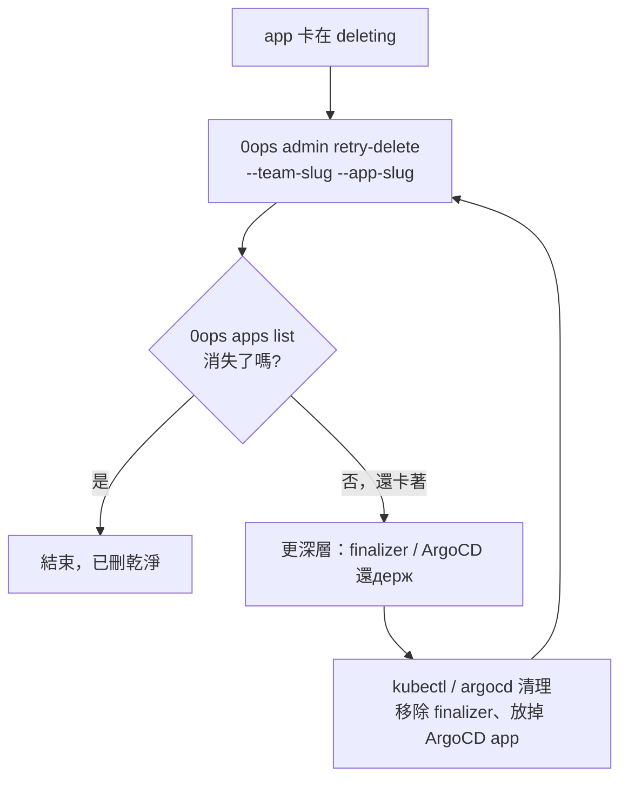
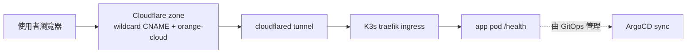

# [Day 24] 排錯（二）- 卡在 deleting 與網址打不開

- 原文連結: （未發佈）
- 發布時間:

---

前言

[Day 23] 筆者陪大家處理了 app 卡在 `building` / `syncing` 的狀況，心法是「先等一個收斂週期再動手」。今天接著，筆者想聊兩種更棘手、也更讓人焦躁的卡關：

- app 卡在 `deleting`——你下了刪除，它卻遲遲不消失；
- 部署明明成功、狀態是 `live`，**網址卻打不開**（4xx / 5xx / 直接連不上）。

筆者發現這兩種問題有個共通點：它們牽動的是 0ops 底層的 K8s / GitOps / 網路這幾層。好消息是，0ops 給了你冪等的復原指令；而網址打不開這種分層系統的故障，筆者自己的經驗是，只要照著「從外到內」逐層定位，多半能自己找到卡在哪。

今天要建立三件事：

- 卡在 `deleting` 時，用 `0ops admin retry-delete` 復原；
- 更深層卡住（finalizer / ArgoCD 還держ 著）時，該往哪清；
- 網址打不開時，一條 Cloudflare → tunnel → ingress → pod → ArgoCD 的分層排查路徑。

狀況一：app 卡在 deleting

你下了 `0ops apps delete <slug>`，走完了打 slug、打 `required_phrase`、`[y/N]` 的整套確認，結果 `0ops apps list` 一看，那個 app 還在，狀態是 `deleting`，賴著不走。

第一手段是 `0ops admin retry-delete`。它會重新驅動刪除流程，**而且是冪等的**——重跑幾次都不會出錯，所以放心多按幾次：

```sh
$ 0ops admin retry-delete --team-slug acme --app-slug web-demo
```

```
retrying delete for app web-demo (team acme)...
delete flow re-triggered. poll with: 0ops apps list
```

跑完用 `0ops apps list` 確認它真的消失了：

```sh
$ 0ops apps list --all
```

```
SLUG        NAME        REPO_URL                      STATUS
api-gw      api-gw      github.com/acme/api-gw        live
```

`web-demo` 不在清單裡了，代表刪乾淨。九成的卡 `deleting` 到這裡就結束。

更深層卡住：finalizer 與 ArgoCD

如果 `retry-delete` 跑了幾次、app 還是卡著，那問題比較深——通常是底層 K8s 資源被 **finalizer** 卡住（PVC、namespace、ingress 的 finalizer 沒被清掉），或是 **ArgoCD** 還держ 著那個 application 不放。這時 `retry-delete` 本身無能為力，因為卡點在叢集裡，得用 `kubectl` / `argocd` 手動清。

要留意的是：這一步需要你有叢集的存取權（self-host 場景你自己就有；代管版通常得找 operator）。大致方向是——找到卡住的資源、移除它的 finalizer 或讓 ArgoCD 放手，**清完之後再回頭跑一次 `0ops admin retry-delete`**。因為 retry-delete 冪等，清完再 retry 是安全的收尾動作。



狀況二：狀態 live，網址卻打不開

這是最容易讓人抓狂的一種——`0ops apps get` 明明寫著 `live`，你打開 `https://web-demo.jesontech.com/` 卻是 4xx、5xx，或乾脆連不上。

要理解怎麼排查，先得知道一個請求從外面打進來，會經過哪幾層。0ops（以 self-host 的參考架構為例）的流量路徑是這樣：



排錯的原則是**從外到內、逐層定位，不要跳層猜**。一層一層問「這裡通不通」：

**第 1 層 — Cloudflare zone。** DNS 有沒有指對？wildcard CNAME（`*.<domain>`）是否存在、是否走 orange-cloud（proxied）。這一層錯，請求根本進不了你的隧道。

**第 2 層 — cloudflared tunnel。** 隧道有沒有活著？參考架構要求 **至少 2 個 ready 的 cloudflared replica**。如果隧道掛了，Cloudflare 收到請求卻沒地方轉。一個常用的介入手段是重啟 cloudflared：

```sh
$ kubectl -n cloudflare-tunnel rollout restart deploy/cloudflared
```

**第 3 層 — K3s traefik ingress。** 請求進到叢集後，ingress 有沒有正確把 host 對應到你的 service？

**第 4 層 — app pod 的 `/health`。** 你的 pod 本身健康嗎？直接打它的 `/health` 端點，確認應用程式真的在服務。如果這裡 5xx，那是你的**應用**掛了，不是 0ops 的網路層。

**第 5 層 — ArgoCD sync。** 兜底檢查：ArgoCD 那個 application 是不是 Synced + Healthy？如果 out-of-sync，叢集實際狀態可能跟你以為的不一樣。

這條路徑的價值在於**收斂問題範圍**：4xx / 5xx / 連不上，你逐層打勾，很快就能定位到「哪一層開始不通」。定位到層，就定位到修法——不通在 Cloudflare 就修 DNS，不通在 tunnel 就 rollout restart，5xx 在 pod 就回去查你的應用。

一個常見誤判要提醒：看到 502 別急著怪 0ops。從外到內查一遍，很多時候根因是**你的 app pod 自己起不來或 `/health` 沒過**——那是應用層的事，跟平台無關。

總結

今天收掉排錯篇的兩個硬骨頭。卡在 `deleting`：先用冪等的 `0ops admin retry-delete` 重跑，多按幾次都安全；真卡在 finalizer / ArgoCD，就 `kubectl` / `argocd` 清完再 retry。網址打不開：照 **Cloudflare → tunnel → ingress → pod `/health` → ArgoCD** 從外到內逐層定位，別跳層猜——定位到層就定位到修法。

排錯篇到這裡告一段落。明天 [Day 25]，筆者想把散落各處的上手陷阱與 FAQ 一次收齊——`asset not found`、PATH 沒加、device flow timeout、AI 工具回 `unauthorized`、MCP 看不到工具——這些「第一天最容易卡」的問題，一篇查完。

Q&A

你踩過「狀態 live 但網址打不開」的坑嗎？最後查到是哪一層出問題？筆者自己每次遇到都還是得乖乖從外到內查一遍，很歡迎你留言告訴我你的分層排查心得唷 : )

參考連結

- 0ops repo：`src/internal/cli/root.go`（`admin retry-delete` / `apps` 指令定義）
- runbook：`delete-app-residue.md`（卡 deleting 的復原）、`winshare-route-failure.md`（URL 分層排查）
- 事實源：`docs/ironman-30day-notes/drafts/_source-pack.md`（排錯段：retry-delete、分層路徑 Cloudflare→tunnel→ingress→pod→ArgoCD）
