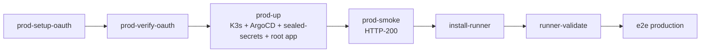

# [Day 26] self-host 你自己的 0ops - 一鍵裝

- 原文連結: （未發佈）
- 發布時間:

---

前言

前面 25 天，我們都是站在「使用者」的位置：裝好 CLI、接上 AI、部署 app、綁網域、排錯。但 0ops 從第一天就強調一件事——它是**可自架**的。對有資料落地、合規、或單純想完全掌控自己那套平台的團隊來說，代管版之外還有一條路：把整套 0ops 裝在你自己的機器上。今天進入最後一章「如何管理 0ops」，第一步就是 self-host。

先破除一個誤會：self-host 的難點**不在裝的指令**。裝的指令幾乎就是一行 `./manage.sh prod-bootstrap-all`。真正的門檻在**外部前置資源**——K3s host、Cloudflare zone、tunnel token、GitHub OAuth App 這些得你自己先備妥。把前置備齊，剩下的一鍵腳本會替你跑完。

今天要建立三件事：

- self-host 前，你得先準備哪些外部資源；
- 怎麼設定 `.env.prod`；
- 一鍵 `prod-bootstrap-all` 做了什麼，以及它冪等、失敗即停、可續跑的特性。

前置清單：門檻在這裡

在跑任何 0ops 指令之前，先確認這些外部資源到位。這份清單就是 self-host 真正的成本所在：

- **一台 K3s host**：跑 0ops 的 Kubernetes 叢集（輕量版 K8s）。
- **Cloudflare zone**：一個你控制的網域（參考架構用 `jesontech.com`），並設好 `*.<domain>` 的 CNAME 指向你的 tunnel（wildcard，讓每個 app 的子網域都通）。
- **Cloudflare Tunnel token**：把叢集流量安全地接出去，不用對外開 port。
- **一個 GitHub OAuth App**：0ops 的登入靠它（[Day 27] 會專門講怎麼設，這裡先備著）。
- **kubeseal**：sealed-secrets 的 CLI，用來把密文加密後才進 git（GitOps 不能放明文密鑰）。
- **可匿名拉取的 ghcr image**：0ops server 的容器映像來源。

這份清單完整寫在 `deploy/bootstrap/README.md`。這些備齊了，接下來才是「裝」。

設定 .env.prod

前置就緒後，第一個動作是從範本複製一份環境設定，再填入你的值：

```sh
$ cp deploy/bootstrap/env.example deploy/bootstrap/.env.prod
$ $EDITOR deploy/bootstrap/.env.prod
```

`.env.prod` 裡要填的大致是這幾類：

- **Cloudflare token**：你的 tunnel token。
- **網域**：你的 zone / host 設定。
- **image tag**：要部署哪個版本的 0ops server 映像。
- **Postgres 密碼**：資料庫密鑰。

這是整個 self-host 過程唯一需要你「動手填」的地方。填對了，剩下交給腳本。

一鍵：prod-bootstrap-all

前置與 `.env.prod` 就緒，一行指令把整套 0ops 拉起來：

```sh
$ ./manage.sh prod-bootstrap-all
```

這一鍵背後串起一整條流水線，依序做完這些事：



- **setup-oauth / verify-oauth**：設定並驗證 GitHub OAuth App（[Day 27] 細講）。
- **prod-up**：裝 K3s、ArgoCD、sealed-secrets，apply root app，跑 smoke。這是把平台本體立起來的一步。
- **prod-smoke**：對 api / demo host 做 HTTP-200 的煙霧測試，確認服務真的活著。
- **install-runner / runner-validate**：裝並驗證 self-hosted GitHub Actions runner（build 你的 app 用）。
- **e2e production**：跑一次端到端測試，證明整條「從原始碼到上線」的路真的通。

三個讓你放心的特性

`prod-bootstrap-all` 不是那種「中途出錯就得整套重來」的腳本。它有三個特性讓你放心跑：

**冪等（idempotent）。** 重跑不會把已經裝好的東西弄壞或裝兩份。所以跑到一半你不確定狀態，直接再跑一次是安全的。

**失敗即停（fail-fast）。** 任何一步出錯，它立刻停下來，不會帶著錯誤狀態硬往下走。你會清楚知道卡在哪一步。

**可續跑。** 配合幾個旗標，你不必每次都從頭：

- `--resume-from=N`：從第 N 步接著跑（前面已經成功的就跳過）。例如 OAuth 那步先卡住，修好之後從那步續跑即可。
- `--skip-runner`：跳過 self-hosted runner 安裝（你如果暫時不需要 CI build）。
- `--skip-e2e`：跳過最後的端到端測試（想先讓平台起來、之後再驗）。

想更有掌控感、或某一步特別想單獨確認，也可以不用一鍵、改成分步跑：

```sh
$ ./manage.sh prod-setup-oauth
$ ./manage.sh prod-verify-oauth
$ ./manage.sh prod-up
$ ./manage.sh prod-smoke
```

分步跑的好處是每一步的輸出你都看得清清楚楚，哪一步卡住一目瞭然。跑到 `prod-smoke` 回 HTTP-200，就代表你自己那套 0ops 已經活著了。

裝好之後、想拆掉怎麼辦

如果你只是試裝、之後想移除，用 `prod-down`：

```sh
$ ./manage.sh prod-down
```

它會移除 ArgoCD 的 root app、以及 `system-0ops` / `cloudflare-tunnel` 這兩個 namespace。**注意**：它**刻意保留** Postgres 的 namespace 與 PVC——也就是你的資料庫不會被一起砍掉。這是保護資料的設計，避免你一個 `prod-down` 手滑就把資料清光。真要連資料一起清，得手動處理那個 PVC。

總結

今天把 self-host 的第一步走完了。核心觀念是：**self-host 的門檻在外部前置資源（K3s、Cloudflare、tunnel、OAuth App、kubeseal），不在裝的指令。** 前置備齊、填好 `.env.prod`，一行 `./manage.sh prod-bootstrap-all` 就把整套平台拉起來——而且冪等、失敗即停、可用 `--resume-from` 續跑，不怕中途卡住。

不過你有沒有發現，一鍵流程的第一步是 OAuth，而 OAuth 也是 self-host 最容易卡的地方？明天 [Day 27] 就專門攻這一關——生產環境的 OAuth 與網域設定，包括那個 99% 的人第一次都會設錯的 callback URL，以及「Enable Device Flow」那個一定要勾的選項。

Q&A

你有考慮過把 0ops self-host 嗎？前置清單裡哪一項對你來說最麻煩——K3s、Cloudflare、還是 OAuth App？留言聊聊你的環境 : )

參考連結

- 0ops repo：`deploy/bootstrap/README.md`（前置清單）、`deploy/bootstrap/env.example`（環境範本）、`manage.sh`（`prod-bootstrap-all` / `prod-up` / `prod-down` 等）
- 事實源：`docs/ironman-30day-notes/drafts/_source-pack.md`（進階 / self-host 段）
