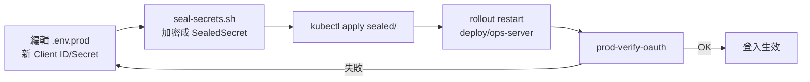

# [Day 27] 生產 OAuth 與網域設定

- 原文連結: （未發佈）
- 發布時間:

---

前言

[Day 26] 我們用 `./manage.sh prod-bootstrap-all` 把一整套 0ops 裝到自己的 K3s 上，也點出了 self-host 真正的門檻不在那條指令，而在外部前置資源——Cloudflare zone、Tunnel token、GitHub OAuth App。今天要處理的，正是那些前置資源裡最容易卡住新手的一塊：**登入用的 GitHub OAuth**，以及讓 app 對外可達的**網域**設定。

self-host 裝完之後，最常見的第一個「怎麼登不進去」的問題，九成不是 0ops 本身壞掉，而是 OAuth App 的 callback URL 填錯，或者忘了勾 Device Flow。這一篇就把生產 OAuth 從註冊、寫入設定、驗證，到「換了 secret 之後怎麼熱更新」整條路走一遍。今天你會做到三件事：

1. 用 `./manage.sh prod-setup-oauth` 互動式註冊 GitHub OAuth App 並寫進 `.env.prod`；
2. 用 `prod-verify-oauth` 確認 Client ID 與 Device Flow 都就緒；
3. 換 Client ID / Secret 後，用 sealed-secrets 熱更新 `ops-server`，不用整組重裝。

這一篇的權威來源是 repo 裡的 `docs/runbooks/production-oauth-setup.md`，指令我都對過。

為什麼 self-host 一定要自己弄 OAuth

代管版的 0ops，登入這件事平台幫你處理好了，你 device flow 授權一次就能用。但 self-host 的時候，**你就是平台**——0ops 需要一個屬於你自己網域的 GitHub OAuth App，來換取使用者的身分。這個 OAuth App 有兩個關鍵設定，填錯任何一個都會登不進去：

- **Authorization callback URL**：GitHub 授權完之後要把使用者導回哪裡。必須精確等於 `https://<你的 API host>/v1/auth/oauth2/callback`。
- **Enable Device Flow**：0ops 的 CLI 走的是 device flow（印一組 `user_code` 讓你去瀏覽器貼），這個開關**一定要勾**，否則 CLI 登入會直接被 GitHub 回 `unauthorized_client`。

先把這兩點記在心裡，後面的操作只是把它們落實。

一鍵互動註冊：prod-setup-oauth

repo 提供了一個互動式指令，會開一個預填好欄位的 GitHub 註冊頁，你只要貼回 Client ID 與 Secret 即可：

```sh
$ ./manage.sh prod-setup-oauth
```

實際會看到類似這樣的流程：

```
==> Production OAuth setup
Open this URL to register a new GitHub OAuth App (fields pre-filled):

  https://github.com/settings/applications/new?oauth_application[name]=0ops-prod&oauth_application[url]=https://api.jesontech.com&oauth_application[callback_url]=https://api.jesontech.com/v1/auth/oauth2/callback

After creating the app, check "Enable Device Flow", then paste:

  GitHub OAuth Client ID: Iv1.a1b2c3d4e5f6a7b8
  GitHub OAuth Client Secret: ****************************************

==> Wrote 3 lines to deploy/bootstrap/.env.prod
    GITHUB_OAUTH_CLIENT_ID=Iv1.a1b2c3d4e5f6a7b8
    GITHUB_OAUTH_CLIENT_SECRET=(hidden)
    GITHUB_OAUTH_REDIRECT_URL=https://api.jesontech.com/v1/auth/oauth2/callback
```

這裡的重點：註冊頁把 name / homepage / callback 都幫你填好了，你**唯一不能忘的手動動作，是在建立 App 的頁面勾選 "Enable Device Flow"**。GitHub 這個選項預設不勾，而它偏偏是 CLI 登入的命脈。

如果你不想走互動流程，也可以手動去 `https://github.com/settings/applications/new` 自己建，只要保證：

- callback 填 `https://<PROD_API_HOST>/v1/auth/oauth2/callback`；
- 勾 Enable Device Flow；
- 把 Client ID / Secret / redirect URL 三行寫進 `deploy/bootstrap/.env.prod`。

驗證：prod-verify-oauth

寫完設定不代表就通了。用驗證指令確認 `ops-server` 讀到的 Client ID 正確、而且 Device Flow 真的啟用：

```sh
$ ./manage.sh prod-verify-oauth
```

順利的話會看到：

```
==> Verifying production OAuth configuration
    GITHUB_OAUTH_CLIENT_ID present: yes (Iv1.a1b2...b8)
    Device Flow enabled: yes
    Callback reachable: https://api.jesontech.com/v1/auth/oauth2/callback -> 200
==> OAuth configuration OK
```

驗證通過後，就可以拿一台裝了 `0ops` CLI 的機器實際登入你的 self-host 實例：

```sh
$ 0ops auth login --host=https://api.jesontech.com
Open https://github.com/login/device and enter code: WDJB-MJHT
Waiting for authorization...
Login successful.

$ 0ops auth status
Host:  https://api.jesontech.com
User:  your-github-login
Token: stored at ~/.config/0ops/auth.json
```

能走完 device flow、`auth status` 回得出你的身分，OAuth 這關就過了。

換 Client ID / Secret 後怎麼熱更新

生產環境難免要輪替 secret——可能是 secret 外洩、或你要換一個新的 OAuth App。這裡的關鍵是：**改 `.env.prod` 不會自動生效**，因為生產環境的 secret 是走 sealed-secrets 加密後由 ArgoCD 同步進叢集的，`ops-server` 也需要重啟才會讀到新值。完整四步：

```sh
# 1. 把 .env.prod 裡的新 secret 重新封裝成 SealedSecret
$ ./deploy/bootstrap/seal-secrets.sh

# 2. 套用封裝後的 sealed secret
$ kubectl apply -f deploy/bootstrap/tmp/sealed/

# 3. 重啟 ops-server 讓它讀到新 secret
$ kubectl -n system-0ops rollout restart deploy/ops-server

# 4. 再驗一次
$ ./manage.sh prod-verify-oauth
```

`seal-secrets.sh` 會用叢集裡 sealed-secrets controller 的公鑰，把明文 secret 加密成只有該叢集能解的 `SealedSecret`——所以你可以安心把封裝後的檔案 commit 進 git，明文不會外流。這一步的心智模型是：明文只活在你本機的 `.env.prod`，進叢集的永遠是加密版。

整條熱更新流程可以這樣看：



網域設定：讓 app 對外可達

OAuth 解決的是「誰能登入」，網域解決的是「app 怎麼被外界打到」。self-host 的對外流量走的是 Cloudflare Tunnel：你在 [Day 26] 備妥的 `*.jesontech.com` wildcard CNAME 指向 tunnel，任何 `<slug>.jesontech.com` 的請求就會被 cloudflared 接進 K3s 的 traefik ingress，再轉給對應 app 的 pod。所以平台層的 app 預設子網域**不需要你逐一設 DNS**，wildcard 已經涵蓋。

如果使用者要綁自己的**自訂網域**（例如把 app 掛到 `app.mycompany.com`），那就是 [Day 15] 講過的流程：加 CNAME + `_0ops-verify.<host>` TXT，後端每 30s 輪詢雙條件驗證。查驗證狀態一樣只有唯讀的：

```sh
$ 0ops domains list nextdemo
HOSTNAME               KIND    VERIFIED  VERIFIED_AT
app.mycompany.com      cname   true      2026-07-06T09:12:03Z
```

再次提醒 [Day 15] 標過的狀態：目前 CLI **只有 `0ops domains list`**，新增與驗證觸發是 API / spec 面，尚未 CLI 化，不要去找 `0ops apps add-domain`——它不存在。

兩個最常見的卡點

生產 OAuth 卡住，`docs/runbooks/production-oauth-setup.md` 的排錯章節歸納出兩個佔絕大多數的原因：

- **登入卡在 pending，瀏覽器授權完卻導不回來**：99% 是 callback URL 填錯。GitHub 會嚴格比對，多一個斜線、http/https 不符、host 打錯都不行。改成 `https://<host>/v1/auth/oauth2/callback` 後重跑 `prod-up`（或至少重驗）即可。
- **CLI 登入直接被回 `unauthorized_client`**：OAuth App 沒勾 Enable Device Flow。回 GitHub App 設定頁補勾，不用改 secret，`prod-verify-oauth` 會立刻反映。

把這兩個先排掉，剩下的 OAuth 問題其實很少見。

總結

今天我們把 self-host 的登入這關收乾淨了：`prod-setup-oauth` 互動註冊並寫入 `.env.prod`、`prod-verify-oauth` 驗證 Client ID 與 Device Flow、換 secret 走 seal → apply → rollout restart → verify 的熱更新四步；網域則靠 Cloudflare Tunnel 的 wildcard 涵蓋平台子網域，自訂網域沿用 [Day 15] 的 TXT 驗證。記住那條經驗法則：**OAuth 出問題，九成是 callback URL 或 Device Flow 開關，先查這兩個。**

明天 [Day 28]，我們往企業場景再進一步：當團隊不想每個人各自用 GitHub 登入，而要接公司自己的身分供應商時，0ops 的 per-team OIDC SSO 怎麼設、離職或資安事件要一鍵撤掉一個人的所有存取時又怎麼做。

Q&A

你在 self-host 時卡過哪一種 OAuth 錯誤？是 callback、Device Flow，還是別的？歡迎留言分享你的排查過程，我們一起補齊這份卡點清單 : )

參考連結

- `docs/runbooks/production-oauth-setup.md`（生產 OAuth 註冊、驗證、secret 輪替）
- `deploy/bootstrap/seal-secrets.sh`、`deploy/bootstrap/env.example`（sealed-secrets 與環境設定）
- `manage.sh`（`prod-setup-oauth` / `prod-verify-oauth` / `prod-up`）
