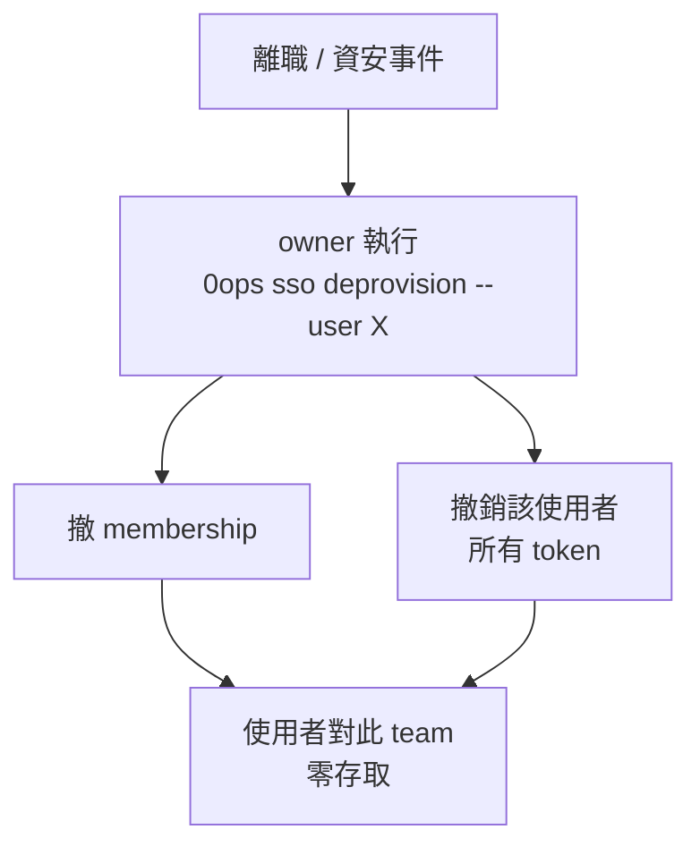

# [Day 28] 企業級 SSO / OIDC 登入與集中撤權

- 原文連結: （未發佈）
- 發布時間:

---

前言

[Day 27] 筆者把 self-host 的 GitHub OAuth 登入設好、驗過，也帶你走了換 secret 的熱更新四步。但 GitHub OAuth 有一個企業場景撐不住的假設：**它預設每個人都拿自己的 GitHub 帳號登入**。到了有規模的組織，IT 想要的是「員工用公司的身分供應商（Okta、Entra ID、Google Workspace 這類）登入」、「離職當天一鍵讓這個人徹底沒有存取」。這就是 SSO / OIDC 要解決的問題。

今天這一篇筆者想寫得誠實一點——0ops 的 SSO 能力，有些已經有 end-to-end 測試落地，有些還在規劃中，筆者會逐項標清楚狀態，不把 roadmap 講成現貨。今天你會理解三件事：

1. 0ops 的 **per-team OIDC** 登入模型，以及 owner / admin 怎麼用 `0ops sso status` 檢視設定；
2. 資安事件或離職時，怎麼用 `0ops sso deprovision` **一次撤掉**一個人的 membership 與所有 token；
3. 哪些 SSO / 合規能力已落地、哪些仍是規劃中（SAML 細節、SOC2 / DPA）。

per-team OIDC 登入模型

0ops 的 SSO 是**綁在 team 這一層**的，不是全平台一個統一設定。這個設計對 self-host 尤其重要：同一個 0ops 實例上可能有多個 team，每個 team 屬於不同的組織，各自接自己的身分供應商。A 團隊接 Okta、B 團隊接 Entra ID，互不干涉。

owner / admin 可以用唯讀指令查自己 team 目前的 OIDC 設定：

```sh
$ 0ops sso status
```

會看到類似這樣的輸出（欄位以你的 team 設定為準）：

```
TEAM       SSO      PROVIDER   ISSUER                              STATUS
acme-inc   oidc     okta       https://acme.okta.com               enabled
```

沒設 SSO 的 team 則會顯示未啟用：

```
TEAM       SSO      PROVIDER   ISSUER   STATUS
my-team    -        -          -        not configured
```

這裡要標清楚狀態：**per-team OIDC 登入已經有 compose 環境的 end-to-end 測試落地（PR #141）**，也就是「用 OIDC 走完整登入」這條路是驗過的。至於 **SAML** 這種另一種常見的企業 SSO 協定，細節請以 repo 的 spec 為準——本系列不宣稱 SAML 已經像 OIDC 一樣有 e2e 覆蓋，避免給你錯誤預期。

集中撤權：一鍵讓一個人徹底沒有存取

企業要 SSO，真正的痛點往往不是「登入」，而是「**登出**」——更精確說，是**撤權**。想像一個場景：某位成員離職，或更緊急的，某個帳號被判定可能已遭入侵。這時候 IT 最怕的是「以為撤乾淨了，其實還留一條後門」：membership 撤了但個人 token 還活著，或者反過來。

0ops 把這件事收斂成一個 owner-only 的指令：

```sh
$ 0ops sso deprovision --user alice@acme.com --yes
```

它會**一次原子地**做完兩件事：撤掉這個使用者在 team 內的 membership，以及**撤銷他名下所有 token**。輸出會把撤了什麼攤給你看：

```
==> Deprovisioning user alice@acme.com from team acme-inc
    Membership: removed (was: member)
    Tokens revoked: 3
      - ci-runner       (revoked)
      - laptop-cli      (revoked)
      - personal-token  (revoked)
==> Deprovision complete. User has no remaining access to team acme-inc.
```

這裡有幾個要點：

- `--user` 可以吃 **email 或 user id**，你手上有哪個都行。
- 這是 **owner-only** 的操作——撤除一個人的全部存取權，本身就是高權限動作，只有 team owner 能執行。
- 它是「集中且徹底」的：你不需要先去 `0ops members remove` 再去 `0ops auth tokens revoke` 逐一清 token，一條指令蓋掉整條存取面。

撤權這件事的心智模型，可以這樣看：



為什麼 deprovision 值得單獨做成一個指令

你可能會想：分開撤 membership 跟 token 不也行嗎？問題出在**時間差與遺漏**。真實資安事件裡，「撤了 A 忘了撤 B」是最常見的破口。把兩件事綁成一個原子操作，等於用工具消除掉人為遺漏的空間——這正是企業合規稽核會盯的地方：你能不能證明「這個人現在真的一點都碰不到」。

同時要注意，deprovision 撤的是**存取權**，不是資料。使用者過去在 audit_log 裡留下的操作紀錄不會因為撤權而消失（這也是合規要的——撤權本身也該留痕）。這條線筆者明天 [Day 29] 談稽核時會接上。

哪些已落地、哪些規劃中

企業採購最在意的往往是合規認證，這裡筆者必須把話說清楚，避免你把 roadmap 當成已交付：

| 能力 | 狀態 |
|---|---|
| per-team OIDC 登入 | 已落地，有 compose e2e（PR #141） |
| `0ops sso status` / `deprovision` | 已在 CLI |
| SAML | 見 spec，本系列不宣稱有 e2e 覆蓋 |
| SOC2 認證 | **規劃中**，尚未取得 |
| DPA（資料處理協議） | **規劃中** |

換句話說：**「用 OIDC 登入」和「一鍵集中撤權」是你今天就能用的**；**「我們有 SOC2」「我們有 DPA」這種話現在還不能說**。如果你的採購流程硬性要求 SOC2 報告，目前得走「self-host + 自己的合規論述」這條路，而不是拿 0ops 的認證去交差。

離職 / 資安事件的實務操作

把今天的能力落到一個實際 runbook：

```sh
# 1. 事件發生，先確認這個人現在的 membership 與 token
$ 0ops members list
$ 0ops auth tokens list        # 若要盤點自己的；全域盤點由 audit 面查

# 2. owner 一鍵撤權
$ 0ops sso deprovision --user compromised@acme.com --yes

# 3. 撤完後，用稽核確認這個人此後沒有任何成功的寫入操作（Day 29 會細講）
$ 0ops audit list --actor compromised@acme.com --since 24h
```

順序的重點是：**先撤，再查**。資安事件的第一要務是止血——把存取切斷，再回頭用 audit 盤點損害範圍。deprovision 給你的就是那把「一刀切乾淨」的止血刀。

總結

今天筆者陪你看了 0ops 面向企業的兩個核心：per-team OIDC 讓每個 team 各自接自己的身分供應商（OIDC 登入已有 compose e2e），以及 `0ops sso deprovision` 把「撤 membership + 撤所有 token」原子化成一條 owner-only 指令，消除人為遺漏。同時誠實標清楚：SAML 細節見 spec、SOC2 / DPA 仍在規劃中，不能當現貨宣稱。記住那條原則：**企業要的是「一鍵讓一個人徹底沒有存取」，撤權要集中且徹底。**

明天 [Day 29]，筆者接著談撤權之後的另一半——稽核與合規。撤權止了血，但你怎麼證明「誰在什麼時候做了什麼」、怎麼把稽核紀錄匯出並驗證它沒被竄改、事故怎麼登記與收尾。

Q&A

你們組織現在用哪套身分供應商？如果要把 0ops 接進去，最卡的會是 OIDC 設定還是合規認證那關？筆者自己也還在摸索不同供應商的接法，歡迎留言聊聊你的合規紅線給我唷 : )

參考連結

- `src/internal/cli/root.go`（`sso status` / `sso deprovision` verb）
- 0ops SSO/OIDC spec 與 PR #141（OIDC compose e2e）
- `docs/ironman-30day-notes/drafts/_source-pack.md`（SSO 狀態與撤權語意）
