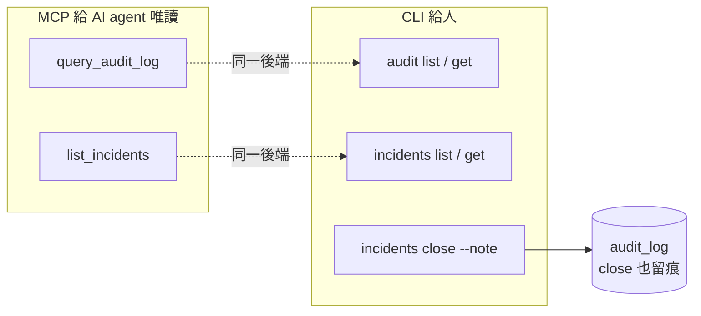

# [Day 29] 稽核與合規 - 查詢 / 匯出 / incident

- 原文連結: （未發佈）
- 發布時間:

---

前言

[Day 28] 筆者帶你在資安事件時用 `0ops sso deprovision` 一刀把一個人的所有存取切乾淨，也留下一句伏筆：撤權止了血，但你怎麼**證明**「誰在什麼時候做了什麼」？這就是今天的主題——稽核（audit）與合規（compliance）。

筆者自己踩過幾次稽核需求後才體會到，稽核的價值不在於「有記」，而在於**不可否認**：查得到、匯得出、驗得了它沒被竄改。一份可以被偷偷改掉的稽核紀錄，在合規上等於沒有。今天你會做到三件事：

1. 用 `0ops audit list` / `get` 查稽核紀錄，並用 trace-id 串起一次操作的完整軌跡；
2. 認識 audit **export / verify** 的防竄改（tamper-evidence）機制，以及它的落地狀態；
3. 用 `0ops incidents` 登記、查詢、收尾事故，並理解 MCP 這一側哪些是唯讀、哪些只在 CLI。

查稽核：audit list 與 get

先從最日常的查詢開始。`0ops audit list` 讓你依時間、動作、操作者、trace 篩選稽核事件：

```sh
$ 0ops audit list --since 24h --action create_app --actor me
```

輸出大致長這樣：

```
ID          TIME                  ACTOR              ACTION       TARGET      TRACE
a1b2c3d4    2026-07-06T09:12:03Z  you@acme.com       create_app   nextdemo    tr-7f3a...
e5f6a7b8    2026-07-06T08:40:11Z  you@acme.com       create_app   apidemo     tr-2c9d...
```

常用篩選旗標（以 source-pack 為準）：

- `--since` / `--until`：時間範圍。
- `--action`：動作類型，如 `create_app`、`delete_app`。
- `--actor`：操作者，特別的是可以填 `me` 只看自己。
- `--trace`：用 trace-id 撈同一次操作串起來的所有事件。
- `--page-size`（最大 200）/ `--cursor` / `--all`：分頁。

要看單一事件的完整內容，用 `get`：

```sh
$ 0ops audit get a1b2c3d4
```

```
id:         a1b2c3d4
time:       2026-07-06T09:12:03Z
actor:      you@acme.com
action:     create_app
target:     nextdemo
trace_id:   tr-7f3a1b2c9d8e
result:     success
metadata:
  source:   github.com/acme/nextdemo
  ref:      main
```

用 trace-id 串一次操作的完整軌跡

單看一條 audit 事件常常不夠——一次「部署」在後端其實是好幾個步驟。trace-id 就是把它們縫起來的線。從上面那條 `create_app` 拿到 `trace_id`，再用它反查：

```sh
$ 0ops audit list --trace tr-7f3a1b2c9d8e --all
```

```
ID          TIME                  ACTOR                    ACTION           TARGET
a1b2c3d4    2026-07-06T09:12:03Z  you@acme.com             create_app       nextdemo
b2c3d4e5    2026-07-06T09:12:05Z  system:builder           build_started    nextdemo
c3d4e5f6    2026-07-06T09:13:40Z  system:builder           build_succeeded  nextdemo
d4e5f6a7    2026-07-06T09:14:02Z  system:reconciler        deploy_synced    nextdemo
```

這條軌跡的價值：你能看到一次意圖（人按下 create）如何展開成一連串系統動作（builder、reconciler 各自的 actor），每一步都留痕。合規稽核最愛問的「這個部署到底是誰觸發、經過哪些自動步驟」，一條 trace 就能回答。

權限：誰能查全團隊、誰只能查自己

稽核資料本身敏感，所以查詢也分權限。這點在 MCP 與 CLI 都一致：

- **admin 以上**：`query_audit_log`（MCP）/ `0ops audit list` 可查**全團隊**的稽核事件。
- **viewer**：只能查 `actor=me`，也就是自己的操作，而且回傳是**脫敏**的。

這個設計的用意是最小揭露——一個 viewer 不該看到別人做了什麼的細節。所以如果你以 viewer 身分跑 `0ops audit list` 卻只看到自己的紀錄，那不是 bug，是設計。

匯出與驗證：tamper-evidence

查得到只是第一層，合規真正要的是**匯得出、而且驗得了沒被竄改**。0ops 的 audit 有 export / verify 機制，屬於 tamper-evidence（防竄改證據）——匯出的稽核紀錄帶有可驗證的完整性保證，你（或稽核方）可以事後 verify 它從匯出到現在沒被動過手腳。

這裡筆者要把狀態標清楚：**audit export / verify 的 tamper-evidence 機制已落地（對應里程碑 M9.1 / M9.6）**。這是已交付的能力，不是規劃中。它的意義在於：當你要向稽核方提交「過去一季的所有部署與撤權紀錄」時，你交出去的不只是一份可以被 Excel 改掉的表格，而是一份能被獨立驗證完整性的證據。

事故管理：incidents

稽核回答「發生了什麼」，事故（incident）回答「我們怎麼處理」。0ops 把事故也納入同一套可稽核的體系。查目前開著的事故：

```sh
$ 0ops incidents list --status open
```

```
ID          KIND            SEVERITY  STATUS  OPENED
inc-4821    deploy_failure  high      open    2026-07-06T07:30:00Z
inc-4820    route_failure   medium    open    2026-07-05T22:11:00Z
```

篩選旗標：`--status`（open | closed | all）、`--kind`、`--severity`。看單一事故細節用 `get`：

```sh
$ 0ops incidents get inc-4821
```

處理完後收尾，並且**留下 root cause**：

```sh
$ 0ops incidents close inc-4821 --note "reconciler timeout; builder image pull throttled by registry; raised pull concurrency"
```

```
==> Closing incident inc-4821
    Status: open -> closed
    Note recorded.
==> Audit event written: incident_closed (trace tr-9a8b...)
```

注意最後一行——**`close` 這個動作本身會寫進 audit_log**。也就是說「誰在什麼時候用什麼理由關掉這個事故」也是被稽核的。這正是不可否認性的閉環：連處理事故的動作都留痕。

CLI 與 MCP 的分工：唯讀 vs 寫入

給 AI agent 用的 MCP 這一側，事故與稽核工具是**唯讀**的：

- `query_audit_log`（MCP）：唯讀查稽核，權限規則同上（全團隊需 admin，viewer 只 `actor=me` 且脫敏）。
- `list_incidents`（MCP）：唯讀列事故。

而**關閉事故（`close`）只在 CLI**——MCP 沒有對應的寫入工具。這是刻意的：讓 agent 能「讀」現況幫你分析，但「登記結案」這種帶主觀判斷（root cause 怎麼寫）的動作，留給人在 CLI 手動做。



合規對映：已落地 vs 規劃中

筆者把今天的能力對到合規語彙，同時把狀態標乾淨：

| 能力 | 狀態 |
|---|---|
| audit 查詢（list / get / trace 串接） | 已落地（CLI + MCP 唯讀） |
| audit 查詢權限分級（admin 全團隊 / viewer 僅 me 脫敏） | 已落地 |
| audit export / verify（tamper-evidence） | 已落地（M9.1 / M9.6） |
| incidents（list / get / close --note，close 寫 audit_log） | 已落地（close 僅 CLI） |
| SOC2 認證 / DPA | **規劃中**（見 [Day 28]） |

換句話說：**「查、匯、驗、事故留痕」這套機制本身已經是現貨**；但**外部合規認證（SOC2 / DPA）仍在規劃中**——機制到位不等於已拿到第三方認證，這兩件事別混為一談。

總結

今天筆者陪你把稽核與合規走了一遍：`0ops audit list` / `get` 加 trace-id 能串出一次操作從人到系統的完整軌跡；查詢權限分 admin（全團隊）與 viewer（僅自己且脫敏）；export / verify 提供已落地的防竄改證據（M9.1 / M9.6）；`0ops incidents` 讓事故可登記、可收尾，而 `close --note` 連處理動作都寫回 audit_log。MCP 這側 `query_audit_log` / `list_incidents` 唯讀，`close` 只在 CLI。記住那條原則：**稽核的價值在不可否認——查得到、匯得出、驗得了才算數。**

明天 [Day 30]，是這個系列的最後一天。筆者會做進階運維的收尾動作（PITR 演練、生產驗證），然後回顧 Day 1 到 29 這一路走來、列出「你現在會做的事」，並誠實交代 0ops 還沒證明什麼。

Q&A

你們的合規稽核最常被問到的是哪一類紀錄？是部署、權限變更，還是事故處理？筆者自己也還在補齊各種稽核需求的樣貌，歡迎留言分享你踩過的稽核需求給我唷 : )

參考連結

- `src/internal/cli/root.go`（`audit list` / `get`、`incidents list` / `get` / `close` verb）
- audit export / verify 里程碑 M9.1 / M9.6（tamper-evidence）
- `docs/ironman-30day-notes/drafts/_source-pack.md`（稽核權限與 MCP 唯讀語意）
