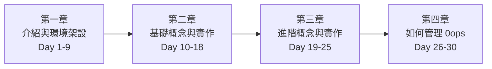

# [Day 30] 0ops 30 天學習總結

- 原文連結: （未發佈）
- 發布時間:

---

前言

不知不覺，鐵人賽來到了最後一天。回頭看這 30 篇，筆者陪你從「AI agent 會寫 code 卻不會出貨」這個痛點出發，一路走到自己 self-host 一整套 0ops、設好生產 OAuth、接企業 SSO、查稽核、驗證防竄改。

[Day 29] 筆者把稽核與合規收乾淨，也留了個尾巴：最後一天要做兩件事。今天筆者會先補上進階運維的幾個收尾動作，然後把整個系列串一遍——列出「你現在會做的事」，並且誠實交代 0ops 還沒證明什麼。收尾的價值，在於同時說清楚「你學會了什麼」與「還沒證明什麼」。

進階運維：上線之後的日常

self-host 一套 0ops 不是裝完就結束，它是一個要持續運維的系統。`./manage.sh` 提供了幾個日常會用到的運維動作：

演練備份還原（PITR，Point-In-Time Recovery）——你不希望真的出事那天才第一次試還原：

```sh
$ ./manage.sh pitr-drill
```

```
==> Postgres PITR drill
    Taking base backup... ok
    Simulating restore to 2026-07-06T08:00:00Z... ok
    Verifying restored data integrity... ok
==> PITR drill passed
```

定期驗證整套系統健康——確認所有 ArgoCD app 都 Synced + Healthy，並跑 smoke：

```sh
$ ./manage.sh prod-verify
```

```
==> Verifying production deployment
    ArgoCD apps: all Synced + Healthy (7/7)
    Smoke (api host):  200
    Smoke (demo host): 200
==> Production verify OK
```

驗證 self-hosted GHA runner 還能正常接活（push-to-deploy 的建置端）：

```sh
$ ./manage.sh prod-runner-validate
```

這三個動作構成一個簡單的運維節律：**平時 `prod-verify` 確認健康、定期 `pitr-drill` 演練還原、`prod-runner-validate` 確認建置管線活著**。運維的心法就一句：別等出事才第一次跑這些指令。

回顧：四章走過的路

這個系列分成四章，對映一個從「聽說過」到「自己運維」的完整進程：



**第一章 介紹與環境架設（Day 1–9）**——先把「為什麼」講清楚：AI agent 補不上出貨最後一哩（Day 1）、30 秒 demo（Day 2）、誰該用（Day 3）、preview/confirm 安全網（Day 4）、與 Vercel/Railway/K8s 的選型（Day 5）、CLI 與 MCP 雙入口（Day 6），然後動手裝：一條 curl 上手（Day 7）、接 AI CLI（Day 8）、deny-by-default 的工具授權（Day 9）。

**第二章 基礎概念與實作（Day 10–18）**——把最短路徑跑通：從 GitHub repo（Day 10）或本機資料夾（Day 11）部署、用自然語言讓 agent 部署（Day 12）、查狀態與看 log（Day 13）、redeploy 與 push-to-deploy（Day 14）、綁自訂網域（Day 15）、團隊協作（Day 16）、app 生命週期與安全刪除（Day 17）、token 與 CI（Day 18）。

**第三章 進階概念與實作（Day 19–25）**——把操作串成真實情境：讓 Claude Code 從零部署 Next.js（Day 19）、preview/confirm 實戰審閱（Day 20）、GitHub App 全自動化（Day 21）、權限與稽核（Day 22），以及兩篇排錯——卡 building/syncing（Day 23）、卡 deleting 與網址打不開（Day 24），最後是上手陷阱 FAQ（Day 25）。

**第四章 如何管理 0ops（Day 26–30）**——把平台扛到自己肩上：self-host 一鍵裝（Day 26）、生產 OAuth 與網域（Day 27）、企業 SSO 與集中撤權（Day 28）、稽核與合規（Day 29），到今天的運維回顧（Day 30）。

你現在會做的事

如果你這 30 天有跟著做，你現在應該能夠：

1. 三分鐘用一條 curl 裝好 0ops、走 device flow 登入、驗 `0ops auth status`。
2. 把 0ops 接上 Claude Code / Codex / Copilot，並確認 agent 看得到工具。
3. 用 `0ops auth grant` / `revoke` 管理 deny-by-default 的 MCP 工具權限。
4. 用 `0ops apps create --slug <slug> --source <github-url>` 從 GitHub 部署一個 app。
5. 用 `--source ./my-app` 從本機資料夾部署，不用先推 GitHub。
6. 在 Claude Code 裡用一句話讓 agent 跑完 `create_app_preview` → 你審 side_effects → `create_app`。
7. 用 `0ops apps get <slug>` 查詳情（記得：是 `get`，不是 `show`）。
8. 用 `0ops deploys status <slug>` 查狀態、`0ops deploys logs <slug> --follow` 看即時 log。
9. 用 `0ops deploys redeploy <slug>` 手動重部署（記得：是 `deploys redeploy`，不是 `0ops redeploy`）。
10. 設好 push-to-deploy，push 一個 commit 就自動上線。
11. 用 `0ops domains list <slug>` 查自訂網域驗證狀態（CLI 目前只有 list）。
12. 用 preview→confirm 邀請/移除團隊成員。
13. 安全刪除 app：打 slug → 打 `DELETE <slug>` → `[y/N]`。
14. 建限範圍、短期的 CI token 跑非互動式部署。
15. 讀懂 side_effects，判斷一個寫入操作「該批准」還是「該擋下」。
16. app 卡 building/syncing 時先等一個收斂週期，再逐級升級介入。
17. app 卡 deleting 時用 `0ops admin retry-delete` 復原。
18. 網址打不開時，從 Cloudflare → tunnel → traefik → pod → ArgoCD 分層定位。
19. 用 `./manage.sh prod-bootstrap-all` 把整套 0ops self-host 到自己的 K3s。
20. 設好生產 OAuth（callback + Device Flow）、換 secret 走 seal → apply → rollout restart → verify。
21. 用 `0ops sso status` 看 team OIDC、`0ops sso deprovision` 一鍵集中撤權。
22. 用 `0ops audit list` / `get` 加 trace-id 串出一次操作的完整軌跡。
23. 用 `0ops incidents list` / `get` / `close --note` 管理事故，並知道 close 會留痕。
24. 用 `./manage.sh pitr-drill` / `prod-verify` / `prod-runner-validate` 做日常運維。

誠實交代：0ops 還沒證明什麼

一個好的收尾，不能只報喜。這 30 天筆者盡量在每篇該標狀態的地方都標了，這裡集中再講一次——**這些是規劃中或有前提，不是現貨**：

- **production 路徑需自備外部資源**：self-host 不是一條指令搞定。K3s host、Cloudflare zone + Tunnel token、GitHub OAuth App、kubeseal、可匿名拉取的 image——這些前置得你自己備妥。門檻在外部資源，不在 0ops 的裝設指令。
- **部分 CLI verb 尚未落地**：網域的**新增與驗證觸發**目前是 API / spec 面，CLI 只有 `0ops domains list`，沒有 `0ops apps add-domain`。
- **SSO 的 SAML**：per-team OIDC 已有 compose e2e（PR #141），但 SAML 細節請以 spec 為準，本系列不宣稱它有同等的 e2e 覆蓋。
- **合規認證**：audit export / verify 的 tamper-evidence 機制已落地（M9.1 / M9.6），但 **SOC2 / DPA 仍在規劃中**——機制到位不等於拿到第三方認證。
- **其他規劃中能力**：SKILL packs（`skills/*/SKILL.md` 佈局，DevRel 負責，待可重現案例後釋出，尚未 CLI/MCP 化）、以及 MCP tool 權限的 **invocation-time enforcement / token claim 編碼**（spec 標 TODO）——這些是 roadmap，不是今天就能用的。

把這些講清楚不是扣分，而是讓你在真的要導入時，知道邊界畫在哪、哪些要自己補。

下一步：往哪深入、去哪回報

30 天只能把主幹走一遍，很多細節值得你自己再挖，這也是筆者接下來想繼續往下鑽的方向：

- 想深入某個指令的確切行為，回去看 `src/internal/cli/root.go`——它是所有 CLI verb 的權威來源，本系列的正確性也都對著它校。
- 想 self-host，`deploy/bootstrap/README.md` 與 `docs/runbooks/production-oauth-setup.md` 是你最該精讀的兩份。
- 排錯時，`docs/features/end-user-onboarding/` 與各 runbook（create-app-stuck、delete-app-residue、winshare-route-failure）是對症下藥的地圖。
- 遇到規劃中能力想追進度，看對應的 spec 與 PR（如 SSO 的 PR #141）。

感謝

謝謝你陪筆者走完這 30 天。這個系列從頭到尾只有一個執念：**教真實指令，不教漂移文件**——每一條 `0ops ...` 筆者都對過 `root.go`，每一個規劃中能力都標了狀態。如果哪裡筆者標錯了、或你在實作時發現和文中不符的地方，非常歡迎留言或到 repo 回報，讓這份筆記更準。

AI 讓開發快了十倍，出貨這最後一哩，希望這 30 天讓你（和你的 agent）也一起補上了。明年，也許還有機會再跟大家聊聊 : )

Q&A

這 30 篇裡，哪一天的內容對你最有用？又有哪個主題你希望筆者再展開一篇？歡迎留言給我，我們把這份筆記一起養得更完整 : )

參考連結

- `src/internal/cli/root.go`（所有 CLI verb 的權威來源）
- `manage.sh`（`pitr-drill` / `prod-verify` / `prod-runner-validate`）
- `deploy/bootstrap/README.md`、`docs/runbooks/production-oauth-setup.md`（self-host 與生產 OAuth）
- `docs/ironman-30day-notes/`（本系列 spec / outline / drafts）
