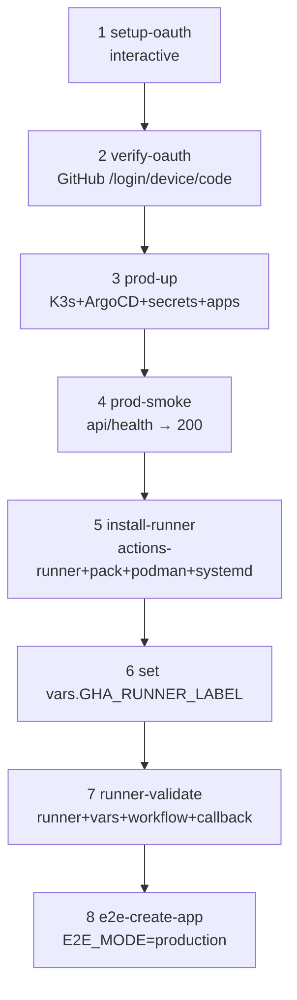

# Runbook：production acceptance（v1 final go-live）

> 對應 spec：
> - `docs/features/production-deployment/spec.md`
> - `docs/features/auth-login-flow/spec.md`
> - `docs/features/self-hosted-runner/spec.md`
>
> 適用範圍：把 0ops v1 從 repo 內全部工程封裝，導向「外部 curl `<slug>.<domain>` 拿
> HTTP 200」的最後一里。
>
> v1 收尾 #5：本 runbook 一條指令到底。

## 1. TL;DR

```bash
cp deploy/bootstrap/env.example deploy/bootstrap/.env.prod
$EDITOR deploy/bootstrap/.env.prod
./manage.sh prod-bootstrap-all
```

完成定義：

```bash
curl -fsS https://api.<your-domain>/health        # 200
curl -fsS https://nextdemo.<your-domain>/         # 200（e2e 跑完）
gh api /repos/wusung/0ops/actions/runners         # 0ops-prod-1 status=online
```

## 2. 前置（user 手動，不在 repo 範圍）

| 項目 | 取得方式 | 驗證 |
|---|---|---|
| K3s host | VPS / homelab，Linux + sshd + ssh key 設好 | `ssh $PROD_HOST true` |
| Cloudflare zone | 已在 Cloudflare 帳號 | `dig +short ${PROD_BASE_DOMAIN} NS` |
| `*.winshare.tw` CNAME | Cloudflare → DNS → wildcard CNAME → tunnel hostname | `dig +short '*.winshare.tw' CNAME` |
| Cloudflare Tunnel token | one.dash.cloudflare.com → Networks → Tunnels → Create | 寫入 `.env.prod` 之 `CF_TUNNEL_TOKEN` |
| GitHub OAuth App | `./manage.sh prod-setup-oauth` 互動式 | `./manage.sh prod-verify-oauth` |
| 本機工具 | `kubeseal` + `gh`（已 `gh auth login`） | `kubeseal --version` / `gh auth status` |

## 3. 一條指令的內容

`./manage.sh prod-bootstrap-all` 串接 8 步（spec § 1）：



每步冪等；任何一步失敗即停。

## 4. flags

```bash
./manage.sh prod-bootstrap-all --skip-runner       # 跳 step 5/6/7，workflow 走 ubuntu-latest
./manage.sh prod-bootstrap-all --skip-e2e          # 跳 step 8，只到 prod-up + smoke
./manage.sh prod-bootstrap-all --resume-from=4     # 從第 4 步開始（卡過後續跑）
```

## 5. 失敗對照表

| 失敗點 | 看這 |
|---|---|
| step 1 setup-oauth | `docs/runbooks/production-oauth-setup.md` |
| step 2 verify-oauth | 同上 § 5 |
| step 3 prod-up | `[prod-up]` log；常見：cloudflare token / kubeseal 缺 |
| step 4 smoke | `docs/runbooks/winshare-route-failure.md` |
| step 5 install-runner | `docs/runbooks/gha-self-hosted-runner.md` § 4 |
| step 7 runner-validate | 同上 |
| step 8 e2e | `OPS_HOST` 是否對；ArgoCD app `<app>` 狀態 |

## 6. 重跑

任一步失敗：

```bash
# 修 .env.prod 或對應 secret / chart values
./manage.sh prod-bootstrap-all --resume-from=<N>
```

或對應的單步指令：

```bash
./manage.sh prod-up                    # 重跑 step 3
./manage.sh prod-install-runner        # 重跑 step 5
./manage.sh prod-runner-validate       # 重跑 step 7
```

## 7. 卸載

```bash
./manage.sh prod-down                  # 刪 ArgoCD root + system-0ops + cloudflare-tunnel
                                       # postgres ns + PVC 保留
ssh $PROD_HOST sudo systemctl disable --now 0ops-runner.service
ssh $PROD_HOST sudo rm -rf /opt/0ops-runner /etc/systemd/system/0ops-runner.service
gh variable delete GHA_RUNNER_LABEL --repo wusung/0ops
```

完整清空 postgres：`ssh $PROD_HOST sudo kubectl delete ns postgres`。

## 8. 切換 runner

| 動作 | 指令 |
|---|---|
| Hosted → self-hosted | `gh variable set GHA_RUNNER_LABEL --body 0ops-builder` |
| Self-hosted → hosted | `gh variable delete GHA_RUNNER_LABEL` |

切換不需重 deploy；下次 workflow run 即生效。

## 9. v1 acceptance：HTTP 200 證據

跑完 `prod-bootstrap-all` 後：

```bash
# api
curl -fsS https://${PROD_API_HOST}/health | jq .
# expected: {"status": "ok", "version": "..."}

# demo app (e2e 跑完，nextdemo 已建)
curl -fsS https://${PROD_DEMO_HOST}/
# expected: HTML or app-specific payload, HTTP 200

# audit trail
gh api "/repos/${GHA_REPO}/actions/runs?per_page=3" -q '.workflow_runs[] | [.id, .conclusion]'
# expected: 最新 run conclusion=success
```

全綠 → v1 收尾 #5 達成。
